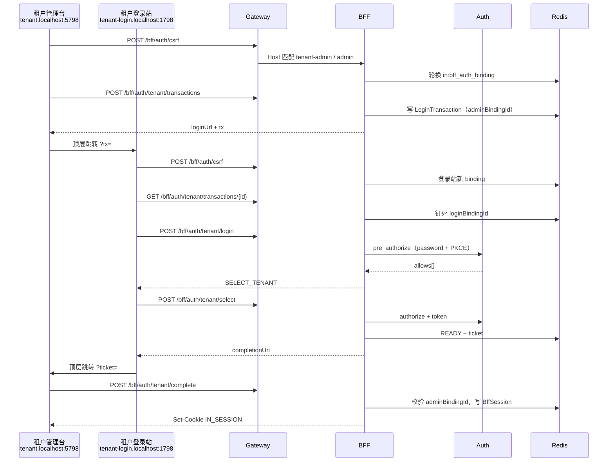

# BFF 双入口登录链路

本文描述**当前实现**的登录、交接与会话链路，便于对照浏览器、Gateway、BFF、Auth 与 Redis。契约细节以 `specs/changes/active/20260912-iam-identity-access-management/BFF-LOGIN.md` 为准。

## 1. 一眼看懂

```
管理台 /auth/start
    │  POST /bff/auth/csrf          → Cookie IN_AUTH_BINDING（本 host）
    │  POST /bff/auth/{entry}/transactions
    ▼
登录站 /oauth2/challenge?tx=…
    │  POST /bff/auth/csrf          → 登录站自己的 IN_AUTH_BINDING
    │  GET  /bff/auth/{entry}/transactions/{id}
    │  POST /bff/auth/{entry}/login （HYBRID + CSRF）
    │  [租户多候选] POST /bff/auth/tenant/select
    │  Auth：pre_authorize → authorize → token（PKCE）
    ▼
管理台 /auth/complete?ticket=…
    │  POST /bff/auth/{entry}/complete
    │  校验 start 时记下的 adminBindingId（不要再轮换 CSRF）
    ▼
正式会话 Cookie IN_SESSION（本 host）
    │  Gateway 读 Session → 注入 Authorization: Bearer
    ▼
下游微服务
```

浏览器**不传** domain、OAuth 参数、跳转 URL。Gateway 用请求 **Host** 匹配 Nacos `ingot.bff.apps` 的 `admin-origin` / `login-origin`，写入内部头 `In-Inner-Bff-App-Id`、`In-Inner-Bff-Entry`。BFF 只认这组头，不认前端自报的身份。

## 2. 本机 DEV 四个域名

Gateway / BFF 共用 Nacos `DEV_GROUP` 的 `in-bff-apps.yml`（`require-https: false`）。**必须同步到运行中的 Nacos**，改仓库文件不会自动生效。

| 站点 | 本机 URL | Nacos origin | Vite 端口 |
|------|----------|--------------|-----------|
| 租户管理台 | http://tenant.localhost:5798 | `admin-origin` | 5798 |
| 租户登录 | http://tenant-login.localhost:1798 | `login-origin` | 1798 |
| 平台管理台 | http://platform.localhost:5799 | `admin-origin` | 5799 |
| 平台登录 | http://platform-login.localhost:1799 | `login-origin` | 1799 |

`*.localhost` 按 RFC 6761 直接回环，**不必写 `/etc/hosts`**，也没有 `.local` 的 mDNS 等待。用上表 hostname 打开，不要用光杆 `http://localhost:5798`（四个站点会共享 Cookie）。Host 对不上注册表时 Gateway 直接 403。

四个 hostname 各自一份 **host-only** Cookie（不写 `Domain`）。不要把前端 `VITE_APP_COOKIE_DOMAIN` 配成 `.localhost`，否则四站点会串 Cookie。

OAuth `oauth-redirect-uri` 仍是网关协议回调（如 `http://localhost:5400/bff/auth/tenant/callback`）。BFF 请求带 `pre_grant_type`，Auth **不 302**，只在 JSON 里回授权码。浏览器不会打开这个地址。

Vite `/api` 代理到 Gateway，且 `changeOrigin: false`，这样 Gateway 看到的 Host 仍是 `tenant.localhost:5798` 这类前端主机名。

## 3. 角色与存储

| 组件 | 职责 |
|------|------|
| 管理台 SPA | `/auth/start` 开事务；`/auth/complete` 用 ticket 换正式会话；之后走 IAM |
| 登录站 SPA | 凭证、挑战、租户选择；**不能** `complete` / `me` / `logout` |
| Gateway | Host→appId；剥伪造内部头；正式 `IN_SESSION` → Bearer JWT |
| BFF | CSRF/绑定、LoginTransaction、编排 Auth RPC、发 Cookie |
| Auth | 预授权、授权码+PKCE、签发 JWT；BFF 客户端为 `in-bff-tenant` / `in-bff-platform` |

Redis（前缀 `in:`）：

| Key | 内容 | 默认 TTL |
|-----|------|----------|
| `in:bff_auth_binding:{bindingId}` | CSRF + appId | 登录阶段与事务相同，约 600s；complete 后延长到 `session-ttl` |
| `in:bff_login_tx:{transactionId}` | 登录事务（PKCE、Auth cookie、ticket、两站点 binding） | 600s |
| ticket 索引 | ticket → transactionId | 60s，且不超过事务剩余 |
| `in:bff_session:{sessionId}` | 正式会话（accessToken 等） | 小时～天（`session-ttl`） |
| `in:security_context:{sid}` | Auth 侧 SecurityContext | Auth 既有 |

Cookie（DEV HTTP，`require-https: false`）：

| 名称 | 谁写 | 谁读 |
|------|------|------|
| `IN_AUTH_BINDING` | BFF `POST /csrf` | 状态修改请求；**Gateway 不做 JWT 中继** |
| `IN_SESSION` | BFF `complete` | Gateway 中继 + `me` / `logout` |

属性：Path=/、HttpOnly、SameSite=Lax、无 Domain、无 Secure。HTTPS 环境改为 `__Host-IN_*` + Secure。

事务里两个绑定：

- `adminBindingId`：管理台 **start 那一次** CSRF 绑定。complete 必须仍是这个 Cookie，不能在完成页再 `POST /csrf` 轮换。
- `loginBindingId`：登录站第一次 `GET transactions/{id}` 时钉死。login / select 必须还是这个浏览器。

## 4. 逐步调用链

浏览器路径都带同源 `/api` 前缀。`{entry}` 为 `tenant` 或 `platform`。状态修改请求带 `X-CSRF-Token`，与当前 host 的绑定 Cookie 对应 Redis 记录核对。

### 4.1 管理台开事务

1. 打开 `{adminOrigin}/auth/start`。
2. `GET /bff/auth/me`：已有有效 `IN_SESSION` 则落地 `defaultReturnTo`（`/`），不再开事务。
3. 否则 **强制** `POST /bff/auth/csrf`（轮换绑定，丢掉前端缓存的旧 token），再 `POST /bff/auth/{entry}/transactions`。
4. BFF 校验内部头是 **admin**、路径与 `domain` 一致；记下 `adminBindingId`、PKCE `code_verifier`、OAuth `state`。
5. 返回 `{transactionId, loginUrl}`。`loginUrl` 仅为 `{loginOrigin}/oauth2/challenge?tx={transactionId}`。
6. 浏览器顶层跳转到登录站。

### 4.2 登录站认证

1. 无 `tx`：跳回配对管理台 `{adminOrigin}/auth/start`（构建期 `VITE_APP_ADMIN_START_URL`）。
2. 按当前 `tx` 决定是否 `POST /csrf`：新事务或 CSRF 缓存不属于该事务则重签，并绑定 `transactionId`。同一事务内挑战重试复用。
3. `GET /bff/auth/{entry}/transactions/{id}`：校验入口为 **login**，写入 `loginBindingId`（已有则必须相同）。
4. `POST /bff/auth/{entry}/login`（整包 HYBRID）：校验 CSRF + `loginBindingId`。
5. BFF Feign `preAuthorize`：账号密码、`domain`、PKCE challenge、注册表里的 `oauth-client-id` / `oauth-redirect-uri`。Auth 错误（如「用户名或密码错误」）原样回传 `code`/`message`，不改成 `S0500`。
6. 平台：无租户候选，直接授权换码。租户：零候选 → `BFF_IDENTITY_UNAVAILABLE`；单候选自动 `authorize`；多候选返回 `SELECT_TENANT`。
7. 多候选时 `POST /bff/auth/tenant/select`，再 `authorize`。授权时重新校验成员资格。
8. `authorize` + `token`（`code_verifier`）成功后，Token **先放在事务里**，签发一次性 `ticket`（默认 60s），返回 `READY` 与 `completionUrl`：`{adminOrigin}/auth/complete?ticket=…`。

### 4.3 管理台完成交接

1. 完成页立刻从 URL 去掉 `ticket`（`replaceState`）。
2. `POST /bff/auth/{entry}/complete`：用 **start 时** 的绑定 Cookie + sessionStorage 里的 CSRF（`ensureCsrf` 有 token 就不再签发）。
3. BFF 消费 ticket，核对 `adminBindingId`，创建 `BffSession`，写本 host `IN_SESSION`，删除事务与 ticket。
4. 返回 `returnTo`（恒为注册表 `defaultReturnTo`）。前端可再恢复本 origin `sessionStorage` 里的相对深链。
5. 管理台 `GET /me` + bootstrap，校验 `appId`/`domain` 与本产物一致。

### 4.4 登录后与退出

- 业务请求：Gateway 读 `IN_SESSION` → Redis → `Authorization: Bearer`。绑定 Cookie 不会触发中继。csrf / transactions / login / select / complete 即使带绑定 Cookie 也不注入 Bearer。
- `DELETE /bff/auth/logout`：尽量带 CSRF。能读到会话则撤销当前应用 Auth sid；无论 CSRF 是否匹配都清本 host 正式 Cookie 与绑定 Cookie，返回成功。显式退出不保存 returnTo，`/auth/start` 不因残留会话弹回业务页。另一域会话不受影响。

## 5. 时序（租户多候选）



平台链路相同，但 login 成功后直接 READY，没有 select。

## 6. 关键校验（对照排错）

| 现象 | 常见原因 |
|------|----------|
| Gateway 403 | 浏览器 Host 不在 `in-bff-apps.yml`（仍用光杆 localhost、Nacos 未刷新） |
| `BFF_ENTRY_MISMATCH` | 管理台打了 login 接口，或内部头与路径不一致 |
| `BFF_BINDING_MISMATCH` | CSRF 与 Cookie 脱节；complete 时绑定被轮换；换了浏览器/隐私窗口 |
| `BFF_TRANSACTION_EXPIRED` / 410 | 事务超过约 10 分钟，或 authorize/token 时 Auth 预授权会话 / state / 授权码已失效 |
| `BFF_TICKET_INVALID` | ticket 用过、过期、或 appId 不符 |
| `unauthorized_client` | Auth 客户端缺 `pre_authorization_code` / `authorization_code`，或 redirect_uri 与 Nacos 不一致 |
| Vite “host is not allowed” | 未放行 `*.localhost`（`packages/vite-config` 的 `DEV_BFF_ALLOWED_HOSTS`） |

事务过期或绑定不匹配时，登录站清本 origin CSRF 缓存，跳回配对 `/auth/start`。不要跨租户/平台互跳。

## 7. 配置落点

| 项 | 位置 |
|----|------|
| 四站点 origin、`require-https` | Nacos `in-bff-apps.yml`（仅 Gateway、BFF import） |
| 事务/ticket/session TTL、指纹 | Nacos `in-service-bff.yml` |
| OAuth 客户端 | `oauth2_registered_client`，种子 `databases/bff_client_init.sql` |
| 管理台回跳登录前地址 | 登录应用 `VITE_APP_ADMIN_START_URL` |
| 前端 JS Cookie Domain | `VITE_APP_COOKIE_DOMAIN` 本机留空；生产才写父域 |
| 网关路由 | `/bff/**` → `ingot-service-bff` |

TEST / PROD 仍是 HTTPS 四主机 + `__Host-` Cookie，见各环境 `in-bff-apps.yml`。不要把 `http://IP:端口` 配进已部署环境。
