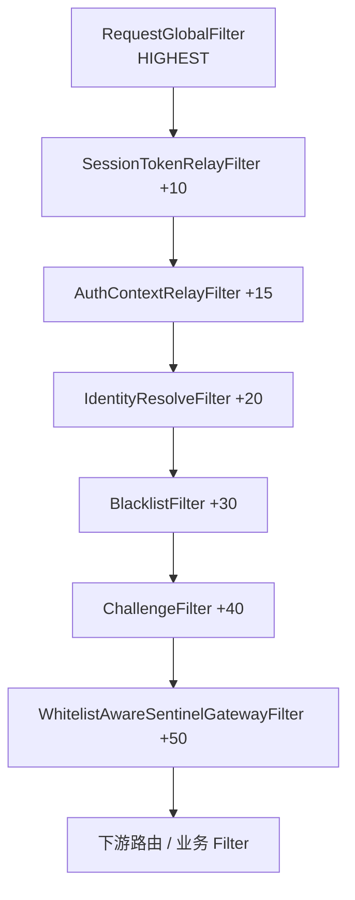

# 网关限流与安全策略执行面

> **文档定位**：描述 `ingot-gateway`（执行面）与 `ingot-gateway-rule-client`（规则 SDK）的当前实现，便于开发与运维对照代码。  
> **数据与管理面**：规则持久化与 Platform/Inner API 见 `ingot-service/ingot-security` 与 `databases/migrations/005_security_policy_center.sql`。  
> **验证**：端到端步骤见 [`test-case/security-policy-e2e.md`](../../test-case/security-policy-e2e.md)。

---

## 1. 模块职责

| 模块 | 路径 | 职责 |
|------|------|------|
| **ingot-gateway-rule-client** | `ingot-framework/ingot-gateway-rule-client` | 规则加载（local yaml / remote Feign）、L1 编译缓存、失效事件订阅与 evict |
| **ingot-gateway** | `ingot-service/ingot-gateway` | GlobalFilter 链、Sentinel Gateway 限流、Redis 运行时状态（临时封禁、PassToken、违规计数） |
| **ingot-verification-code** | `ingot-framework/ingot-verification-code` | 验证码与 PassToken 常量；网关 `CaptchaVCProcessor` 在验码成功后签发 token |
| **ingot-security**（非本文展开） | `ingot-service/ingot-security` | 规则 CRUD、快照 API、跨节点 `SecurityPolicyInvalidationEvent` 广播 |

网关 `build.gradle` 已依赖 `ingot.framework_gateway_rule_client`、`ingot.framework_vc`、`ingot.framework_sentinel` 与 Reactive Redis。

---

## 2. 请求处理总览

### 2.1 Filter 执行顺序

Spring Cloud Gateway 中 **order 越小越先执行**。安全相关链路如下（常量见 `GatewayFilterOrders`、`SecurityPolicyFilterOrder`）：



| Order | 组件 | 作用 |
|-------|------|------|
| `HIGHEST` | `RequestGlobalFilter` | 剥离内部 Header、写入 `In-Inner-Client-Real-IP` |
| +10 | `SessionTokenRelayFilter` | Cookie Session → Bearer |
| +15 | `AuthContextRelayFilter` | JWT 解析 → `userId` attribute |
| +20 | `IdentityResolveFilter` | 聚合 `ClientIdentity`，回填 `In-Inner-User-Id`（USER 维度限流） |
| +30 | `BlacklistFilter` | 白名单 bypass、临时封禁、静态黑白名单 → 403 |
| +40 | `ChallengeFilter` | ALWAYS 挑战、PassToken 消费 → 412 或放行 |
| +50 | `WhitelistAwareSentinelGatewayFilter` | Sentinel 限流（白名单 / PassToken 跳过） |

### 2.2 身份维度

`IdentityResolveFilter` 从标准化 Header 与 JWT attribute 构建 `ClientIdentity`，供黑白名单、违规计数与审计使用：

| 字段 | 来源 |
|------|------|
| IP | `In-Inner-Client-Real-IP`（`RequestGlobalFilter` 写入，**不用** Sentinel 自带的 client IP） |
| 设备 | `In-Ca-Sig` |
| userId | `AuthContextRelayFilter` → attribute，并回填 `In-Inner-User-Id` |
| UA / Referer | 标准 HTTP Header |

> **内部 Header 安全约束**：`In-Inner-*` 系列（含 `In-Inner-Client-Real-IP`、`In-Inner-User-Id`、`In-Inner-From`）由 `RequestGlobalFilter` 在网关入口统一剥离，后续 Filter 按需写入可信值；外部客户端伪造无效。

### 2.3 自定义 Header 速查

| Header | 写入方 | 用途 | Java 常量 |
|---|---|---|---|
| `In-Ca-Sig` | 前端/BFF | 设备指纹 | `BFF_DEVICE_FINGERPRINT_HEADER` |
| `In-Inner-Client-Real-IP` | 网关 | 标准化客户端 IP | `INNER_CLIENT_REAL_IP` |
| `In-Inner-User-Id` | 网关 | Sentinel USER 维度 | `INNER_USER_ID` |
| `In-Inner-From` | 网关 | 请求来源标识 | `SECURITY_FROM` |

---

## 3. ingot-gateway-rule-client（规则 SDK）

### 3.1 子域与 SPI

SDK 按域拆分，各域独立开关与 `policy.mode`（`local` | `remote`）：

| 子域 | 配置前缀 | SPI | 编译产物 |
|------|----------|-----|----------|
| 限流 | `ingot.security.ratelimit` | `RateLimitRuleService` | `RateLimitSnapshot` → 由网关编译为 Sentinel 规则 |
| 黑白名单 | `ingot.security.blacklist` | `BlacklistService` | `CompiledIpList`（IP set / CIDR / UA·Referer 正则等） |
| 挑战 | `ingot.security.challenge` | `ChallengePolicyService` | `CompiledChallengePolicy`（路径 + trigger 匹配） |
| 验证码运行时 | `ingot.security.vc` | `VcRuntimeConfigService` | VC 模块路由配置（与挑战联动） |
| 违规升级 | `ingot.security.violation-escalation` | `ViolationEscalationService` | `ViolationEscalationConfig`（窗口 / 阈值 / 临时封禁 TTL） |

自动配置入口（`META-INF/spring/...AutoConfiguration.imports`）：

- `GatewayRuleClientAutoConfiguration` — Coordinator、`RemoteSnapshotFetcher`
- `RateLimitAutoConfiguration`
- `BlacklistAutoConfiguration`
- `ChallengeAutoConfiguration`
- `VcConfigAutoConfiguration`
- `ViolationEscalationAutoConfiguration`

### 3.2 加载模式

**local**：规则写在各域 `*Properties` 的 yaml 中，适合单机调试。  
**remote**：通过 `RemoteSnapshotFetcher` 一次 Feign 拉取 `SecurityPolicySnapshotVO`（`GET /inner/security/policy/snapshot`），`SnapshotAssembler` 转为各域内部模型；失败返回空快照，**不抛异常**（限流侧 Sentinel 退化为无 SDK 规则；名单侧视为未命中）。

### 3.3 L1 缓存与热更新

- 各域 Service 内使用 `LocalCompiledCache`（`AtomicReference`，无 TTL）。
- `ingot.security.policy.client.enabled=true`（默认）时装配 `SecurityPolicyCacheCoordinator`，订阅 `SecurityPolicyInvalidationEvent`，按 `SecurityPolicyDomain` 分发 evictor；`ALL` 域触发全部回调。
- 限流域除 `RateLimitRuleService::evictAll` 外，网关 `SentinelGatewayConfiguration` 另注册 `reloadRules()`（先 evict 再拉快照，全量 `GatewayRuleManager.loadRules`）。

典型生产配置：

```yaml
ingot:
  security:
    policy:
      client:
        enabled: true
        invalidation-enabled: true   # 跨节点改规则后自动 evict + Sentinel reload
    ratelimit:
      enabled: true
      policy:
        mode: remote
    blacklist:
      enabled: true
      policy:
        mode: remote
    challenge:
      enabled: true
      policy:
        mode: remote
    violation-escalation:
      enabled: true
      policy:
        mode: remote
```

### 3.4 限流规则模型

`RateLimitRule` 要点：

- **路径**：`groupCode` 引用 `EndpointGroup`，或内联 `patternList`；**未配置的路径默认不限流**（白名单式限流）。
- **维度** `RateLimitDimension`：`IP` / `DEVICE` / `USER`，对应 Header 见 `SentinelGatewayConfiguration.buildFlowRule`。
- **Sentinel 参数**：`qps`、`burst`、`intervalSec`、`controlBehavior`（`F` 快速失败 / `Q` 排队）。
- **`enabled=false`** 的规则不编译进 Sentinel。
- **已知限制**：`EndpointPattern.method` 暂不参与 Sentinel 编译（`ApiPathPredicateItem` 不支持 HTTP method）。

路径匹配策略（编译 `ApiDefinition` 时，见 `SentinelPathPredicateCompiler`）：

- 含 `*` 或 `?`（Ant 风格，如 `/pms/**`、`/pms/*`）→ Sentinel **PREFIX** → `AntPathMatcher` 全 pattern 匹配（**不要**写成下游路径 `/test/**`，应写网关路径 `/pms/**`）
- 否则 → **EXACT** 精确匹配

> 注意：Sentinel SCG 适配器的 PREFIX 策略并非「去掉 `/**` 后的字符串前缀」；旧实现若把 `/pms/**` 截成 `/pms` 会导致永不匹配。

### 3.5 黑白名单模型

`BlacklistService` 热路径仅调用 `isBlocked` / `isWhitelisted`，内部为 `CompiledIpList`：

| `IpKeyType` | 说明 |
|-------------|------|
| IP | 精确 IP |
| CIDR | 网段 |
| DEVICE | 设备指纹 Header |
| USER_ID | 用户 ID |
| USER_AGENT / REFERER | 正则子串匹配 |

支持 `effectiveAt` / `expiresAt` 定时生效。list-type：`BLACK` / `WHITE`。

### 3.6 挑战策略模型

`ChallengeTrigger`：

| 触发器 | 执行位置 |
|--------|----------|
| `ALWAYS` | `ChallengeFilter`：未带有效 PassToken 则 **412** |
| `ON_RATE_LIMIT` | `SentinelBlockHandler`：Sentinel 拒绝后优先 **412**，否则 **429** |

`ChallengePolicyService.match(path, method, trigger)` 按 `priority` 与路径模式匹配；`groupCode` 通过 `GroupPatternResolver` 解析分组路径。

挑战类型 `challengeType`（如 `SLIDER`）经 `ChallengeTypes` 映射为 VC 路由名（如 `image`），响应体由 `ChallengeResponses.buildPayload` 组装。

**不支持** `on_failure_threshold`：登录连续失败由 `ingot-account-domain` 的 `RecordLoginUseCaseService` 计数并自动锁定账号；管理面保存挑战策略时仅允许 `always` / `on_rate_limit`。

管理面表字段 `failure_*`、`challenge_failure_limit`、`block_ttl_sec` 保留列兼容，**网关执行面不读取**；限流违规临时封禁阈值由 `ViolationEscalationService` 提供（Platform 单行表 `gateway_violation_escalation` 或 local yaml，默认 60s 窗口 / 30 次 / 900s TTL）。

---

## 4. ingot-gateway（执行面）

### 4.1 Sentinel 限流装配

| 类 | 说明 |
|----|------|
| `SentinelGatewayConfiguration` | `RateLimitRuleService` 存在且 `ingot.security.ratelimit.enabled=true` 时，将快照编译为 `ApiDefinition` + `GatewayFlowRule` 并热加载 |
| `SecurityPolicySentinelConfiguration` | 注册 `WhitelistAwareSentinelGatewayFilter`，order=`+50`，替代默认过早执行的 `SentinelGatewayFilter` |
| `SentinelBlockHandler` | 注册为 `GatewayCallbackManager` 的 `BlockRequestHandler` |

**启用 SDK 限流**必须同时满足：

1. `ingot.security.ratelimit.enabled=true`
2. `spring.cloud.sentinel.scg.enabled=true`（默认 true）
3. 存在 `RateLimitRuleService` bean（local 或 remote 模式）

未开启 SDK 限流时，仍可走既有 Nacos 等方式下发 Sentinel 规则，SDK 静默不接管。

### 4.2 黑白名单：`BlacklistFilter`

处理顺序：

1. 无 `ClientIdentity` → 放行（异常链路兜底）
2. 静态**白名单**命中 → 设置 `ingot.security.whitelisted=true`，跳过后续挑战与 Sentinel
3. Redis **临时封禁**（`TempBlockStore`，检查 IP、DEVICE）
4. SDK **静态黑名单** → **403**，`code=FORBIDDEN_BLOCKED`

临时封禁与静态名单无关，但静态名单需 `ingot.security.blacklist.enabled=true`。

### 4.3 挑战：`ChallengeFilter` + PassToken

流程：

1. 白名单 → 直接放行
2. 查询参数 `_vc_pass_token` 存在 → `PassTokenStore.consume(scope, token)`；成功则设置 `ingot.security.passToken.ok=true` 并放行（Sentinel 跳过）
3. 命中 `ALWAYS` 策略且无有效 token → **412** `CHALLENGE_REQUIRED`
4. 否则进入 Sentinel；触发限流时由 `SentinelBlockHandler` 处理 `ON_RATE_LIMIT`

**PassToken 全链路**：

```
业务请求 → 412（data 含 scope、checkPath、passTokenParam）
  → POST /vc/{vcType}/check?_vc_scope={scope} 验码
  → 响应 data._vc_pass_token
  → 重试业务 URL?...&_vc_pass_token=...
  → ChallengeFilter 消费 token → 放行（可跳过 Sentinel）
```

签发：`CaptchaVCProcessor` 在挑战域开启且带 `_vc_scope` 时，验码成功后调用 `PassTokenStore.issue`。

Redis Key：`in:gw:vc:pass:{scope}:{token}`，值为剩余次数，消费为 Lua `DECR`（≤0 时删除）。

### 4.4 限流拒绝：`SentinelBlockHandler`

Sentinel 阻断后并行逻辑：

1. **违规累积**（需 `ingot.security.violation-escalation.enabled=true` 且配置 `enabled=true`）：`ViolationCounter` 按 `windowSec` 滑动窗口（默认 60s，按 IP）累加；窗口内 ≥ `blockThreshold`（默认 30）→ `TempBlockStore` 封禁 `tempBlockTtlSec`（默认 900s）+ `BlacklistEventReporter` 异步上报 security
2. 匹配 `ON_RATE_LIMIT` 挑战 → **412** + `CHALLENGE_REQUIRED`
3. 否则 → **429** + `LIMIT_TOO_MANY`，Header `Retry-After: 1`

### 4.5 Redis 运行时 Key

| Key 模式 | 用途 |
|----------|------|
| `in:gw:bl:tmp:{keyType}:{keyValue}` | 临时封禁（value 为规则编码，带 TTL） |
| `in:gw:vc:pass:{scope}:{token}` | PassToken 剩余次数 |
| （`ViolationCounter` 内部 key，见实现类） | 限流违规滑动计数 |

无 `ReactiveStringRedisTemplate` 时，临时封禁与 PassToken 能力降级为 no-op（不抛错）。

---

## 5. HTTP 响应约定

| 场景 | HTTP | `code` | 说明 |
|------|------|--------|------|
| 静态/临时黑名单 | 403 | `FORBIDDEN_BLOCKED` | `BlacklistFilter` |
| 强制/限流后挑战 | 412 | `CHALLENGE_REQUIRED` | body `data` 含 `vcType`、`scope`、`checkPath`、`passTokenParam` 等 |
| 纯限流（无 ON_RATE_LIMIT 策略） | 429 | `LIMIT_TOO_MANY` | `Retry-After: 1` |

**单次请求**只会返回上表之一：Filter 顺序为 Blacklist → Challenge → Sentinel，403 最先判定；`ALWAYS` 的 412 在 Sentinel 之前且会终止链路；Sentinel 阻断后 412 与 429 互斥（先匹配 `ON_RATE_LIMIT` 策略）。

**跨请求升级**：反复触发 Sentinel 阻断（每次 412 或 429）→ `ViolationCounter` 异步累计 → 窗口内达 `blockThreshold` → `TempBlockStore` 写入临时封禁 → **后续请求**在 `BlacklistFilter` 直接 403（须 `blacklist.enabled=true`；非同一次响应内 412 变 403）。

挑战响应示例：

```json
{
  "code": "CHALLENGE_REQUIRED",
  "msg": "Captcha required",
  "data": {
    "vcType": "image",
    "scope": "anon",
    "scopeParam": "_vc_scope",
    "passTokenParam": "_vc_pass_token",
    "checkPath": "/vc/image/check",
    "ttlSec": 300,
    "remaining": 3
  }
}
```

---

## 6. 配置速查

### 6.1 SDK 总开关

| 配置项 | 默认 | 含义 |
|--------|------|------|
| `ingot.security.policy.client.enabled` | true | 关闭则无 Coordinator / RemoteSnapshotFetcher |
| `ingot.security.policy.client.invalidation-enabled` | true | 关闭则不发失效订阅，需重启或手动广播 |

### 6.2 各域开关（均需 `enabled=true` 才装配）

| 域 | 开关 | 默认 |
|----|------|------|
| 限流 | `ingot.security.ratelimit.enabled` | **false**（避免影响现有 Sentinel 部署） |
| 黑白名单 | `ingot.security.blacklist.enabled` | 见 `BlacklistProperties` |
| 挑战 | `ingot.security.challenge.enabled` | 见 `ChallengeProperties` |
| 违规升级 | `ingot.security.violation-escalation.enabled` | **false**（避免影响现有部署） |

各域 `policy.mode`：`local`（yaml 内联）| `remote`（Feign 快照）。

详细 yaml 示例见各类 `*Properties` 类 JavaDoc（如 `RateLimitProperties`、`BlacklistProperties`、`ChallengeProperties`、`ViolationEscalationProperties`）。

### 6.3 网关侧 Sentinel order

`SecurityPolicySentinelConfiguration` 将 Sentinel Filter 固定在 `HIGHEST_PRECEDENCE + 50`，等效于：

```yaml
spring:
  cloud:
    sentinel:
      scg:
        enabled: true
        # order 由 SecurityPolicyFilterOrder.SENTINEL 决定，无需手写
```

---

## 7. 关键类索引

### 7.1 ingot-gateway-rule-client

| 包/类 | 说明 |
|-------|------|
| `config.GatewayRuleClientAutoConfiguration` | SDK 顶层、Fetcher、Coordinator |
| `internal.RemoteSnapshotFetcher` | 共享 Feign 拉快照 |
| `internal.SecurityPolicyCacheCoordinator` | 失效事件 → 多 evictor 串行 |
| `internal.SnapshotAssembler` | VO → 域模型 |
| `internal.LocalCompiledCache` | L1 编译缓存 |
| `ratelimit.*` | 限流规则 local/remote |
| `blacklist.*` | 黑白名单编译与匹配 |
| `challenge.*` | 挑战策略编译与匹配 |
| `violation.*` | 限流违规升级配置 local/remote |

### 7.2 ingot-gateway

| 类 | 说明 |
|----|------|
| `filter.GatewayFilterOrders` | 身份链 order 常量 |
| `security.SecurityPolicyFilterOrder` | 安全策略 Filter order |
| `filter.auth.IdentityResolveFilter` | `ClientIdentity` |
| `security.BlacklistFilter` | 黑白名单 + 临时封禁 |
| `security.ChallengeFilter` | ALWAYS 挑战 + PassToken |
| `security.WhitelistAwareSentinelGatewayFilter` | 可跳过的 Sentinel |
| `security.SentinelGatewayConfiguration` | 快照 → Sentinel 热加载 |
| `security.SentinelBlockHandler` | 429/412 + 违规封禁 |
| `security.PassTokenStore` / `TempBlockStore` / `ViolationCounter` | Redis 状态 |
| `security.SecurityPolicyBootstrapLogger` | 启动时打印快照摘要 |
| `captcha.CaptchaVCProcessor` | 验码 + PassToken 签发 |

---

## 8. 与验证码模块的关系

| 场景 | 机制 | 参数 |
|------|------|------|
| 业务强制验码 | `VCWebFilter` / `@VCVerify` | 业务请求带 `_vc_code` |
| 风控降级挑战 | `ChallengeFilter` → 412 → `/vc/{type}/check` | 重试带 `_vc_pass_token`、`_vc_scope` |
| 登录 password 验码 | `CaptchaVCProcessor.checkOnly` | `/auth/token?grant_type=password` |

常量定义：`VCConstants`（`QUERY_PARAMS_PASS_TOKEN`、`QUERY_PARAMS_SCOPE` 等）。

---

## 9. 运维与排障提示

1. **改了 Platform 规则但网关未生效**：确认 `invalidation-enabled=true`、Feign 可达 security、且对应域 `enabled=true`；限流另看 `[Sentinel] reloaded` 日志。
2. **限流粒度不对**：确认 `RequestGlobalFilter` 已写 `In-Inner-Client-Real-IP`，勿依赖 Sentinel 默认 client IP。
3. **白名单不生效**：须先命中 `BlacklistFilter` 静态白名单；仅 PassToken 不会跳过黑名单检查。
4. **412 后仍被限流**：检查 PassToken 是否带对 `scope`、Redis 是否可用、是否设置 `ingot.security.passToken.ok` 路径。
5. **403 来自 temp**：查 Redis `in:gw:bl:tmp:IP:*`，或等待 `tempBlockTtlSec` TTL；阈值见 Platform `GET /platform/security/policy/violation-escalation` 或 local `ViolationEscalationProperties`。

启动摘要：`SecurityPolicyBootstrapLogger` 在各域 Service 可用时输出规则/名单/挑战条数与版本号。

---

## 10. 版本说明

本文描述 **Phase 1–4** 网关执行面与 SDK 的 As-Built 行为（2026-05）。管理面 API 见 `ingot-service/ingot-security`；E2E 用例见 `test-case/security-policy-e2e.md`；DB 表结构见 `databases/migrations/005_security_policy_center.sql`。
