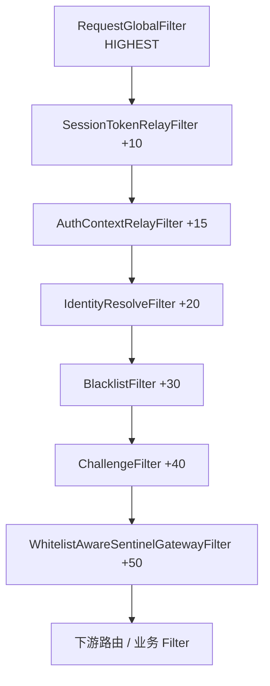

# 网关限流与安全策略执行面

> **文档定位**：描述 `ingot-gateway`（执行面）与 `ingot-gateway-rule-client`（规则 SDK）的当前实现，便于开发与运维对照代码。  
> **数据与管理面**：规则持久化与 Platform/Inner API 见 `ingot-service/ingot-security` 与 `databases/migrations/005_security_policy_center.sql`。  
> **验证**：端到端步骤见 [`test-case/security-policy-e2e.md`](../../test-case/security-policy-e2e.md)。

---

## 1. 模块职责

| 模块 | 路径 | 职责 |
|------|------|------|
| **ingot-gateway-rule-client** | `ingot-framework/ingot-gateway-rule-client` | 规则加载（local yaml / remote Feign）、L1 编译缓存、失效事件订阅与 evict |
| **ingot-gateway** | `ingot-service/ingot-gateway` | GlobalFilter 链、Sentinel Gateway 限流、Redis 运行时状态（临时封禁、PassToken、违规计数） |
| **ingot-verification-code** | `ingot-framework/ingot-verification-code` | 验证码与 PassToken 常量；网关 `CaptchaVCProcessor` 在验码成功后签发 token |
| **ingot-security**（非本文展开） | `ingot-service/ingot-security` | 规则 CRUD、快照 API、跨节点 `SecurityPolicyInvalidationEvent` 广播 |

网关 `build.gradle` 已依赖 `ingot.framework_gateway_rule_client`、`ingot.framework_vc`、`ingot.framework_sentinel` 与 Reactive Redis。

---

## 2. 请求处理总览

### 2.1 Filter 执行顺序

Spring Cloud Gateway 中 **order 越小越先执行**。安全相关链路如下（常量见 `GatewayFilterOrders`、`SecurityPolicyFilterOrder`）：


```mermaid
flowchart TD
  A[RequestGlobalFilter<br/>HIGHEST] --> B[SessionTokenRelayFilter +10]
  B --> C[AuthContextRelayFilter +15]
  C --> D[IdentityResolveFilter +20]
  D --> E[BlacklistFilter +30]
  E --> F[ChallengeFilter +40]
  F --> G[WhitelistAwareSentinelGatewayFilter +50]
  G --> H[下游路由 / 业务 Filter]
```

| Order | 组件 | 作用 |
|-------|------|------|
| `HIGHEST` | `RequestGlobalFilter` | 剥离内部 Header、写入 `In-Inner-Client-Real-IP` |
| +10 | `SessionTokenRelayFilter` | Cookie Session → Bearer |
| +15 | `AuthContextRelayFilter` | JWT 解析 → `userId` attribute |
| +20 | `IdentityResolveFilter` | 聚合 `ClientIdentity`，回填 `In-Inner-User-Id`（USER 维度限流） |
| +30 | `BlacklistFilter` | 白名单 bypass、临时封禁、静态黑白名单 → 403 |
| +40 | `ChallengeFilter` | ALWAYS 挑战、PassToken 消费 → 412 或放行 |
| +50 | `WhitelistAwareSentinelGatewayFilter` | Sentinel 限流（白名单 / PassToken 跳过） |

### 2.2 身份维度

`IdentityResolveFilter` 从标准化 Header 与 JWT attribute 构建 `ClientIdentity`，供黑白名单、违规计数与审计使用：

| 字段 | 来源 |
|------|------|
| IP | `In-Inner-Client-Real-IP`（`RequestGlobalFilter` 写入，**不用** Sentinel 自带的 client IP） |
| 设备 | `In-Ca-Sig` |
| userId | `AuthContextRelayFilter` → attribute，并回填 `In-Inner-User-Id` |
| UA / Referer | 标准 HTTP Header |

> **内部 Header 安全约束**：`In-Inner-*` 系列（含 `In-Inner-Client-Real-IP`、`In-Inner-User-Id`、`In-Inner-From`）由 `RequestGlobalFilter` 在网关入口统一剥离，后续 Filter 按需写入可信值；外部客户端伪造无效。

### 2.3 自定义 Header 速查

| Header | 写入方 | 用途 | Java 常量 |
|---|---|---|---|
| `In-Ca-Sig` | 前端/BFF | 设备指纹 | `BFF_DEVICE_FINGERPRINT_HEADER` |
| `In-Inner-Client-Real-IP` | 网关 | 标准化客户端 IP | `INNER_CLIENT_REAL_IP` |
| `In-Inner-User-Id` | 网关 | Sentinel USER 维度 | `INNER_USER_ID` |
| `In-Inner-From` | 网关 | 请求来源标识 | `SECURITY_FROM` |

---

## 3. ingot-gateway-rule-client（规则 SDK）

### 3.1 子域与 SPI

SDK 按域拆分，各域独立开关与 `policy.mode`（`local` | `remote`）：

| 子域 | 配置前缀 | SPI | 编译产物 |
|------|----------|-----|----------|
| 限流 | `ingot.security.ratelimit` | `RateLimitRuleService` | `RateLimitSnapshot` → 由网关编译为 Sentinel 规则 |
| 黑白名单 | `ingot.security.blacklist` | `BlacklistService` | `CompiledIpList`（IP set / CIDR / UA·Referer 正则等） |
| 挑战 | `ingot.security.challenge` | `ChallengePolicyService` | `CompiledChallengePolicy`（路径 + trigger 匹配） |
| 验证码运行时 | `ingot.security.vc` | `VcRuntimeConfigService` | VC 模块路由配置（与挑战联动） |
| 违规升级 | `ingot.security.violation-escalation` | `ViolationEscalationService` | `ViolationEscalationConfig`（窗口 / 阈值 / 临时封禁 TTL） |

自动配置入口（`META-INF/spring/...AutoConfiguration.imports`）：

- `GatewayRuleClientAutoConfiguration` — Coordinator、共享快照缓存链、`CacheSourceHolder` 与 Actuator
- `RateLimitAutoConfiguration`
- `BlacklistAutoConfiguration`
- `ChallengeAutoConfiguration`
- `VcConfigAutoConfiguration`
- `ViolationEscalationAutoConfiguration`

### 3.2 加载模式

**local**：规则写在各域 `*Properties` 的 yaml / Nacos `in-security-gateway.yml` 中，适合单机调试与本地联调。Nacos 推送变更后，`ConfigurationPropertiesRebinder` 重绑定 Properties，各域 local Service 的编译缓存自动失效；限流域还会触发 Sentinel 规则热重载，无需重启。  
**remote**：通过 `RemoteSnapshotFetcher` 一次 Feign 拉取 `SecurityPolicySnapshotVO`（`GET /inner/security/policy/snapshot`），`SnapshotAssembler` 转为各域内部模型；**失败不 fail-open**，而是按 `remote → LKG(Redis) → Nacos 地板` 阶梯降级，当前来源见 Actuator `securitypolicy` 端点。`local-floor-enabled=false` 且无 LKG 时抛 `PolicyRemoteUnavailableException`（fail-closed）。

远程 HTTP 成功但 `data` 为空视为**合法空快照**：接受、刷新 LKG、编译为空规则集，不触发降级。

### 3.3 缓存与热更新

缓存分两层，均由 [ingot-cache 分层缓存框架](../../../.agents/skills/layered-cache/SKILL.md) 提供：

- **共享快照层**：`SecurityPolicySnapshotVO` 走 `L1 Caffeine → L2 Redis → Resilient(remote → LKG → 地板)`，四域共用一个实例，因此冷启动或全量失效后只打一次 Feign。参数见 `ingot.security.policy.client.cache.*`。
- **派生编译层**：各域 Service 缓存自己的编译产物（`CompiledIpList` 等含 `Pattern`/`PathPattern`，不可序列化故只留本机）。remote 模式按共享快照的 `(来源, version)` 二元组判定是否重编译，version 未变则复用；local 模式仅在显式失效后重编译。

三条一致性路径：

| 机制 | 时延 | 解决的问题 |
|---|---|---|
| `InvalidationBus` 广播 | 秒级 | 规则变更即时生效 |
| L1/L2 TTL | 一个 TTL 周期 | Redis Pub/Sub 消息丢失导致的永久 stale |
| `(来源, version)` 比对 | — | 避免无谓重编译与 Sentinel 规则抖动 |

`ingot.security.policy.client.invalidation-enabled=true`（默认）且容器内存在 `InvalidationBus` 时装配 `SecurityPolicyCacheCoordinator`，订阅 `SecurityPolicyInvalidationEvent`，按 `SecurityPolicyDomain` 分发 evictor；`ALL` 域触发全部回调。各域 `evictAll()` 会同时清共享快照层与自身派生缓存。

限流域比较特殊：Sentinel 读的是 `GatewayRuleManager` 里已加载的规则，不经过缓存，所以 TTL 刷新对它天然无效。`SentinelGatewayConfiguration` 因此有三条刷新路径——失效广播走 `reloadRules()`（先清缓存再无条件重载）；共享快照被其他域流量刷新时发出的通知走 `reloadIfChanged()`（快照未变则跳过）；只启用限流域、没有其他域流量的部署可再打开 `cache.refresh-interval` 做定时兜底，默认关闭。

典型生产配置：

```yaml
ingot:
  security:
    policy:
      client:
        invalidation-enabled: true   # 跨节点改规则后自动 evict + Sentinel reload
    ratelimit:
      enabled: true
      policy:
        mode: remote
    blacklist:
      enabled: true
      policy:
        mode: remote
    challenge:
      enabled: true
      policy:
        mode: remote
    violation-escalation:
      enabled: true
      policy:
        mode: remote
```

### 3.4 限流规则模型

`RateLimitRule` 要点：

- **路径**：`groupCode` 引用 `EndpointGroup`，或内联 `patternList`；**未配置的路径默认不限流**（白名单式限流）。
- **维度** `RateLimitDimension`：`IP` / `DEVICE` / `USER`，对应 Header 见 `SentinelGatewayConfiguration.buildFlowRule`。
- **Sentinel 参数**：`qps`、`burst`、`intervalSec`、`controlBehavior`（`F` 快速失败 / `Q` 排队）。
- **`enabled=false`** 的规则不编译进 Sentinel。
- **已知限制**：`EndpointPattern.method` 暂不参与 Sentinel 编译（`ApiPathPredicateItem` 不支持 HTTP method）。

路径匹配策略（编译 `ApiDefinition` 时，见 `SentinelPathPredicateCompiler`）：

- 含 `*` 或 `?`（Ant 风格，如 `/iam/**`、`/iam/*`）→ Sentinel **PREFIX** → `AntPathMatcher` 全 pattern 匹配（**不要**写成下游路径 `/test/**`，应写网关路径 `/iam/**`）
- 否则 → **EXACT** 精确匹配

> 注意：Sentinel SCG 适配器的 PREFIX 策略并非「去掉 `/**` 后的字符串前缀」；旧实现若把 `/iam/**` 截成 `/iam` 会导致永不匹配。

### 3.5 黑白名单模型

`BlacklistService` 热路径仅调用 `isBlocked` / `isWhitelisted`，内部为 `CompiledIpList`：

| `IpKeyType` | 说明 |
|-------------|------|
| IP | 精确 IP |
| CIDR | 网段 |
| DEVICE | 设备指纹 Header |
| USER_ID | 用户 ID |
| USER_AGENT / REFERER | 正则子串匹配 |

支持 `effectiveAt` / `expiresAt` 定时生效。list-type：`BLACK` / `WHITE`。

### 3.6 挑战策略模型

`ChallengeTrigger`：

| 触发器 | 执行位置 |
|--------|----------|
| `ALWAYS` | `ChallengeFilter`：未带有效 PassToken 则 **412** |
| `ON_RATE_LIMIT` | `SentinelBlockHandler`：Sentinel 拒绝后优先 **412**，否则 **429** |

`ChallengePolicyService.match(path, method, trigger)` 按 `priority` 与路径模式匹配；`groupCode` 通过 `GroupPatternResolver` 解析分组路径。

挑战类型 `challengeType`（如 `SLIDER`）经 `ChallengeTypes` 映射为 VC 路由名（如 `image`），响应体由 `ChallengeResponses.buildPayload` 组装。

**不支持** `on_failure_threshold`：登录连续失败由 `ingot-security/ingot-security-account` 的 `RecordLoginUseCaseService` 计数并自动锁定账号；管理面保存挑战策略时仅允许 `always` / `on_rate_limit`。

管理面表字段 `failure_*`、`challenge_failure_limit`、`block_ttl_sec` 保留列兼容，**网关执行面不读取**；限流违规临时封禁阈值由 `ViolationEscalationService` 提供（Platform 单行表 `gateway_violation_escalation` 或 local yaml，默认 60s 窗口 / 30 次 / 900s TTL）。

---

## 4. ingot-gateway（执行面）

### 4.1 Sentinel 限流装配

| 类 | 说明 |
|----|------|
| `SentinelGatewayConfiguration` | `RateLimitRuleService` 存在且 `ingot.security.ratelimit.enabled=true` 时，将快照编译为 `ApiDefinition` + `GatewayFlowRule` 并热加载 |
| `SecurityPolicySentinelConfiguration` | 注册 `WhitelistAwareSentinelGatewayFilter`，order=`+50`，替代默认过早执行的 `SentinelGatewayFilter` |
| `SentinelBlockHandler` | 注册为 `GatewayCallbackManager` 的 `BlockRequestHandler` |

**启用 SDK 限流**必须同时满足：

1. `ingot.security.ratelimit.enabled=true`
2. `spring.cloud.sentinel.scg.enabled=true`（默认 true）
3. 存在 `RateLimitRuleService` bean（local 或 remote 模式）

未开启 SDK 限流时，仍可走既有 Nacos 等方式下发 Sentinel 规则，SDK 静默不接管。

### 4.2 黑白名单：`BlacklistFilter`

`BlacklistFilter` 为网关常驻 Filter（**不**受 `ingot.security.blacklist.enabled` 门控），处理顺序：

1. 无 `ClientIdentity` → 放行（异常链路兜底）
2. 静态**白名单**命中 → 设置 `ingot.security.whitelisted=true`，跳过后续挑战与 Sentinel（须 `blacklist.enabled=true` 装配 `BlacklistService`）
3. Redis **临时封禁**（`TempBlockStore`，检查 IP、DEVICE、CLIENT）→ **403**（**不依赖** `blacklist.enabled`；由违规升级或 Auth 登录失败防护写入）
4. SDK **静态黑名单** → **403**，`code=FORBIDDEN_BLOCKED`（须 `blacklist.enabled=true`）

`blacklist.enabled=false` 时仅关闭静态黑白名单 SDK；临时封禁的读取与 403  enforcement 仍由本 Filter 执行。

### 4.3 挑战：`ChallengeFilter` + PassToken

流程：

1. 白名单 → 直接放行
2. `/vc/**` → 直接放行（验码接口不做 ALWAYS）
3. Header `In-Vc-Pass-Token` 与 `In-Vc-Scope` 均存在 **且** 当前路径 `matchByScope` 命中该 scope → `PassTokenStore.consume(scope, token)`；成功则设置 `ingot.security.passToken.ok=true` 并放行（Sentinel 跳过）。缺 Header、只放 query、或路径未覆盖该 scope 视为无效 token（有 ALWAYS → 412，否则进 Sentinel，不打跳过标记、**不扣次数**）
4. 命中 `ALWAYS` 策略且无有效 token → **412** `CHALLENGE_REQUIRED`
5. 否则进入 Sentinel；触发限流时由 `SentinelBlockHandler` 处理 `ON_RATE_LIMIT`

**PassToken 全链路**：

```
业务请求 → 412（data 含 scope、checkPath、passTokenParam、scopeParam；param 为头名）
  → POST /vc/image/check  Header In-Vc-Scope: {scope} 验码
  → 响应 data["In-Vc-Pass-Token"]（无 captcha）
  → 重试业务  Header In-Vc-Pass-Token + In-Vc-Scope
  → ChallengeFilter matchByScope 后按请求 scope 消费 token → 放行（可跳过 Sentinel）
```

签发：`CaptchaVCProcessor` 在带 Header `In-Vc-Scope` 且能 `findByScope` 时，验码成功后调用 `PassTokenStore.issue`。Redis 不可用或无策略 → check **失败**（fail-closed），不得返回成功且无 token。

Redis Key：`in:gw:vc:pass:{scope}:{token}`，值为剩余次数，消费为 Lua `DECR`（≤0 时删除）。本轮 **不** 把客户端 IP 写入 Redis。

消费 **必须** 使用请求 Header `In-Vc-Scope`，与签发 Redis key 一致；不要回退到 ALWAYS 策略 scope 或默认 `default`。消费前路径必须属于该 scope 策略。

### 4.4 限流拒绝：`SentinelBlockHandler`

Sentinel 阻断后并行逻辑：

1. **违规累积**（需 `ingot.security.ratelimit.enabled=true` 触发 Sentinel 阻断，且 `ingot.security.violation-escalation.enabled=true` 与配置 `enabled=true`）：`ViolationCounter` 按 `windowSec` 滑动窗口（默认 60s，按 IP）累加；窗口内 ≥ `blockThreshold`（默认 30）→ `TempBlockStore.tryBlockFirst`（SETNX）封禁 `tempBlockTtlSec`（默认 900s）。**仅首次占位成功**时 `BlacklistEventReporter` 上报一条 `RATE_LIMIT_VIOLATION`；已存在则只刷新 TTL。**与 `blacklist.enabled` 无关。**
2. 匹配 `ON_RATE_LIMIT` 挑战 → **412** + `CHALLENGE_REQUIRED`
3. 否则 → **429** + `LIMIT_TOO_MANY`，Header `Retry-After: 1`

### 4.5 Redis 运行时 Key

| Key 模式 | 用途 |
|----------|------|
| `in:gw:bl:tmp:{keyType}:{keyValue}` | 临时封禁（value 为规则编码，带 TTL） |
| `in:gw:vc:pass:{scope}:{token}` | PassToken 剩余次数 |
| （`ViolationCounter` 内部 key，见实现类） | 限流违规滑动计数 |

无 `ReactiveStringRedisTemplate` 时：临时封禁读取视为未命中；PassToken **签发 fail-closed**（带 Header `In-Vc-Scope` 的 check 返回错误），**消费视为无效**（不打跳过标记）。412/429 仍可返回。

---

## 5. HTTP 响应约定

| 场景 | HTTP | `code` | 说明 |
|------|------|--------|------|
| 静态/临时黑名单 | 403 | `FORBIDDEN_BLOCKED` | `BlacklistFilter` |
| 强制/限流后挑战 | 412 | `CHALLENGE_REQUIRED` | `data`：`vcType`、`checkPath`、`scope`、`scopeParam`、`passTokenParam` |
| 纯限流（无 ON_RATE_LIMIT 策略） | 429 | `LIMIT_TOO_MANY` | `Retry-After: 1` |

**单次请求**只会返回上表之一：Filter 顺序为 Blacklist → Challenge → Sentinel，403 最先判定；`ALWAYS` 的 412 在 Sentinel 之前且会终止链路；Sentinel 阻断后 412 与 429 互斥（先匹配 `ON_RATE_LIMIT` 策略）。

**跨请求升级**：反复触发 Sentinel 阻断（每次 412 或 429）→ `ViolationCounter` 异步累计 → 窗口内达 `blockThreshold` → `TempBlockStore` 写入临时封禁 → **后续请求**在常驻的 `BlacklistFilter` 查 Redis 后直接 **403**（**无需** `blacklist.enabled=true`；非同一次响应内 412/429 变 403）。若需静态白名单跳过后续限流/挑战，才须开启 `blacklist.enabled` 并配置 WHITE 条目。

挑战响应示例：

```json
{
  "code": "CHALLENGE_REQUIRED",
  "msg": "Captcha required",
  "data": {
    "vcType": "image",
    "checkPath": "/vc/image/check",
    "scope": "anon",
    "scopeParam": "In-Vc-Scope",
    "passTokenParam": "In-Vc-Pass-Token"
  }
}
```

客户端须 **全局拦截** 412：按 `data` 动态拉码、验码并重试原请求。不返回 `ttlSec` / `remaining`。完整约定见 [PLATFORM-API.md](../../../specs/changes/archive/2026/20260827-security-challenge-verification/PLATFORM-API.md) §3；已上线事实见 [challenge-verification](../../../specs/current/security/challenge-verification/SPEC.md)。

---

## 6. 配置速查

### 6.1 SDK 基础设施调参

快照缓存链（Feign / LKG / 地板 / Resilient / L1 / L2 / `RemoteSnapshotFetcher` / `CacheSourceHolder` / Actuator）属于**能力层**，无功能开关，仅在 Feign 客户端 `RemoteSecurityPolicyService` 已注册时装配；装配后不主动发请求，按需 lazy fetch。以下键只调参，不做功能门控：

| 配置项 | 默认 | 含义 |
|--------|------|------|
| `ingot.security.policy.client.invalidation-enabled` | true | 关闭则不订阅失效事件，需重启或手动广播 |
| `ingot.security.policy.client.resilience-enabled` | true | 关闭则退化为纯 Feign 直连（不写 LKG、不降级，远端不可用直接抛异常） |
| `ingot.security.policy.client.local-floor-enabled` | true | 关闭则 remote 不可用且无 LKG 时 fail-closed 抛异常，不落 Nacos 地板 |
| `ingot.security.policy.client.lkg-redis-key` | `in:sec:policy:lkg:snapshot` | LKG 快照 Redis key，长存不过期 |
| `ingot.security.policy.client.cache.l1-enabled` | true | 共享快照本机缓存开关 |
| `ingot.security.policy.client.cache.l1-ttl` | 5m | 本机缓存 TTL，同时是失效广播丢失时的收敛上限；无单位数值按分钟解析 |
| `ingot.security.policy.client.cache.l1-maximum-size` | 8 | L1 最大条目数；共享快照为单 key，取小值即可 |
| `ingot.security.policy.client.cache.l2-enabled` | true | 共享快照 Redis 缓存开关；Redis 不可用时自动跳过 |
| `ingot.security.policy.client.cache.l2-ttl` | 30m | Redis 缓存 TTL |
| `ingot.security.policy.client.cache.l2-redis-key` | `in:sec:policy:snapshot` | Redis 缓存 key，区别于 LKG key |
| `ingot.security.policy.client.cache.refresh-interval` | 未设置（关闭） | Sentinel 规则定时兜底重载间隔；仅「只开限流域且其他域无流量」的部署需要 |

> `ingot.security.policy.client.enabled` 已移除。该键原先同时门控快照链能力与失效协调器，导致各域 `mode=remote` 隐式依赖它。现快照链无条件装配，协调器由 `invalidation-enabled` 独立控制。

### 6.2 各域开关（均需 `enabled=true` 才装配）

各域开关与 §6.1 的基础设施调参**互不级联**：任一方状态不影响另一方对应的功能。

| 域 | 开关 | 默认 |
|----|------|------|
| 限流 | `ingot.security.ratelimit.enabled` | **false**（避免影响现有 Sentinel 部署） |
| 黑白名单 | `ingot.security.blacklist.enabled` | **false** |
| 挑战 | `ingot.security.challenge.enabled` | 代码缺省 **false**；三环境 Nacos 为 **true**（见 [challenge-verification](../../../specs/current/security/challenge-verification/SPEC.md)） |
| 违规升级 | `ingot.security.violation-escalation.enabled` | **false**（避免影响现有部署） |

各域 `policy.mode`：`local`（yaml 内联）| `remote`（Feign 快照）。

**域间独立**：违规升级（`violation-escalation`）与黑白名单（`blacklist`）开关互不级联——可只开违规升级而不开静态名单；临时封禁的写入（`SentinelBlockHandler`）与 403  enforcement（`BlacklistFilter` → `TempBlockStore`）不依赖 `blacklist.enabled`。

各域 `*Properties` 由各自的 AutoConfiguration 绑定，因此域关闭时其 Properties Bean 不存在，Nacos 地板中该域片段自动为空——地板内容与域开关始终一致。启动期 `GatewayRuleClientWiringReporter` 会打印各域装配结果与地板贡献来源。

详细 yaml 示例见各类 `*Properties` 类 JavaDoc（如 `RateLimitProperties`、`BlacklistProperties`、`ChallengeProperties`、`ViolationEscalationProperties`）。

### 6.3 网关侧 Sentinel order

`SecurityPolicySentinelConfiguration` 将 Sentinel Filter 固定在 `HIGHEST_PRECEDENCE + 50`，等效于：

```yaml
spring:
  cloud:
    sentinel:
      scg:
        enabled: true
        # order 由 SecurityPolicyFilterOrder.SENTINEL 决定，无需手写
```

---

## 7. 关键类索引

### 7.1 ingot-gateway-rule-client

| 包/类 | 说明 |
|-------|------|
| `config.GatewayRuleClientAutoConfiguration` | SDK 顶层：共享快照缓存链、Coordinator、Actuator |
| `config.GatewayRuleClientWiringReporter` | 启动期汇总各域装配结果与地板贡献来源 |
| `internal.RemoteSnapshotFetcher` | 对外统一入口，持有四域共享的 `LayeredCache` |
| `internal.FeignPolicySnapshotFetcher` | 纯 Feign 拉快照，失败抛 `PolicyRemoteUnavailableException` |
| `internal.LocalPolicyFloorSupplier` | 按域 `ObjectProvider` 聚合 Nacos 地板 |
| `internal.PolicySnapshotFloorAssembler` | 各域 `*Properties` → 地板快照 VO |
| `actuate.SecurityPolicyEndpoint` | `GET /actuator/securitypolicy` |
| `internal.SecurityPolicyCacheCoordinator` | 失效事件 → 多 evictor 串行 |
| `internal.SnapshotAssembler` | VO → 域模型 |

分层缓存、LKG 存储、来源标记与降级阶梯由框架模块 `ingot-framework/ingot-cache` 提供，见 [分层缓存接入指引](../../../.agents/skills/layered-cache/SKILL.md)。
| `ratelimit.*` | 限流规则 local/remote |
| `blacklist.*` | 黑白名单编译与匹配 |
| `challenge.*` | 挑战策略编译与匹配 |
| `violation.*` | 限流违规升级配置 local/remote |

### 7.2 ingot-gateway

| 类 | 说明 |
|----|------|
| `filter.GatewayFilterOrders` | 身份链 order 常量 |
| `security.SecurityPolicyFilterOrder` | 安全策略 Filter order |
| `filter.auth.IdentityResolveFilter` | `ClientIdentity` |
| `security.BlacklistFilter` | 黑白名单 + 临时封禁 |
| `security.ChallengeFilter` | ALWAYS 挑战 + PassToken |
| `security.WhitelistAwareSentinelGatewayFilter` | 可跳过的 Sentinel |
| `security.SentinelGatewayConfiguration` | 快照 → Sentinel 热加载 |
| `security.SentinelBlockHandler` | 429/412 + 违规封禁 |
| `security.PassTokenStore` / `TempBlockStore` / `ViolationCounter` | Redis 状态 |
| `security.SecurityPolicyBootstrapLogger` | 启动时打印快照摘要 |
| `captcha.CaptchaVCProcessor` | 验码 + PassToken 签发 |

---

## 8. 与验证码模块的关系

| 场景 | 机制 | 参数 |
|------|------|------|
| 风控挑战（登录 / 敏感接口 / 限流后） | `ChallengeFilter` → **412** `CHALLENGE_REQUIRED` | 客户端按 `data` 动态拉码、验码；重试带 `{passTokenParam}`、`{scopeParam}` |
| 遗留 `verifyUrls` / `@VCVerify` | `VCWebFilter` | 已清空登录路径，**不要**再当安全触发 |

常量：`VCConstants`（`HEADER_PASS_TOKEN`、`HEADER_SCOPE`）。412 字段名见 `ChallengeResponses`。前端全局拦截约定见 [PLATFORM-API.md](../../../specs/changes/archive/2026/20260827-security-challenge-verification/PLATFORM-API.md) §3。

---

## 9. 运维与排障提示

1. **改了 Platform 规则但网关未生效**：确认 `invalidation-enabled=true`、Feign 可达 security、且对应域 `enabled=true`；限流另看 `[Sentinel] reloaded` 日志。
2. **限流粒度不对**：确认 `RequestGlobalFilter` 已写 `In-Inner-Client-Real-IP`，勿依赖 Sentinel 默认 client IP。
3. **白名单不生效**：须先命中 `BlacklistFilter` 静态白名单；仅 PassToken 不会跳过黑名单检查。
4. **412 后仍被限流**：检查 PassToken 是否带对 `scope`、Redis 是否可用、是否设置 `ingot.security.passToken.ok` 路径。
5. **403 来自 temp**：查 Redis `in:gw:bl:tmp:IP:*`，或等待 `tempBlockTtlSec` TTL；阈值见 Platform `GET /platform/security/policy/violation-escalation` 或 local `ViolationEscalationProperties`。

启动摘要：`SecurityPolicyBootstrapLogger` 在各域 Service 可用时输出规则/名单/挑战条数与版本号。

---

## 10. 版本说明

本文描述 **Phase 1–4** 网关执行面与 SDK 的 As-Built 行为（2026-05）。管理面 API 见 `ingot-service/ingot-security`；E2E 用例见 `test-case/security-policy-e2e.md`；DB 表结构见 `databases/migrations/005_security_policy_center.sql`。
