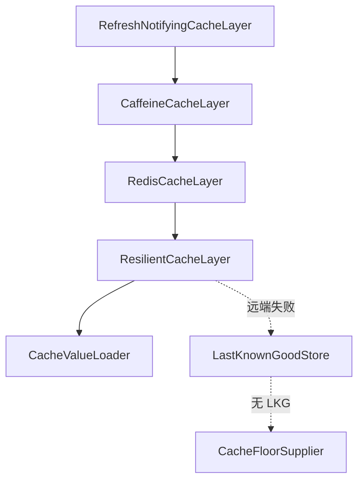

# Ingot Layered Cache

统一分层缓存框架 — 把「L1 Caffeine → L2 Redis → Resilient(remote → LKG → 本地地板) → Loader」抽象为泛型装饰器链，供策略、配置、字典等**读多写少、来自远端、故障时不能 fail-open** 的参考数据使用。

## 适用范围

| 适用 | 不适用 |
|---|---|
| 安全策略快照、凭证规则、字典项、租户参数等远端参考数据 | 实体 CRUD 的 `@Cacheable` 缓存（由 `InRedisCacheManager` 承担） |
| 需要 LKG / Nacos 地板降级的只读路径 | 写路径、会话、计数器等 |
| 编译产物（`Pattern`、`PathPattern`）需留本机的场景 | 纯本地无版本源、且不需要跨节点失效的简单缓存 |

详细契约见 [specs/changes/active/20260730-framework-layered-cache/DESIGN.md](../../specs/changes/active/20260730-framework-layered-cache/DESIGN.md)；接入时可配合 [.agents/skills/layered-cache/SKILL.md](../../.agents/skills/layered-cache/SKILL.md)。

---

## 快速开始

### 1. 添加依赖

```gradle
dependencies {
    implementation project(ingot.framework_cache)
}
```

Redis 与 Actuator 在框架内为 `compileOnly`，消费模块若需要 L2/LKG 应自行引入 `spring-boot-starter-data-redis`；Actuator 可选，用于汇总端点。

### 2. 实现 Loader（必填）

```java
public class FeignPolicySnapshotFetcher implements CacheValueLoader<String, SecurityPolicySnapshotVO> {

    private final RemoteSecurityPolicyService remoteService;

    @Override
    public SecurityPolicySnapshotVO load(String key) {
        R<SecurityPolicySnapshotVO> response = remoteService.snapshot();
        if (response == null || !response.isSuccess()) {
            // 远端不可用 → 抛 RemoteUnavailableException（或其子类）
            throw new PolicyRemoteUnavailableException("...");
        }
        // 远端成功但 data 为空 → 合法空，直接返回，会刷新 LKG，不触发降级
        return response.getData() != null ? response.getData() : new SecurityPolicySnapshotVO();
    }
}
```

### 3. 映射配置并组装

框架**不定义** `@ConfigurationProperties`，配置键归属消费模块。把现有 Properties 映射为 `LayeredCacheSettings`，再用 `LayeredCacheBuilder` 装配：

```java
@Bean
public LayeredCache<String, SecurityPolicySnapshotVO> securityPolicySnapshotCache(
        FeignPolicySnapshotFetcher loader,
        LocalPolicyFloorSupplier floorSupplier,
        CacheSourceHolder sourceHolder,
        MyModuleProperties properties,
        ObjectProvider<StringRedisTemplate> redisProvider,
        ObjectProvider<ObjectMapper> objectMapperProvider,
        ObjectProvider<LayeredCacheRegistry> registryProvider) {

    LayeredCacheSettings settings = LayeredCacheSettings.builder()
            .l1Enabled(properties.getCache().isL1Enabled())
            .l1Ttl(properties.getCache().getL1Ttl())
            .l2Enabled(properties.getCache().isL2Enabled())
            .l2Ttl(properties.getCache().getL2Ttl())
            .resilienceEnabled(properties.isResilienceEnabled())
            .localFloorEnabled(properties.isLocalFloorEnabled())
            .build();

    return LayeredCacheBuilder.<String, SecurityPolicySnapshotVO>named("security-policy-snapshot")
            .loader(loader)
            .settings(settings)
            .emptyValue(SecurityPolicySnapshotVO::new)
            .sourceHolder(sourceHolder)
            .resilientSingleKey(
                    redisProvider.getIfAvailable(),
                    objectMapperProvider.getIfAvailable(),
                    new TypeReference<>() {},
                    properties.getLkgRedisKey(),
                    floorSupplier)
            .l2SingleKey(
                    redisProvider.getIfAvailable(),
                    objectMapperProvider.getIfAvailable(),
                    new TypeReference<>() {},
                    properties.getCache().getL2RedisKey())
            .registry(registryProvider.getIfAvailable())
            .build();
}
```

### 4. 使用缓存

```java
SecurityPolicySnapshotVO vo = cache.get("all");
cache.evictAll();   // 清 L1 + L2，不清 LKG
```

---

## 分层结构

装饰器链自外向内固定为：

```
刷新通知（可选） → L1 Caffeine → L2 Redis（可选） → Resilient（可选） → Loader
```



**读路径**：`get(key)` 逐层穿透，非空则回填上层。

**写路径**：`evict` / `evictAll` 只清 L1 与 L2；LKG 独立 key、无 TTL、不随失效清除。

**Resilient 位于最内侧**是故意的：降级值因此受上层 TTL 约束，远端恢复后会在 TTL 到期时自动重试，无需依赖失效广播。

任一可选层缺省（开关关闭、Redis 不可用、未配置）时直接跳过，链路结构保持完整。

---

## 核心 API

### SPI

| 接口 | 职责 |
|---|---|
| `LayeredCache<K, V>` | 统一读写口：`get` / `evict` / `evictAll` / `name` |
| `CacheValueLoader<K, V>` | 最内层加载器（Feign / DB） |
| `CacheFloorSupplier<K, V>` | Nacos 等本地地板；必须返回非 null 基线 |
| `RemoteUnavailableException` | 远端不可用信号；合法空**不得**抛此异常 |

### 装配

| 类 | 职责 |
|---|---|
| `LayeredCacheSettings` | 各层调参 POJO，由消费模块 Properties 映射 |
| `LayeredCacheBuilder` | 流式装配，可选层缺省即跳过 |
| `CacheSourceHolder` | 当前来源（REMOTE / LAST_KNOWN_GOOD / LOCAL_FLOOR）与降级计数 |
| `LayeredCacheRegistry` | 汇总已注册实例，供 Actuator |
| `LayeredCacheCoordinator<E, D>` | 订阅 `InvalidationBus`，按域分发 `evictAll` |
| `CacheRefreshPublisher<V>` | 缓存值变化时的回调中介 |

### 派生缓存

| 类 | 适用场景 |
|---|---|
| `VersionedDerivedCache<S, D>` | remote 模式；失效键为 `SnapshotVersion(source, version)` |
| `LazyDerivedCache<D>` | local 模式；无外部版本源，仅 `evictAll` 后重编译 |

---

## 接入模式

### 单 key 全量快照

credential、gateway 策略快照等场景：传固定 key（如 `"all"`）。

```java
LayeredCacheBuilder.<String, List<CredentialPolicyConfigVO>>named("credential")
        .loader(remoteLoader)
        .settings(settings)
        .cacheable(v -> v != null && !v.isEmpty())
        .emptyValue(List::of)
        .resilientSingleKey(redisTemplate, objectMapper, TYPE, lkgKey, floorSupplier)
        .l2SingleKey(redisTemplate, objectMapper, TYPE, "in:credential:configs:all")
        .build();
```

### 多 key 按实体分存

dict 等场景：业务 key 映射到 `前缀 + key`。

```java
LayeredCacheBuilder.<String, List<DictItem>>named("dict")
        .loader(remoteLoader)
        .settings(settings)
        .cacheable(v -> v != null && !v.isEmpty())
        .emptyValue(List::of)
        .l2MultiKey(redisTemplate, objectMapper, TYPE, "in:dict:items:")
        .build();

// 精确失效
cache.evict("user_status");
```

| L2 辅助方法 | 场景 | `evictAll` 行为 |
|---|---|---|
| `l2SingleKey` | 单一聚合快照 | 直接 DEL 一个 key |
| `l2MultiKey` | 按业务 key 分存 | 前缀 SCAN + DEL |

L2 与 LKG **必须是两个独立 Redis key**：L2 有 TTL 且随失效清除，LKG 无 TTL 且不随失效清除。

---

## 派生编译缓存

原始 VO 可 JSON 进 L2，但 `Pattern`、`PathPattern`、预建索引等**不可序列化**，只留本机。

### remote：VersionedDerivedCache

失效键必须是 `(来源, version)` 二元组，不能只看 version 数值——地板快照 version 恒为 0，降级/恢复时会出现回退或相等。

```java
VersionedDerivedCache<SecurityPolicySnapshotVO, RateLimitSnapshot> derived =
        new VersionedDerivedCache<>(
                fetcher::versionOf,
                vo -> SnapshotAssembler.toRateLimitSnapshot(vo));

RateLimitSnapshot snapshot = derived.get(fetcher.fetch());
```

`versionOf` 典型实现：

```java
public SnapshotVersion versionOf(SecurityPolicySnapshotVO vo) {
    return new SnapshotVersion(sourceHolder.current(), vo.getVersion());
}
```

### local：LazyDerivedCache

数据源来自 `Properties`、没有可比对的外部版本号时使用：

```java
LazyDerivedCache<RateLimitSnapshot> cache = new LazyDerivedCache<>(this::compile);

@Override
public RateLimitSnapshot getSnapshot() {
    return cache.get();
}

@Override
public void evictAll() {
    cache.evictAll();
}
```

---

## 跨节点失效

写侧（provider）：

```java
cache.evictAll();          // 必须先清本地，广播方收不到自己的事件
invalidationBus.publish(event);
```

读侧（其他节点）：

```java
@Bean
public LayeredCacheCoordinator<SecurityPolicyInvalidationEvent, SecurityPolicyDomain> coordinator(
        InvalidationBus bus) {
    return new LayeredCacheCoordinator<>(bus,
            SecurityPolicyInvalidationEvent.class,
            SecurityPolicyInvalidationEvent::getDomain,
            SecurityPolicyDomain.ALL);
}

// 注册 evictor（同域可注册多个，串行执行，单个异常不中断其余）
coordinator.register(SecurityPolicyDomain.RATE_LIMIT_RULE, cache::evictAll);
```

若共享层与派生层分离，各域 `evictAll()` 应同时清两层，避免 `reloadRules()` 之类「先 evict 再立即读」的路径拿到旧快照。

---

## 无读路径的消费者

Sentinel 读的是 `GatewayRuleManager` 里已加载的规则，请求路径不会触发缓存 TTL 刷新。共享快照被其他域流量刷新后，需要通知 Sentinel 按需重载。

```java
// 装配时（仅单 key 共享快照场景）
.refreshPublisher(refreshPublisher)

// 消费方
refreshPublisher.addListener(vo -> reloadIfChanged());
```

`RefreshNotifyingCacheLayer` 位于链最外层：监听器回调里回读缓存时必然命中 L1，不会把一次加载放大成两次。它用引用比对去重，仅适用于单 key 场景。

---

## 可观测性

| 入口 | 说明 |
|---|---|
| `CacheSourceHolder` | 当前来源、降级次数、`lastDegradeAt`；只在 Resilient 层更新，L1/L2 命中不改来源 |
| `GET /actuator/layeredcache` | 框架汇总端点，展示所有已注册实例的层次开关 |
| 消费模块自有 Actuator | 如 `securitypolicy`、`credentialpolicy`；迁移时保留，不替换 |

---

## 必须遵守的语义

违反以下任一条都会重现框架要消除的旧 bug：

1. **Resilient 在最内侧** — 降级值受 L1/L2 TTL 约束，远端恢复后能自动回到新鲜数据。
2. **LKG 不是热缓存** — 独立 Redis key、默认无 TTL、不随 `evictAll` 清除；只在远端成功时写入。
3. **不缓存空值** — 集合类必须 `.cacheable(v -> v != null && !v.isEmpty())`；读到 stale empty 应删 key 并穿透。
4. **远端不可用 ≠ 合法空** — 只有前者抛 `RemoteUnavailableException`。
5. **地板 fail-closed** — 无 LKG 且地板关闭时抛异常，不返回空。
6. **广播方先自清** — `InvalidationBus` 按 origin 过滤，写侧必须先 `evictAll()`。
7. **TTL 不可省** — Pub/Sub 无持久化，漏消息时 L1 TTL 是收敛兜底。

---

## 仓库内参考实现

| 模块 | 文件 | 说明 |
|---|---|---|
| gateway-rule-client | `config/GatewayRuleClientAutoConfiguration` | 共享快照 `LayeredCache` 完整装配 |
| gateway-rule-client | `internal/FeignPolicySnapshotFetcher` | `CacheValueLoader` |
| gateway-rule-client | `internal/LocalPolicyFloorSupplier` | `CacheFloorSupplier` |
| gateway-rule-client | `ratelimit/internal/RemoteRateLimitRuleService` | `VersionedDerivedCache` |
| gateway-rule-client | `ratelimit/internal/LocalRateLimitRuleService` | `LazyDerivedCache` |
| ingot-gateway | `security/SentinelGatewayConfiguration` | `CacheRefreshPublisher` 订阅 |
| gateway-rule-client | `config/SharedSnapshotCacheTest` | 冷启动 Feign 去重、失效后重拉 |

credential、LoginFailure、dict 的迁移见 change [20260730-framework-layered-cache](../../specs/changes/active/20260730-framework-layered-cache/README.md) Phase 03–04。

---

## 测试清单

接入新缓存时，至少覆盖：

- [ ] L1 / L2 / Resilient 各开关组合下链路完整
- [ ] 空值不写入 L1/L2；stale empty 读后删 key 并穿透
- [ ] 合法空远端响应刷新 LKG，不 increment 降级计数
- [ ] `evictAll` 清 L1/L2 但 LKG 仍可读
- [ ] 地板关闭 + 无 LKG → 抛异常而非返回空
- [ ] `VersionedDerivedCache`：version 回退、同 version 不同 source
- [ ] 多 key `evictAll` 只清本前缀
- [ ] `StringRedisTemplate` 为 null 时 L2/LKG 静默 no-op

框架自身单测位于 `src/test/java/com/ingot/framework/cache/`。
