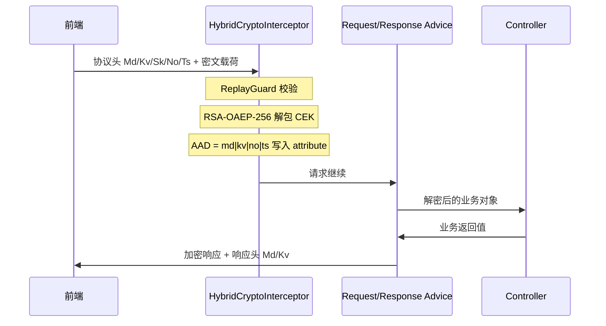

# ingot-security-crypto

应用层加解密模块，为 Spring MVC 端点提供声明式请求解密与响应加密能力。

**当前默认算法为信封加密（HYBRID）**：前端每请求生成临时 CEK（AES-256-GCM），用服务端 RSA 公钥包裹传输；服务端解包后解密请求，并复用同一 CEK 加密响应。前端无需保存长期对称密钥。

> 应用层加密是对 HTTPS 的补充，**生产环境仍必须启用 HTTPS**。  
> 前端对接协议详见：[frontend-integration.md](../../../specs/changes/active/20260707-security-crypto-hybrid/frontend-integration.md)

---

## 1. 引入模块

在业务服务的 `build.gradle` 中添加依赖：

```gradle
dependencies {
    implementation project(ingot.framework_security_crypto)
}
```

模块通过 Spring Boot 自动配置（`META-INF/spring/org.springframework.boot.autoconfigure.AutoConfiguration.imports`）注册以下组件，**无需手动 `@Import`**：

| 组件 | 职责 |
|---|---|
| `HybridCryptoInterceptor` | 解析协议头、防重放、解包 CEK、写入上下文、回带响应头 |
| `InDecryptRequestBodyAdvice` | 整体请求体解密（`@InDecrypt`） |
| `InEncryptResponseBodyAdvice` | 整体响应体加密（`@InEncrypt`） |
| `InDecryptParamResolver` | URL 查询参数解密（参数上 `@InDecrypt`） |
| `CryptoSerializer` / `CryptoDeserializer` | 字段级加解密（`@InEncryptField` / `@InDecryptField`） |
| `HybridPublicKeyController` | 公钥下发 `GET /crypto/public-keys`（可关闭） |

**依赖要求：**

- Spring Web MVC（Servlet）
- Redis（供 `ingot-security-replay` 做 nonce 去重；未配置 `ReplayGuard` 时跳过防重放）

---

## 2. 配置说明

配置前缀：`ingot.crypto`（`@RefreshScope`，支持配置中心热刷新密钥）。

### 2.1 完整配置示例

```yaml
ingot:
  crypto:
    # 请求/响应体中密文载荷的 JSON 键名（整体加解密时使用）
    body-key: data
    # URL 查询参数中密文载荷的键名（GET 场景）
    param-key: data

    # 传统 AES/RSA 模式的静态密钥（HYBRID 不使用此项）
    secret-keys:
      default: "<Base64 对称密钥或 RSA 私钥>"

    hybrid:
      # 响应包装：DATA_ONLY=仅加密 R.data；FULL=整个响应体加密
      response-wrap: DATA_ONLY
      # 当前活跃密钥版本，回写在响应头 X-In-Crypto-Kv
      active-kid: k-2026-07
      # 协议头 Md 的取值，标识信封加密 v1
      mode-value: h1
      # 是否暴露 GET /crypto/public-keys 端点
      public-key-endpoint-enabled: true
      # 防重放命名空间（传给 ReplayGuard）
      replay-namespace: crypto

      # 协议头名称（可整体重命名以隐藏特征）
      headers:
        mode: X-In-Crypto-Md
        kid: X-In-Crypto-Kv
        key: X-In-Crypto-Sk
        nonce: X-In-Crypto-No
        timestamp: X-In-Crypto-Ts
        alg: X-In-Crypto-Al
        enc: X-In-Crypto-En

      # 多版本 RSA 密钥对，key 为 kid；轮换时新旧 kid 并存
      key-pairs:
        k-2026-07:
          public-key: "<X509 DER Base64>"
          private-key: "<PKCS8 DER Base64>"
        k-2026-01:
          public-key: "<历史公钥，轮换过渡期保留>"
          private-key: "<历史私钥>"

  # 防重放（ingot-security-replay，crypto 模块自动依赖）
  replay:
    enabled: true
    window: 5m          # nonce 去重窗口
    clock-skew: 5m      # 时间戳允许偏移
    key-prefix: "replay:"
    fail-open: false    # Redis 不可用时：false=拒绝，true=放行并告警
```

### 2.2 配置项速查

| 配置项 | 默认值 | 说明 |
|---|---|---|
| `ingot.crypto.body-key` | `data` | 整体加解密时，从请求/响应 JSON 中取密文的键名 |
| `ingot.crypto.param-key` | `data` | GET 请求 URL 参数中取密文的键名 |
| `ingot.crypto.secret-keys` | — | 传统 AES/RSA 静态密钥映射，`secretKey` 注解值作 key |
| `ingot.crypto.hybrid.response-wrap` | `DATA_ONLY` | `DATA_ONLY` / `FULL` |
| `ingot.crypto.hybrid.active-kid` | — | 活跃 kid，须存在于 `key-pairs` |
| `ingot.crypto.hybrid.key-pairs` | `{}` | kid → `{publicKey, privateKey}` |
| `ingot.crypto.hybrid.mode-value` | `h1` | 协议头 Md 期望值 |
| `ingot.crypto.hybrid.public-key-endpoint-enabled` | `true` | 是否注册公钥端点 |
| `ingot.crypto.hybrid.replay-namespace` | `crypto` | 防重放隔离命名空间 |
| `ingot.crypto.hybrid.headers.*` | 见示例 | 七个协议头名称 |
| `ingot.replay.enabled` | `true` | 是否启用防重放 |
| `ingot.replay.window` | `5m` | nonce TTL / 去重窗口 |
| `ingot.replay.clock-skew` | `5m` | 时间戳校验偏移 |
| `ingot.replay.fail-open` | `false` | 存储不可用降级策略 |

### 2.3 生成 RSA 密钥对

模块根目录提供脚本 `create-rsa-keypair.sh`：

```bash
# 生成 PEM 文件
openssl genrsa -out hybrid-private.pem 2048
openssl rsa -in hybrid-private.pem -pubout -out hybrid-public.pem

# 转为配置所需 Base64（单行）
openssl rsa -in hybrid-public.pem -pubin -outform DER | base64 | tr -d '\n'   # public-key
openssl pkcs8 -topk8 -inform PEM -outform DER -in hybrid-private.pem -nocrypt | base64 | tr -d '\n'  # private-key
```

**注意：** 私钥仅配置在服务端，通过配置中心或环境变量注入，勿提交到代码仓库。

### 2.4 网关与公钥端点

- 公钥端点：`GET /crypto/public-keys`，返回 `[{kid, alg, publicKey, active}]`
- 须在网关将该路径加入**匿名放行白名单**，供前端初始化拉取公钥
- 建议部署在对外可访问的认证/BFF 服务（如 `ingot-bff`）

---

## 3. 注解体系

各注解职责单一，按场景组合使用（`@InDecrypt` / `@InEncrypt` / 字段注解的 `value()` **默认均为 `HYBRID`**，可省略显式声明）：

| 注解 | 作用域 | 职责 |
|---|---|---|
| `@InCryptoHybridContext` | 类 / 方法 | **信封加密唯一入口**：建立 CEK/AAD 上下文（拦截器） |
| `@InDecrypt` | 类 / 方法 / 参数 | 整体请求体解密（Advice）；URL 参数解密（标在参数上，GET） |
| `@InEncrypt` | 类 / 方法 | 整体响应体加密（Advice） |
| `@InDecryptField` | 字段 | 字段级解密（Jackson 反序列化） |
| `@InEncryptField` | 字段 | 字段级加密（Jackson 序列化） |

**关键约束：**

- `@InCryptoHybridContext` 只标在**控制器类或处理方法**上，标在 DTO/VO 上无效
- 标注 `@InCryptoHybridContext` 的端点**必须携带完整协议头**，缺头返回 `crypto_header_missing`
- **同一端点不可混用**整体模式（`@InDecrypt`/`@InEncrypt`）与字段级模式（`@InDecryptField`/`@InEncryptField`）
- 字段级端点**不要**再加 `@InDecrypt` / `@InEncrypt`，避免与 Jackson 序列化器重复处理
- HYBRID 字段级的 `secretKey` 无意义（CEK 来自请求上下文）
- Controller 入参直接接业务 DTO；Advice 解密后 JSON 已是明文业务结构，**不要**再包 `{"data":...}`

---

## 4. HYBRID 工作原理



**统一约定（所有粒度共用）：**

- 密文格式：`base64(IV[12] ‖ 密文 ‖ GCM Tag[16])`
- 内容算法：AES-256-GCM（`A256GCM`）
- 密钥包裹：RSA-OAEP-256（`RSA-OAEP-256`）
- AAD：`"<Md>|<Kv>|<No>|<Ts>"`（UTF-8），请求加密与响应解密复用同一 AAD
- 响应头：拦截器统一回带 `X-In-Crypto-Md: h1` 与 `X-In-Crypto-Kv: <activeKid>`

---

## 5. HYBRID 请求解密（3 种粒度）

前端加密、后端解密。三种粒度**互斥**，按接口选定一种。

### 5.1 整体请求体（POST，默认常用）

**链路上行：** `{"data": "<密文>"}`（`body-key` 可自定义）  
**密文内容：** 整段业务 JSON 的 AES-GCM 加密结果

**后端注解：**

```java
@InCryptoHybridContext
@InDecrypt                    // 默认 HYBRID，等价于 @InDecrypt(CryptoType.HYBRID)
@PostMapping("/order")
public R<OrderVO> create(@RequestBody OrderDTO dto) { ... }
```

**配置要点：**

| 配置项 | 值 | 说明 |
|---|---|---|
| `body-key` | `data`（默认） | Advice 从 JSON 取密文的键 |
| `hybrid.key-pairs` | 必填 | 解包 CEK 所需私钥 |

**处理链路：** 拦截器解包 CEK → `InDecryptRequestBodyAdvice` 按 `body-key` 取密文 → GCM 解密 → Jackson 反序列化为 `OrderDTO`。

---

### 5.2 URL 查询参数（GET）

**链路上行：** `GET /query?data=<密文>`（`param-key` 可自定义，需 URL 编码）  
**密文内容：** 整段业务 JSON 的 AES-GCM 加密结果

**后端注解：**

```java
@InCryptoHybridContext
@GetMapping("/query")
public R<?> query(@InDecrypt QueryDTO query) { ... }
// GET /query?data=<密文> + X-In-Crypto-* 协议头
```

**配置要点：**

| 配置项 | 值 | 说明 |
|---|---|---|
| `param-key` | `data`（默认） | 从 query 取密文的键 |
| `hybrid.key-pairs` | 必填 | 同 POST |

**处理链路：** 拦截器解包 CEK → `InDecryptParamResolver` 读 `param-key` → 解密 → 反序列化为参数类型。

---

### 5.3 字段级请求（POST）

**链路上行：** 正常业务 JSON，仅约定字段的值为密文字符串  
**示例：** `{"username":"<密文>","password":"<密文>","tenantId":"1"}`（`tenantId` 明文）

**后端注解：**

```java
@InCryptoHybridContext
@PostMapping("/login")
public R<?> login(@RequestBody LoginDTO dto) { ... }

@Data
public static class LoginDTO {
    @InDecryptField
    private String username;
    @InDecryptField
    private String password;
    private String tenantId;   // 明文
}
```

**配置要点：**

| 配置项 | 说明 |
|---|---|
| `body-key` | **不使用**（请求体不再包 `{"data":...}`） |
| 方法上 | **不加** `@InDecrypt` |

**处理链路：** 拦截器解包 CEK → Jackson `CryptoDeserializer` 对标注字段逐字段 GCM 解密（每字段独立 IV）。

---

### 5.4 请求方向配置对照表

| 粒度 | 必需注解 | 可选注解 | 请求体/参数形态 | 相关配置 |
|---|---|---|---|---|
| 整体 POST | `@InCryptoHybridContext` + `@InDecrypt` | — | `{"<body-key>":"<密文>"}` | `body-key` |
| URL GET | `@InCryptoHybridContext` + 参数 `@InDecrypt` | `@InEncrypt`（若需加密响应） | `?<param-key>=<密文>` | `param-key` |
| 字段级 POST | `@InCryptoHybridContext` + 字段 `@InDecryptField` | — | 正常 JSON，指定字段为密文 | 无 body 包装 |

---

## 6. HYBRID 响应加密（3 种粒度）

后端加密、前端解密。可与请求粒度**自由组合**（例如：字段级请求 + `DATA_ONLY` 响应）。

### 6.1 DATA_ONLY（默认）

**链路下行：** `{"code":"0","message":"OK","data":"<密文>"}`  
**密文内容：** 仅 `R.data` 业务数据的 AES-GCM 加密结果；`code` / `message` 保持明文，便于前端判断错误。

**后端注解：**

```java
@InCryptoHybridContext
@InEncrypt
@PostMapping("/order")
public R<OrderVO> create(@RequestBody OrderDTO dto) {
    return R.ok(orderVO);
}
```

**配置要点：**

| 配置项 | 值 | 说明 |
|---|---|---|
| `hybrid.response-wrap` | `DATA_ONLY`（**默认**） | 仅加密 `R.data` |
| 返回值类型 | 须为 `R<?>` | 非 `R` 结构时退化为整体加密 |

**前提：** 本次请求须已通过拦截器建立 CEK/AAD 上下文（客户端携带完整协议头）。

---

### 6.2 FULL（整体响应）

**链路下行：** 整段响应体为一个密文字符串（非 JSON 包装）  
**密文内容：** 完整 `R` JSON 的 AES-GCM 加密结果

**后端注解：**

```java
@InCryptoHybridContext
@InEncrypt
@PostMapping("/export")
public R<ExportVO> export() { ... }
```

**配置要点：**

| 配置项 | 值 | 说明 |
|---|---|---|
| `hybrid.response-wrap` | `FULL` | 整体加密，忽略 `R` 结构拆分 |

---

### 6.3 字段级响应

**链路下行：** 正常 `R` JSON，仅约定字段的值为密文字符串  
**示例：** `{"code":"0","message":"OK","data":{"name":"张三","idCard":"<密文>"}}`

**后端注解：**

```java
@InCryptoHybridContext
@PostMapping("/profile")
public R<UserVO> profile() { ... }

@Data
public static class UserVO {
    private String name;
    @InEncryptField
    private String idCard;
}
```

**配置要点：**

| 配置项 | 说明 |
|---|---|
| `hybrid.response-wrap` | **不生效**（无 `@InEncrypt`，不走 ResponseBodyAdvice） |
| 方法上 | **不加** `@InEncrypt` |
| 响应头 | 拦截器仍回带 `Md` / `Kv`，前端据此判断字段已加密 |

**处理链路：** Jackson `CryptoSerializer` 对标注字段逐字段 GCM 加密。

---

### 6.4 响应方向配置对照表

| 粒度 | 必需注解 | 响应体形态 | 关键配置 | 响应头 |
|---|---|---|---|---|
| `DATA_ONLY` | `@InCryptoHybridContext` + `@InEncrypt` | `R{code,message,data:密文}` | `response-wrap=DATA_ONLY` | `Md`, `Kv` |
| `FULL` | `@InCryptoHybridContext` + `@InEncrypt` | 整段密文 | `response-wrap=FULL` | `Md`, `Kv` |
| 字段级 | `@InCryptoHybridContext` + 字段 `@InEncryptField` | 正常 JSON，指定字段为密文 | 无 | `Md`, `Kv` |

---

## 7. 常见组合示例

### 7.1 双向整体加解密（POST，生产最常用）

```java
@InCryptoHybridContext
@InDecrypt
@InEncrypt
@PostMapping("/order")
public R<OrderVO> create(@RequestBody OrderDTO dto) { ... }
```

```yaml
ingot:
  crypto:
    hybrid:
      response-wrap: DATA_ONLY
```

- 请求：`{"data":"<密文>"}`  
- 响应：`{"code":"0","message":"OK","data":"<密文>"}`

---

### 7.2 仅解密请求（登录等）

```java
@InCryptoHybridContext
@InDecrypt
@PostMapping("/login")
public R<?> login(@RequestBody LoginDTO dto) { ... }
```

响应不加密，不加 `@InEncrypt`。未标注 `@InEncrypt` 时响应体保持明文（响应头仍回带 `Md`/`Kv` 供前端感知密钥版本）。

---

### 7.3 仅加密响应（GET 查询）

```java
@InCryptoHybridContext
@InEncrypt
@GetMapping("/balance")
public R<BalanceVO> balance() { ... }
```

GET 无请求体，拦截器仍解析协议头建立 CEK；响应按 `response-wrap` 加密。

---

### 7.4 字段级双向（敏感字段）

```java
@InCryptoHybridContext
@PostMapping("/login")
public R<UserVO> login(@RequestBody LoginDTO dto) { ... }

@Data
public class LoginDTO {
    @InDecryptField
    private String username;
    @InDecryptField
    private String password;
}

@Data
public class UserVO {
    @InEncryptField
    private String idCard;
}
```

- 请求/响应均为正常 JSON，仅标注字段为密文
- 方法上**不加** `@InDecrypt` / `@InEncrypt`

---

### 7.5 GET 参数解密 + 响应加密

```java
@InCryptoHybridContext
@InEncrypt
@GetMapping("/search")
public R<List<ItemVO>> search(@InDecrypt SearchQuery query) { ... }
```

- 请求：`GET /search?data=<密文>` + 协议头  
- 响应：按 `response-wrap` 加密

---

## 8. 密钥轮换

1. 在配置中心新增 kid 密钥对，更新 `active-kid`
2. 保留旧 kid 一段时间（新旧并存），避免进行中的请求失败
3. `HybridKeyManager` 监听 `RefreshScopeRefreshedEvent` 自动重载密钥快照
4. 响应头 `X-In-Crypto-Kv` 回传当前 `active-kid`，前端感知后异步刷新公钥缓存
5. 客户端使用已下线 kid 时收到 `crypto_kid_unknown`，应重新拉取公钥并重试

---

## 9. 传统模式（AES / RSA）

未标记 `@InCryptoHybridContext` 的端点不走信封加密。显式指定算法类型即可：

```java
@InDecrypt(CryptoType.AES)
@InEncrypt(CryptoType.AES)
@PostMapping("/legacy")
public R<?> legacy(@RequestBody Map<String, Object> body) { ... }
```

| 类型 | 说明 | 密钥来源 |
|---|---|---|
| `AES` | AES-CBC | `ingot.crypto.secret-keys` 或注解 `secretKey` |
| `AES_GCM` | AES-GCM | 同上 |
| `RSA` | RSA 非对称 | 同上（私钥解密 / 公钥加密） |

传统模式同样支持 `body-key` 包装：`{"data":"<密文>"}`；`body-key` 为空时对整个 body 加解密。

---

## 10. 错误码

均以明文 `R.code` 返回（`DATA_ONLY` 模式下 `code`/`message` 不加密）：

| code | 含义 |
|---|---|
| `crypto_header_missing` | 缺少协议头 |
| `crypto_kid_unknown` | kid 未知或已失效 |
| `crypto_key_unwrap_error` | CEK 解包失败 |
| `crypto_integrity_error` | AAD/密文完整性校验失败 |
| `crypto_alg_unsupported` | 算法不支持 |
| `replay_ts_expired` | 时间戳超窗 |
| `replay_nonce_dup` | nonce 重复 |
| `crypto_decrypt_error` | 解密失败（传统模式） |
| `crypto_config` | 加解密配置异常 |

---

## 11. 开发与联调检查清单

- [ ] `ingot.crypto.hybrid.key-pairs` 与 `active-kid` 已配置
- [ ] Redis 可用（或明确接受 `fail-open` 风险）
- [ ] 网关放行 `GET /crypto/public-keys`
- [ ] 端点注解组合正确（整体 vs 字段级不混用）
- [ ] Controller 入参为业务 DTO，非密文包装类型
- [ ] 端点标注 `@InCryptoHybridContext` 时，前端必须携带完整协议头
- [ ] `response-wrap` 与前端解密逻辑一致（`DATA_ONLY` / `FULL` / 字段级）
