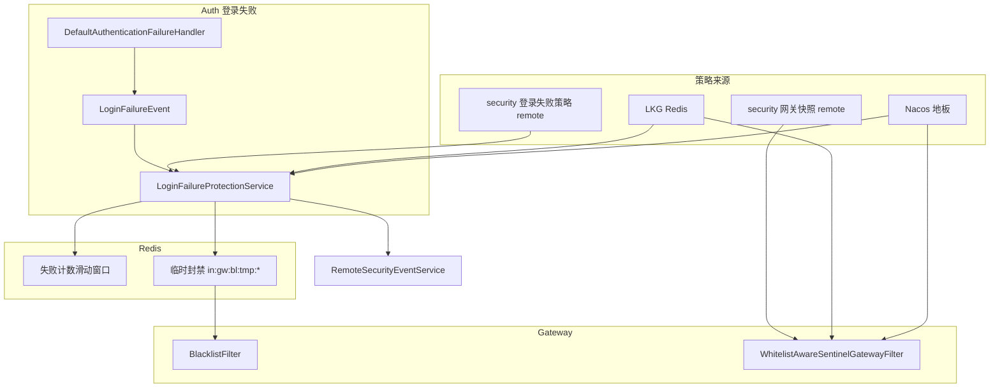

# Design

## 方案摘要

本 change 分三块，共用一次 SDD 变更、分 Phase 实施：

**A. Gateway Policy Resilience**：改造 `ingot-gateway-rule-client` 的 remote 快照链路，引入 `remote(新鲜) → LKG(Redis) → Nacos 地板` 降级阶梯，镜像 [20260717-security-credential-resilience](../../archive/2026/20260717-security-credential-resilience/DESIGN.md) 语义。

**B. Execution Closure**：启用 SDK 四域（限流/黑白名单/违规升级，不含 challenge）、DB 种子规则、Nacos 三环境 remote 配置；**统一 Sentinel 为唯一网关限流引擎**，迁移并移除旧 `RequestRateLimiter`。

**C. Login Failure Access Protection + 安全中心 remote 策略**：新建 `ingot-security-access` 模块实现 §3.1 四维度计数与封禁；**P0 完整交付**安全中心策略表、Platform CRUD、Inner Feign、Auth 侧 `ResilientLoginFailurePolicyLoader`（非 L2 lockout 式「仅土台」）。



### 关键设计决策（T0 待审阅）

| ID | 议题 | 推荐决议 |
|----|------|----------|
| D1 | 登录失败保护模块落点 | 新建 `ingot-security-access-core` + `ingot-security-access-adapter`；Auth/PMS/Member 依赖 adapter |
| D2 | 跨服务临时封禁 | Auth 写 Redis，与 gateway `TempBlockStore` **共用 key 前缀** `in:gw:bl:tmp:{keyType}:{keyValue}`，无需 Feign 调网关 |
| D3 | 账号+IP 达阈值动作 | **仅临时封禁 IP**；不叠加 L2 账号 lockout |
| D4 | Client 维度扩展 | DB `gateway_ip_list.key_type` 新增 `CL`；`RateLimitDimension.CLIENT` + Header 来源 OAuth2 `client_id`（网关侧从 JWT 或 query 解析，待实现细节） |
| D5 | 登录失败策略 remote | **P0 完整 remote**（非 account lockout 土台）：`login_failure_protection_policy` 表 + Platform CRUD + `RemoteLoginFailurePolicyService` Inner Feign + `RemoteLoginFailurePolicyLoader` + `ResilientLoginFailurePolicyLoader`（LKG + Nacos 地板）+ `SecurityPolicyDomain.LOGIN_FAILURE_PROTECTION` 失效；`ingot.security.access.mode=local\|remote` |
| D6 | LKG 存储 | **Redis only**，无进程内副本（对齐 credential D-L） |
| D7 | 地板禁用且无 LKG | `local-floor-enabled=false` 且无 LKG 时 **向上抛错 / Sentinel 不加载空规则**（fail-closed），不 silent fail-open |
| D8 | migration 编号 | `011_security_access_protection_seed.sql` |
| D9 | RequestRateLimiter 迁移 | SDK 等价规则 seed + E2E 通过后 **删除** 三路由 `RequestRateLimiter` filter |
| D10 | `invalid_client` 计数 | **不计入** Client 失败保护（仅 password grant 带 username 的失败）；`invalid_client` 可走独立 ops 监控 |
| D11 | 前端 API 文档 | 交付 [PLATFORM-API.md](./PLATFORM-API.md) 与 Controller/Swagger 一致，作为前端 SoT |

## 数据模型与接口

### 模块职责

| 模块 | 职责 |
|------|------|
| `ingot-security-access-core` | 领域模型、`LoginFailurePolicy`、`LoginFailureProtectionService`、滑动窗口计数、`LoginFailurePolicyLoader` seam |
| `ingot-security-access-adapter` | Redis 计数/封禁、`RemoteLoginFailurePolicyLoader`、`ResilientLoginFailurePolicyLoader`、`LoginFailureLkgStore`、`LocalLoginFailureFloorSupplier`、AutoConfiguration |
| `ingot-security-provider` | `login_failure_protection_policy` 表、Mapper、AdminService、`LoginFailureProtectionAPI`（Platform）、`InnerLoginFailurePolicyAPI`（Inner） |
| `ingot-security-api` | `LoginFailureProtectionPolicyVO`、`RemoteLoginFailurePolicyService` Feign、`SecurityPolicyDomain.LOGIN_FAILURE_PROTECTION` |

**配置前缀**：`ingot.security.access`

```yaml
ingot:
  security:
    access:
      mode: remote                   # local | remote；生产默认 remote
      policy:
        local-floor-enabled: true    # remote 失败且无 LKG 时是否落 Nacos 地板
      login-failure:                 # mode=local 时生效；mode=remote 时作 Nacos 地板源
        ip:
          enabled: true
          max-attempts: 50
          window-minutes: 1
          block-ttl-sec: 3600
        device:
          enabled: true
          max-attempts: 30
          window-minutes: 5
          block-ttl-sec: 1800
        client:
          enabled: true
          max-attempts: 100
          window-minutes: 5
          block-ttl-sec: 3600
        account-ip:
          enabled: true
          max-attempts: 10
          window-minutes: 5
          block-ttl-sec: 3600
```

### 安全中心：登录失败策略表

**表名**：`login_failure_protection_policy`（migration 011 同批 DDL + 四维种子）

| 列 | 类型 | 说明 |
|----|------|------|
| `id` | bigint PK | |
| `dimension` | varchar(16) UK | `IP` / `DEVICE` / `CLIENT` / `ACCOUNT_IP` |
| `enabled` | tinyint | |
| `max_attempts` | int | |
| `window_minutes` | int | |
| `block_ttl_sec` | int | |
| `block_key_type` | char(2) | 写入 TempBlock 的 keyType，默认 IP/DV/CL/IP |
| `remark` | varchar(255) | |
| `created_at` / `updated_at` | timestamp | |

**版本与失效**：任意 PUT 后递增全局 `loginFailurePolicyVersion`（可复用快照 version 或独立计数），发布 `SecurityPolicyInvalidationEvent(LOGIN_FAILURE_PROTECTION)`；Auth 侧 `LoginFailurePolicyCacheCoordinator` 订阅 evict。

### Platform / Inner API

| 面 | 路径 | 说明 |
|----|------|------|
| Platform | `/platform/security/access/login-failure-policies` | CRUD，见 [PLATFORM-API.md](./PLATFORM-API.md) |
| Inner | `GET /inner/security/access/login-failure-policies` | Feign 全量拉取四维策略 |
| Feign | `RemoteLoginFailurePolicyService` | 定义于 `ingot-security-api`，Auth 消费 |

**权限码**（Platform）：`platform:security:access:login-failure:query|update`（本期列表+更新即可，种子预置四行，无物理 DELETE 维度）。

### Auth 侧 Resilient 策略链（镜像凭证，非 stub）

```
LoginFailurePolicyLoader (facade)
  └─ ResilientLoginFailurePolicyLoader
       └─ RemoteLoginFailurePolicyLoader (Feign delegate)
            成功 → 刷新 LoginFailureLkgStore (Redis)
            失败 → LKG → LocalLoginFailureFloorSupplier (Nacos ingot.security.access.login-failure.*)
            地板禁用且无 LKG → 抛错 / 使用内置硬编码安全基线（fail-closed，待 D7 与凭证 D-E 对齐）
```

- **`mode=local`**：仅 `LocalLoginFailurePolicyLoader` 读 `@ConfigurationProperties`，rebinder 热刷新。
- **`mode=remote`**：走 Resilient 链；与 L2 `AccountLockoutPolicyLoader` **独立**，不共用 Feign 接口。
- **Actuator**：`loginfailurepolicy` 端点暴露 `source`（REMOTE/LKG/LOCAL_FLOOR）与降级计数。

| 子模块 | 执行职责 |
|--------|----------|
| `ingot-security-access-core` | `LoginFailureProtectionService`、`TempBlockWriter` 接口 |
| `ingot-security-access-adapter` | Redis 滑动窗口、`TempBlockWriter` 实现、策略 Loader 装配 |

### Auth 事件扩展

**`AuthFailureDTO`** 新增字段：

| 字段 | 来源 |
|------|------|
| `clientId` | `request.getParameter(OAuth2ParameterNames.CLIENT_ID)` |
| `deviceId` | Header `In-Ca-Sig`（`BFF_DEVICE_FINGERPRINT_HEADER`） |

**接线**：`DefaultAuthenticationFailureHandler` 填充 → `LoginFailureEvent` → Auth `LoginFailureAccessListener`（或扩展 `LoginEventListener`）→ `LoginFailureProtectionService.recordFailure(...)`。

登录成功：`LoginSuccessEvent` → `recordSuccess(...)` 清零各维度计数。

### Redis 键设计

| 用途 | Key 模式 | TTL |
|------|----------|-----|
| IP 失败计数 | `in:sec:lf:ip:{ip}` | `window-minutes` |
| 设备失败计数 | `in:sec:lf:dv:{deviceId}` | 同上 |
| Client 失败计数 | `in:sec:lf:cl:{clientId}` | 同上 |
| 账号+IP 计数 | `in:sec:lf:ui-ip:{userType}:{username}:{ip}` | 同上 |
| 临时封禁（与网关共用） | `in:gw:bl:tmp:{keyType}:{keyValue}` | `block-ttl-sec` |

滑动窗口实现：Redis `INCR` + 首次设置 `EXPIRE`，或 Lua 脚本保证原子性（与 `ViolationCounter` 风格一致）。

### DB 种子（migration 011）

**`gateway_endpoint_group`**

| code | name | pattern_list |
|------|------|--------------|
| `login-auth` | 登录认证入口 | `/auth/token/**`, `/bff/auth/login` 等 |
| `api-business` | 业务 API 基线 | `/pms/**`, `/member/**`, `/security/**` |

**`gateway_rate_limit_rule`**（示例，审阅时可调阈值）

| code | group | dimension | qps | burst | interval | 说明 |
|------|-------|-----------|-----|-------|----------|------|
| `login-ip` | login-auth | IP | 1 | 2 | 60 | 登录每 IP 约 1/min（按 interval 语义编译） |
| `pms-ip` | api-business | IP | 200 | 300 | 1 | 替代旧 RequestRateLimiter |
| `member-ip` | api-business | IP | 200 | 300 | 1 | 同上 |
| `security-ip` | api-business | IP | 200 | 300 | 1 | 同上 |

> 具体 qps/burst/interval 编译语义以 `SentinelGatewayConfiguration.buildFlowRule` 为准；种子值须 E2E 校准。

**`gateway_violation_escalation`**：沿用 id=1 默认行（60s / 30 次 / 900s TTL）。

**`login_failure_protection_policy`**：预置四维种子（与 [PLATFORM-API.md](./PLATFORM-API.md) §3.2 默认值一致）。

### 网关 Client 维度扩展（P0，与 Platform 对齐）

- `RateLimitDimension.CLIENT("CL")`：`SentinelGatewayConfiguration.buildFlowRule` 增加 Header 或 attribute 解析。
- `IpKeyType.CLIENT("CL")`：`CompiledIpList` 匹配扩展。
- `ClientIdentity` 增加 `clientId` 字段；`IdentityResolveFilter` 从 OAuth2 参数或 JWT 填充。

### SecurityEventType 扩展

在 `ingot-security-api` 增加 §REQUIREMENTS P0 四种 `LOGIN_FAIL_*_EXCEED`，`event_category=ACCESS`，`extension` 含 `dimension`、`countInWindow`、`ttlSec`、`username`（脱敏可选）。

### Gateway Policy Resilience 组件

| 类 | 模块 | 职责 |
|----|------|------|
| `PolicyRemoteUnavailableException` | gateway-rule-client | 远程失败信号 |
| `ResilientSnapshotFetcher` | gateway-rule-client | 包装 delegate，成功刷新 LKG，失败走 LKG/地板 |
| `PolicyLastKnownGoodStore` | gateway-rule-client | Redis 存 `SecurityPolicySnapshotVO` JSON |
| `LocalPolicyFloorSupplier` | gateway-rule-client | 从各域 `*Properties` 组装最低快照 |
| `PolicySourceHolder` | gateway-rule-client | 当前来源 REMOTE/LKG/LOCAL_FLOOR |
| Actuator endpoint | gateway 或 client | 暴露 `policySource`、降级计数 |

**改造点**：`RemoteSnapshotFetcher.fetch()` 失败时 **抛** `PolicyRemoteUnavailableException`，不再返回 `null`；各领域 `Remote*Service` 经 `ResilientSnapshotFetcher` 取快照。

**Nacos 地板 dataId**：`in-security-policy.yml`（常量 `NacosConstants.IN_SECURITY_POLICY`，与凭证 resilience 一致）。

**合法空快照**：远程 HTTP 成功且 data 为空 → 接受、刷新 LKG、编译结果为空规则集（不限流），**不**触发地板。

### attemptWindowMinutes（L2 补齐）

在 `RecordLoginUseCaseService.incrementFailCount` 路径：

- 读取 `lockState.lastFailedAt`（若无则新增字段或使用 `updated_at`）。
- 若 `now - lastFailedAt > attemptWindowMinutes` → 先重置 `failed_login_count=0` 再递增。
- 或 Redis 辅助窗口（若不想改表结构）；**推荐 DB 字段** `last_failed_at` 若已存在则复用。

> 实施前核对 `account_lock_state` 表是否已有 `last_failed_at`；若无则 migration 012 或合入 011 子变更（TASKS 确认）。

## 数据流与失败处理

### 登录失败 → 多维度封禁

1. OAuth2 认证失败 → `DefaultAuthenticationFailureHandler` 发布 `LoginFailureEvent`。
2. `LoginFailureProtectionService` 并行/顺序处理四维度（各维度 `enabled` 守卫）。
3. Redis INCR 计数；达阈值 → 写 `in:gw:bl:tmp:*` + 异步 `RemoteSecurityEventService.report`。
4. 用户再次请求 → 网关 `BlacklistFilter` 读 TempBlock → 403（须 `blacklist.enabled=true`）。

### 网关请求 → Sentinel 限流

1. `ResilientSnapshotFetcher` 取快照（remote/LKG/地板）。
2. `SentinelGatewayConfiguration.reloadRules()` 编译 `ApiDefinition` + `GatewayFlowRule`。
3. `WhitelistAwareSentinelGatewayFilter` 执行；阻断 → `SentinelBlockHandler` → 429/412/违规升级封禁。

### 失败处理

| 场景 | 行为 |
|------|------|
| Redis 不可用 | 计数 no-op；封禁 no-op；登录/网关主链路继续 |
| security Feign 失败 | 网关 Resilient 走 LKG/地板；Auth login-failure Resilient 走 LKG/地板 |
| 事件上报失败 | warn，不 retry 阻塞 |
| 地板为空且 floor disabled | fail-closed（D7） |

## Nacos 降级与动态刷新

| 能力 | local 降级 | remote | 热刷新 |
|------|-----------|--------|--------|
| 网关限流/名单/违规升级 | 各域 `*Properties` yaml | security 快照 + Resilient | remote：`InvalidationBus`；local：rebinder |
| 登录失败四维度 | `ingot.security.access.login-failure.*`（地板） | Platform CRUD + Feign + Auth Resilient | Platform PUT → `LOGIN_FAILURE_PROTECTION` 失效；local rebinder |
| 地板 | `in-security-policy.yml` | — | `?refreshEnabled=true` |

**验证方式**：Platform 改登录失败 `maxAttempts` → 失效广播 → 不重启 Auth → 下一次失败判定变化；改 Platform 限流 qps → 网关 429 阈值变化；停 security → 网关/Auth Actuator 分别显示 LKG/地板。

## 迁移与回滚

1. 部署 security migration 011（网关种子 + `login_failure_protection_policy` DDL/种子）。
2. 部署 gateway-rule-client + gateway（Resilient + SDK enabled）。
3. 部署 ingot-security-api/provider（Platform + Inner API）+ ingot-security-access + auth 事件扩展。
4. 更新 Nacos：`in-service-auth.yml` 设 `ingot.security.access.mode=remote`；gateway yml SDK remote。
5. 前端按 [PLATFORM-API.md](./PLATFORM-API.md) 联调。
6. E2E 全量回归。

**回滚**：Nacos 恢复旧 gateway yml（含 RequestRateLimiter）；SDK `enabled=false`；login-failure `enabled=false`；migration 011 rollback 删种子行。

## 测试策略

| 类型 | 范围 |
|------|------|
| 单元 | `ResilientSnapshotFetcher`、`ResilientLoginFailurePolicyLoader`、滑动窗口计数 |
| 集成 | Auth 失败 → Redis 封禁 → 网关 403 |
| E2E | [security-policy-e2e.md](../../../../test-case/security-policy-e2e.md) 阶段一+二；新增登录失败四维度用例 |
| 故障注入 | 停 security → LKG/地板；停 Redis → no-op 降级 |
| 回归 | L2 lockout、L3 AUTH/ACCESS 事件 |

## 待审阅决策记录

实施前须在 TASKS T0 闭合 D1–D11；审阅通过后将决议写入本表「决议」列并更新 README 状态为 `approved`。

| ID | 决议（审阅后填写） |
|----|-------------------|
| D1 | |
| D2 | |
| D3 | |
| D4 | |
| D5 | |
| D6 | |
| D7 | |
| D8 | |
| D9 | |
| D10 | |
| D11 | |
