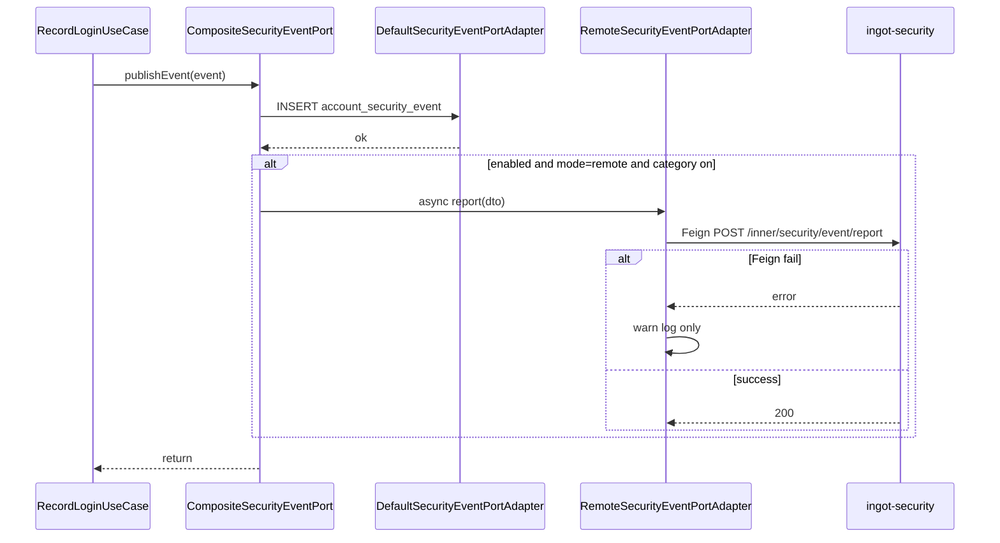
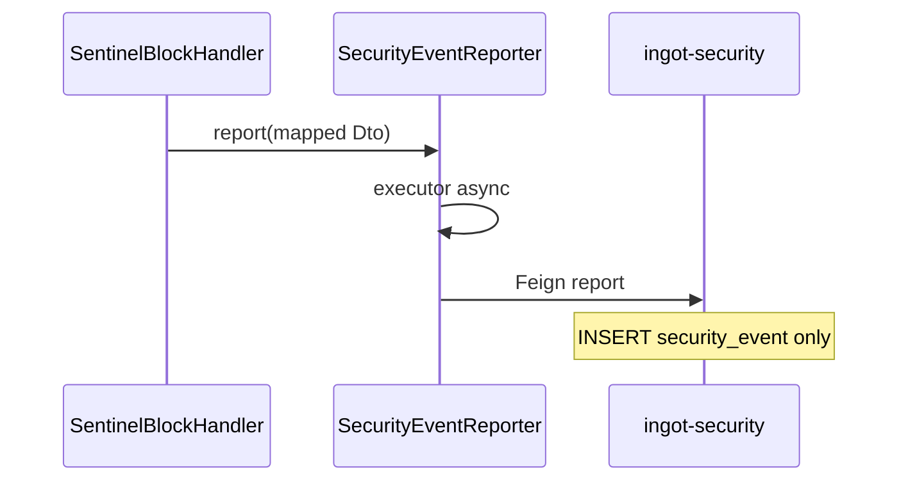

# Design

## 方案摘要

本 change 在 `ingot-security` 建立统一安全事件**写入面**（ingest + storage），通过 Feign 内网 API 接收各模块上报，账号域经 `CompositeSecurityEventPort` 在保留本地审计的前提下可选转发，网关封禁审计从 `gateway_blacklist_event` 迁移至统一模型。

关键设计决策：

- **api 模块为类型 SoT**：`SecurityEventType` / `SecurityEventCategory` 定义在 `ingot-security-api`；account-domain 现有 enum 通过映射 adapter 兼容，逐步 deprecated。
- **双写本地 + 异步上报中心**：`mode=remote` 时本地 INSERT 同步完成，中心 Feign 在独立线程池异步执行。
- **网关旧表停止写入**：`gateway_blacklist_event` 只读保留；新事件仅入 `security_event`。
- **无查询 API**：验收依赖 DB 直查与日志；阶段二安全概览再建读侧。

### 分层职责

| 层 | 组件 | 改动 |
|----|------|------|
| API | `ingot-security-api` | DTO、枚举、`RemoteSecurityEventService` |
| 中心 | `ingot-security-provider` | 表、入库 Service、`InnerSecurityEventAPI` |
| 账号 | `ingot-account-adapter` | 映射器、`RemoteSecurityEventPortAdapter`、`CompositeSecurityEventPort`、Properties |
| 账号 | `ingot-account-core` | 无 UseCase 改动；可选 `SecurityEventProperties` 接口定义 |
| 网关 | `ingot-gateway` | Reporter 改调统一 Feign；DTO 映射 |
| 数据 | `databases/migrations/010_*` | `security_event` DDL + 回滚 + 基线 |

## 数据模型与接口

### 统一事件模型（API）

**`SecurityEventReportDTO`**（`ingot-security-api`）字段：

| 字段 | 类型 | 必填 | 说明 |
|------|------|------|------|
| `eventType` | String | 是 | 统一类型码，见 enum |
| `eventCategory` | String | 是 | AUTH / ACCOUNT / CREDENTIAL / ACCESS |
| `occurredAt` | LocalDateTime | 否 | 业务发生时间；缺省由中心填 `received_at` |
| `tenantId` | Long | 否 | 租户 |
| `userId` | Long | 否 | 用户 ID |
| `userType` | String | 否 | `ADMIN` / `APP` |
| `account` | String | 否 | 登录名/账号标识 |
| `clientId` | String | 否 | OAuth2 Client |
| `appId` | String | 否 | 应用标识 |
| `sessionId` | String | 否 | 会话 sid |
| `deviceId` | String | 否 | 设备标识 |
| `clientIp` | String | 否 | 客户端 IP |
| `requestUri` | String | 否 | 请求路径 |
| `userAgent` | String | 否 | UA |
| `result` | String | 否 | SUCCESS / FAILURE / null |
| `reasonCode` | String | 否 | 原因码 |
| `reasonDetail` | String | 否 | 详情 |
| `sourceModule` | String | 是 | 上报模块：`ingot-pms` / `ingot-member` / `ingot-gateway` 等 |
| `source` | String | 否 | 业务来源：AUTH / PMS / MEMBER / SYSTEM / GATEWAY |
| `operatorId` | Long | 否 | 操作人 |
| `operatorName` | String | 否 | 操作人姓名 |
| `traceId` | String | 否 | 链路 ID |
| `extension` | Map / JSON | 否 | 扩展（ruleCode、keyType、action 等） |

**枚举 `SecurityEventType`**（P0，定义于 api）：

```text
AUTH:        LOGIN_SUCCESS, LOGIN_FAILURE
ACCOUNT:     ACCOUNT_CREATED, ACCOUNT_ENABLED, ACCOUNT_DISABLED,
             ACCOUNT_LOCKED, ACCOUNT_UNLOCKED, ACCOUNT_DELETED
CREDENTIAL:  PASSWORD_CHANGED, PASSWORD_RESET, FORCE_CHANGE_PASSWORD
ACCESS:      BLACKLIST_BLOCK, RATE_LIMIT_VIOLATION
```

预留码位（本期无 producer 强制）：`LOGOUT`, `TOKEN_REFRESH`, `PASSWORD_EXPIRED` 等。

**枚举 `SecurityEventCategory`**：`AUTH`, `ACCOUNT`, `CREDENTIAL`, `ACCESS`（后续可扩 SESSION / POLICY）。

### 中心表 `ingot_security.security_event`

```sql
CREATE TABLE `security_event` (
  `id`              BIGINT       NOT NULL AUTO_INCREMENT COMMENT '主键',
  `event_type`      VARCHAR(64)  NOT NULL COMMENT '事件类型',
  `event_category`  VARCHAR(20)  NOT NULL COMMENT 'AUTH/ACCOUNT/CREDENTIAL/ACCESS',
  `occurred_at`     DATETIME              DEFAULT NULL COMMENT '业务发生时间',
  `received_at`     DATETIME     NOT NULL DEFAULT CURRENT_TIMESTAMP COMMENT '中心接收时间',
  `tenant_id`       BIGINT                DEFAULT NULL,
  `user_id`         BIGINT                DEFAULT NULL,
  `user_type`       VARCHAR(20)           DEFAULT NULL COMMENT 'ADMIN/APP',
  `account`         VARCHAR(128)          DEFAULT NULL,
  `client_id`       VARCHAR(64)           DEFAULT NULL,
  `app_id`          VARCHAR(64)           DEFAULT NULL,
  `session_id`      VARCHAR(64)           DEFAULT NULL,
  `device_id`       VARCHAR(128)          DEFAULT NULL,
  `client_ip`       VARCHAR(64)           DEFAULT NULL,
  `request_uri`     VARCHAR(512)          DEFAULT NULL,
  `user_agent`      VARCHAR(512)          DEFAULT NULL,
  `result`          VARCHAR(20)           DEFAULT NULL COMMENT 'SUCCESS/FAILURE',
  `reason_code`     VARCHAR(50)           DEFAULT NULL,
  `reason_detail`   VARCHAR(500)          DEFAULT NULL,
  `source_module`   VARCHAR(64)  NOT NULL COMMENT '上报模块',
  `source`          VARCHAR(50)           DEFAULT NULL,
  `operator_id`     BIGINT                DEFAULT NULL,
  `operator_name`   VARCHAR(64)           DEFAULT NULL,
  `trace_id`        VARCHAR(64)           DEFAULT NULL,
  `extension`       JSON                  DEFAULT NULL,
  PRIMARY KEY (`id`),
  KEY `idx_event_time` (`received_at`),
  KEY `idx_event_type` (`event_type`, `received_at`),
  KEY `idx_tenant_user` (`tenant_id`, `user_id`),
  KEY `idx_trace` (`trace_id`)
) ENGINE=InnoDB DEFAULT CHARSET=utf8mb4 COMMENT='统一安全事件';
```

- migration：`databases/migrations/010_unified_security_event.sql`
- 回滚：`databases/migrations/rollback_010.sql`
- 基线同步：`databases/ingot_security.sql`

**不含**聚合表、物化视图、分区策略（阶段二安全概览）。

### Feign 与内网 API

**`RemoteSecurityEventService`**（`ingot-security-api`）：

```java
@FeignClient(contextId = "RemoteSecurityEventService", value = ServiceNameConstants.SECURITY_SERVICE)
public interface RemoteSecurityEventService {

    @PostMapping("/inner/security/event/report")
    R<Void> report(@RequestBody SecurityEventReportDTO dto);

    @PostMapping("/inner/security/event/report/batch")
    R<Void> reportBatch(@RequestBody List<SecurityEventReportDTO> dtos);
}
```

**`InnerSecurityEventAPI`**（`ingot-security-provider`）：

- 校验 `eventType` / `eventCategory` / `sourceModule` 非空。
- `occurredAt` 缺省则 `received_at = now()`，`occurred_at` 同步为 `received_at`。
- 入库幂等：本期不做 dedup（同事件可多条）；后续可按 `(traceId, eventType, occurredAt)` 去重扩展。
- 返回 `R.ok()`；异常转 5xx，由调用方 catch 打 warn。

参照现有 [`RemoteSecurityPolicyService.reportBlacklist`](../../../../../ingot-service/ingot-security/ingot-security-api/src/main/java/com/ingot/cloud/security/api/rpc/RemoteSecurityPolicyService.java) 与 [`InnerSecurityPolicyAPI`](../../../../../ingot-service/ingot-security/ingot-security-provider/src/main/java/com/ingot/cloud/security/web/inner/InnerSecurityPolicyAPI.java) 包结构与权限（内网 `@Inner`）。

### 账号域 Port 组合

```
SecurityEventPort (interface, 不变)
    └── CompositeSecurityEventPort
            ├── DefaultSecurityEventPortAdapter   # 同步本地 INSERT
            └── RemoteSecurityEventPortAdapter    # 异步 Feign（条件装配）
```

**`CompositeSecurityEventPort` 逻辑**：

1. `publishEvent` / `publishBatch`：先调用 local adapter（若存在）；local 失败则抛异常（与现行为一致）。
2. 若 `SecurityEventProperties.enabled && mode==remote && categoryEnabled(event)`：提交异步任务调用 remote adapter。
3. Remote 失败：catch + warn，不影响步骤 1 结果。

**`RemoteSecurityEventPortAdapter`**：

- 依赖 `ObjectProvider<RemoteSecurityEventService>` 懒解析（避免与 Feign 循环依赖，同 [`BlacklistEventReporter`](../../../../../ingot-service/ingot-gateway/src/main/java/com/ingot/cloud/gateway/security/BlacklistEventReporter.java)）。
- 单线程守护线程池 `in-acct-security-event-reporter`。
- `AccountSecurityEventMapper.toReportDto(event, sourceModule)`：`sourceModule` 由配置 `ingot.security.event.source-module`（如 `ingot-pms`）注入。

**`AccountSecurityEvent` → DTO 映射要点**：

| Account 字段 | DTO 字段 |
|--------------|----------|
| `eventType.code` | `eventType` |
| `eventType.category` | `eventCategory` |
| `createdAt` / now | `occurredAt` |
| `userType.name()` | `userType` |
| `clientIp` | `clientIp` |
| `userAgent` | `userAgent` |
| `result` → SUCCESS/FAILURE | `result` |
| `source.name()` | `source` |
| `extraData` | `extension` |

account-domain 现有 [`SecurityEventType`](../../../../../ingot-framework/ingot-account-domain/ingot-account-core/src/main/java/com/ingot/framework/account/domain/model/enums/SecurityEventType.java) 通过 `SecurityEventTypeMapping` 转到 api enum code（code 相同则直传）。

### 网关接入

**改造 [`BlacklistEventReporter`](../../../../../ingot-service/ingot-gateway/src/main/java/com/ingot/cloud/gateway/security/BlacklistEventReporter.java)**：

- 重命名或新增 `SecurityEventReporter`，注入 `RemoteSecurityEventService`。
- `BlacklistReportDTO` → `SecurityEventReportDTO` 映射：

| Blacklist 字段 | 映射 |
|----------------|------|
| `action=B` + 自动触发 | `eventType=BLACKLIST_BLOCK` 或 `RATE_LIMIT_VIOLATION`（`triggerSource=A` 且 `ruleCode` 非空时用 VIOLATION，否则 BLOCK） |
| `action=U/R` | `eventType=BLACKLIST_BLOCK`，`extension.action=U/R` |
| `ruleCode`, `countInWindow`, `ttlSec`, `keyType`, `keyValue` | `extension` |
| `realIp` | `clientIp` |
| `requestPath` | `requestUri` |
| `traceId`, `userAgent` | 直传 |
| — | `sourceModule=ingot-gateway`, `source=GATEWAY`, `eventCategory=ACCESS` |

**停止写入 `gateway_blacklist_event`**：

- `InnerSecurityPolicyAPI.reportBlacklist` 入库逻辑改为调用 `SecurityEventService.save`（或废弃 endpoint，仅保留 InnerSecurityEventAPI）。
- Platform `GET .../events` 继续查旧表只读；文档注明新事件查 `security_event`（阶段二提供 API）。

**网关配置**：`ingot.security.event.*` 置于 `in-service-gateway.yml`；ACCESS 类别默认 `true`。

## 数据流与失败处理

### 账号域事件流（remote 模式）



### 网关封禁事件流



### 失败处理原则

| 场景 | 行为 |
|------|------|
| 本地 INSERT 失败 | 与 L2 一致，由 UseCase/事务处理 |
| Feign 超时/5xx | warn，不 retry 阻塞 |
| security 未注册 | `getIfAvailable()` 空，debug skip |
| 非法 eventType | Inner API 400，调用方 warn |
| 中心 DB 失败 | 5xx，调用方 warn |

## Nacos 降级与动态刷新设计

> 遵循 [roadmap 横切原则](../../../../../docs/requirements/themes/security-center-roadmap.md)。

**配置结构**（PMS / Member / Gateway 各自 dataId）：

```yaml
ingot:
  security:
    event:
      enabled: true
      mode: local          # local | remote
      source-module: ingot-pms   # 或 ingot-member / ingot-gateway
      categories:
        auth: true
        account: true
        credential: true
        access: true
```

| 项 | dataId | 可降级 |
|----|--------|--------|
| PMS 事件配置 | `in-service-pms.yml` | 是 |
| Member 事件配置 | `in-service-member.yml` | 是 |
| Gateway 事件配置 | `in-service-gateway.yml` | 是 |

- `@ConfigurationProperties(prefix = "ingot.security.event")` + Nacos `?refreshEnabled=true`。
- `RemoteSecurityEventPortAdapter` / Reporter **每次上报前**读取 Properties（或经无缓存 Supplier），保证热刷新；与 L2 `LocalAccountLockoutPolicyLoader` 同模式。
- **`mode=local`**：不调用 Feign，仅本地表（adapter）或 NoOp。
- **`enabled=false`**：不上报中心；本地表不受影响。
- **不可降级**：中心库聚合、跨服务检索、大盘统计；不部署 security 时中心能力不可用，不影响主链路。

**验证步骤（S6）**：

1. `mode=remote`，触发登录失败，查 `security_event` 有记录。
2. Nacos 改 `enabled=false`，不重启，再次失败，中心无新记录，本地表仍有。
3. 改回 `enabled=true`，中心恢复写入。

## 迁移与回滚

### 执行顺序

1. 执行 `010_unified_security_event.sql`（`ingot_security`）。
2. 上线 `ingot-security`（Inner API + 入库）。
3. 上线 PMS/Member（Composite Port + 配置，默认 `mode=local`）。
4. 灰度：Nacos 改 `mode=remote` 验证双写。
5. 上线 Gateway（Reporter 改造，停止旧表写入）。

### 兼容性

- 账号域 UseCase / Port 接口不变；默认 `mode=local` 行为等同 L2。
- `gateway_blacklist_event` 历史数据保留；旧管理面只读。
- api 新 enum 与 account-domain enum code 一致，映射零损失。

### 回滚

1. Nacos 全量 `mode=local` / `enabled=false`。
2. 回退 Gateway Reporter 至 `reportBlacklist`（若已切换）。
3. 回退 account-adapter Composite 装配。
4. 可选 `rollback_010` 删表（仅无生产数据时）。

## 测试策略

- **单元**：`AccountSecurityEventMapper` 字段映射；`CompositeSecurityEventPort` 在 local/remote/disabled 分支；网关 `BlacklistReportDTO` → DTO 映射。
- **集成**：PMS/Member 登录失败 remote 双写；Gateway 封禁后 `security_event` 有 ACCESS 记录且旧表无 INSERT。
- **降级**：security 停服、Feign 不可用、enabled 关闭、类别关闭。
- **刷新**：改 Nacos 不重启验证 S6。
- **迁移**：`010` 执行与 `rollback_010`。
- **验收**：REQUIREMENTS S1–S6 DB 直查；无 Platform API 测试。

## 待审阅决策点

1. **D1 enum SoT**：api 模块统一定义（推荐）vs account-domain 继续自有 enum 仅 DTO 传 code。
2. **D2 网关 eventType 细分**：一律 `BLACKLIST_BLOCK` + extension.action vs 自动触发用 `RATE_LIMIT_VIOLATION`（推荐后者便于阶段二统计）。
3. **D4 migration 编号**：`010`（实施前确认）。
4. **D6 `reportBlacklist` endpoint**：废弃 vs 内部转调 `SecurityEventService`（推荐转调，减少网关改动面）。
