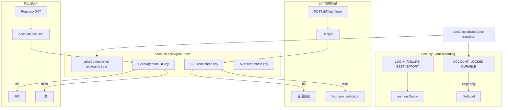
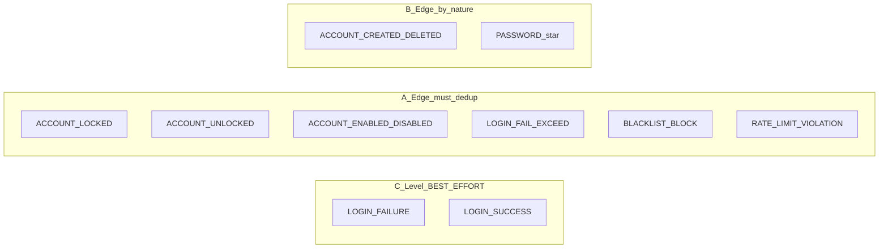
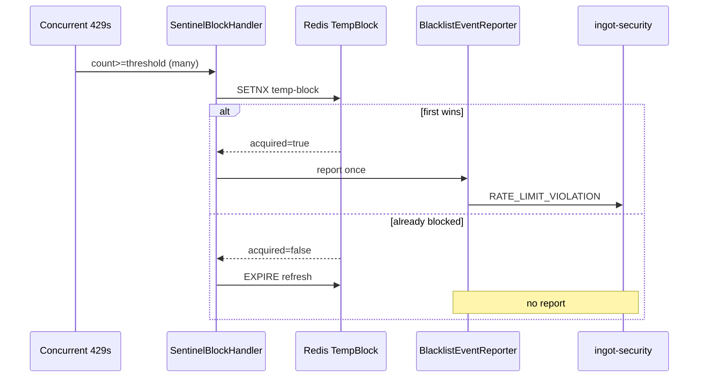

# Design

## 方案摘要

本 change 在三层面解决问题：

1. **领域边沿检测**：状态变更 DURABLE 事件仅在 transition 时 `publishEvent`；活动遥测不变。
2. **Redis 锁定信号**：PMS/Member 锁定/解锁后双写 Redis；BFF / Gateway / Auth 分层读取。
3. **Access/Gateway 超阈值边沿去重**：登录失败保护 DURABLE、以及网关限流升级 `RATE_LIMIT_VIOLATION`，均仅在「首次进入临时封禁」时上报；并发下用 Redis 首次占位避免刷库。

### 目标架构



### 关键决策

| ID | 决策 | 结论 |
|----|------|------|
| D1 | DURABLE vs BEST_EFFORT 触发 | 状态变更 **边沿**；活动遥测 **电平** |
| D2 | 锁定后 LOGIN_FAILURE | **保留**（进入 recordFailure 时仍发）；BFF 前置拦截默认 **不发** |
| D3 | 锁定后 incrementFailCount | **跳过**（已 locked） |
| D4 | Redis Key | **双 Key**：uid + name；lock 双写，unlock 双删 |
| D5 | Redis 写入时机 | **afterCommit**（PMS/Member 本地事务） |
| D6 | BFF 登录拦截 | **BFF 解密后**查 name key；Gateway **不**读 `/bff/**` body |
| D7 | Gateway Filter | **GlobalFilter**；主路径 **JWT uid key**；可选明文 Auth token **name key** |
| D8 | JWT 验签 | Gateway **不验签**（与限流/名单一致）；伪造 token 由 Resource Server 拒绝 |
| D9 | Redis fail-open | 读写失败不阻断主业务；log warn |
| D10 | 重复 manual lock | **no-op**（不延长 lockedUntil；延长需求另开 change） |
| D11 | Access DURABLE | 已 temp-block / 已超阈值 → **跳过**重复 `reportEvent` |
| D12 | 网关限流升级事件 | 保持现网类型映射 `RATE_LIMIT_VIOLATION`（优先级表不改）；**触发语义改为边沿**：每次 temp-block 生命周期至多 1 条 |
| D13 | 升级去重原语 | **禁止**仅用 `count == blockThreshold`；以 `TempBlockStore` **SETNX / setIfAbsent**（首次占位成功）决定是否 `report`；已存在则只 **刷新 TTL** |
| D14 | 与 Filter 顺序 | 同波并发可在写 temp-block 前已过 `BlacklistFilter`，故去重必须在 `SentinelBlockHandler` 内完成，不能依赖「写完立刻 403」 |
| D15 | 边沿实现强度 | 仅 **A 类**做显式 guard（可重复状态入口 / 超阈值升级）；**B 类**（`PASSWORD_*`、create-delete）靠 use case 天然单次；**C 类**电平不去重。详见 REQUIREMENTS R1.1 |
| D16 | 类型枚举 / 硬编码 | 本 change **不**合并双份 `SecurityEventType`，也 **不**抽取 recording code 常量；留给 [20260812-security-event-type-sot-cleanup](../20260812-security-event-type-sot-cleanup/DESIGN.md) |

### 边沿范围示意



## 数据模型与接口

### Redis Key（`RedisKeyConstants.AccountLock`）

```text
in:sec:account:locked:uid:{userType}:{userId}
in:sec:account:locked:name:{userType}:{username}
```

| 字段 | 说明 |
|------|------|
| value | 临时锁：`lockedUntil` ISO-8601；永久锁：`"1"` |
| TTL | 临时锁：至 `lockedUntil` 剩余秒数；永久锁：配置上限（默认 30d，可 Nacos 覆盖） |

与现有 `in:gw:bl:tmp:*`（IP/设备/客户端临时封禁）**独立命名空间**，不共用 key。

### 新增 Port（account-adapter）

```java
public interface AccountLockSignalPort {
    void writeLocked(AccountLockSignal signal);  // 双 key
    void clearLocked(AccountLockSignal signal);  // 双 key DEL
    boolean isLockedByUserId(UserTypeEnum userType, Long userId);
    boolean isLockedByUsername(UserTypeEnum userType, String username);
}

public record AccountLockSignal(
    Long userId, UserTypeEnum userType, String username,
    LocalDateTime lockedUntil  // null = 永久
) {}
```

- 实现：`RedisAccountLockSignalAdapter`（`StringRedisTemplate`）
- 装配：`AccountLockSignalAutoConfiguration`（`@ConditionalOnBean(StringRedisTemplate)`）；无 Redis 时 NoOp（fail-open）

### 配置（新增）

| 前缀 | 键 | 默认 | 说明 |
|------|-----|------|------|
| `ingot.security.account-lock-gateway` | `enabled` | `true` | Gateway Filter 总开关 |
| | `exclude-path-patterns` | `/actuator/**` 等 | 不检查锁定的路径 |
| `ingot.security.account-lock-signal` | `permanent-lock-ttl-days` | `30` | 永久锁 name/uid key TTL |
| `ingot.security.account-lock-bff` | `enabled` | `true` | BFF 登录前检查 |
| | `emit-login-failure-on-bff-block` | `false` | BFF 拦截时是否仍调 Auth 以产生 LOGIN_FAILURE |

## 数据流与失败处理

### Phase 1：领域边沿（account-core）

#### LockAccountUseCaseService

```
lockAutomatically / lockManually:
  state = lockStatePort.findByUser(...)
  if state.isLocked() → return
  updateLockStatus + userAccountPort.updateLockStatus
  publishEvent(ACCOUNT_LOCKED)   // 仅 transition
  accountLockSignalPort.writeLocked(...)  // afterCommit
```

#### RecordLoginUseCaseService.recordFailure

```
if lockStatePort.findByUser(...).isLocked():
  publishEvent(LOGIN_FAILURE)
  return   // skip increment + lockAutomatically

// 现有窗口重置 + increment
publishEvent(LOGIN_FAILURE)
if newFailCount >= maxAttempts:
  lockAccountUseCase.lockAutomatically(...)  // 内部边沿
```

#### UnlockAccountUseCaseService / ManageAccountStatusUseCaseService

- 解锁/启禁前读当前状态；已是目标状态则 **return**（不发 DURABLE）。

### Phase 2：Auth 缓存

- `CachingRemoteUserDetailsService` 装饰 PMS/Member `RemoteUserDetailsService`：
  - `isLockedByUsername(userType, username)` → hit 则 `UserDetailsResponse(locked=true, …)`，**不调 Feign**。
  - miss → 委托原 Feign。

### Phase 3：BFF 登录

- `BffAuthService.login`：`@InDecrypt` 之后、`authClient.preAuthorize` 之前：
  - `isLockedByUsername(ADMIN, dto.getUsername())` → 返回锁定错误（对齐 Auth `LockedException` 文案/错误码）。
  - 默认 **不**调 Auth（无 LOGIN_FAILURE）。

### Phase 3：Gateway AccountLockFilter

**顺序**：`AuthContextRelayFilter` → `IdentityResolveFilter` → **`AccountLockFilter`** → `BlacklistFilter`

**逻辑**：

1. 路径匹配 exclude → pass
2. 从 JWT payload 读 `i`（userId）+ `user_type` → 若齐全，查 **uid key** → hit 则 403
3. 否则若路径为 **非 `/bff/**` 的明文 Auth token 端点** 且 method POST → 解析 form `username`+`user_type` → 查 **name key** → hit 则 403
4. 其它 → pass

**403 响应**：与 Gateway 现有 forbidden 结构一致；body 含账号锁定业务码（与 Auth 对齐，见实现时引用 `InUserDetailsChecker` 文案 key）。

### Phase 4：Access/Gateway 超阈值边沿

#### LoginFailureProtectionService

```
if count >= maxAttempts:
  if tempBlockAlreadyActive(key) → return  // 仅 refresh TTL，不 reportEvent
  tempBlockWriter.block(...)
  reportEvent(...)  // 仅首次
```

#### SentinelBlockHandler（限流升级 → `RATE_LIMIT_VIOLATION`）

**现状问题**（DEV 实测）：

```text
hey -n 100 -c 100 /pms/test/limit, block-threshold=25
→ ~97×429，中心 ~73 条 RATE_LIMIT_VIOLATION（97−24）
→ 同波请求已过 BlacklistFilter；count≥25 后每次 report + SET 覆盖 TTL
→ 第二次压测全 403：Blacklist 短路，0 新事件（路径正确，但首次边沿已刷库）
```

**目标算法**（并发安全）：

```
accumulateAndMaybeBlock:
  incr(key) → count
  if count < blockThreshold → return

  // 首次占位：SETNX key=temp-block, TTL=tempBlockTtl
  acquired = tempBlockStore.tryBlockFirst(keyType, keyValue, ruleCode, ttl)
  if acquired:
      reporter.report(dto)          // 本生命周期唯一一次
  else:
      tempBlockStore.refreshTtl(...) // 可选：续期，禁止 report

  // 当前请求仍返回 429/412（与现网一致；不在本请求改 403）
```

`TempBlockStore` 调整要点：

| 方法 | 语义 |
|------|------|
| `tryBlockFirst`（或 `block` 改为返回是否新建） | Redis `SET key value NX EX ttl`；`true`=首次写入 |
| `refreshTtl` / 已存在时的 `block` | 仅 `EXPIRE` 或等价续期，**不**视为边沿 |
| `isBlocked` | 供 `BlacklistFilter` 使用，不变 |

事件映射保持 `BlacklistReportEventMapper`：`AUTO` + 非空 `ruleCode` + `BLOCK` → `RATE_LIMIT_VIOLATION`，`source_module=ingot-gateway`。本期不改为 `BLACKLIST_BLOCK`，避免与清单/观测字段漂移；边沿语义由 Handler + Store 保证。



## 迁移与回滚

### 上线顺序

1. 部署 PMS/Member（Phase 1 + Redis 写入）— 边沿去重立即生效；Redis 写入 fail-open。
2. 部署 Auth（Phase 2 缓存）。
3. 部署 BFF（Phase 3.6）。
4. 部署 Gateway（Phase 3 Filter + Phase 4 Sentinel）。
5. 部署 ingot-auth access 侧若 LoginFailure 在 auth 进程（access-adapter 随 auth 装配）。

### 回滚

- 各服务独立回滚；Redis key 可保留（TTL 自动过期）或运维批量 DEL `in:sec:account:locked:*`。
- 关闭 Nacos `ingot.security.account-lock-gateway.enabled=false` / `account-lock-bff.enabled=false` 可快速禁用边缘拦截，领域边沿检测仍有效。

### 兼容

- 无 DB schema 变更。
- 无 recording SPI 变更。
- 旧客户端无感知；BFF 加密协议不变。

## 测试策略

| 层级 | 类型 | 覆盖 |
|------|------|------|
| account-core | 单元 | RecordLogin / Lock / Unlock / ManageStatus 边沿 |
| account-adapter | 单元 | Redis 双写双删、NoOp fail-open |
| access-core | 单元 | LoginFailureProtection 重复超阈值 |
| gateway | 单元/集成 | AccountLockFilter uid/name 路径；`TempBlockStore.tryBlockFirst`；Sentinel 并发超阈值仅 1 次 `report` |
| bff | 单元 | login 解密后拦截 |
| 手工 | E1–E7 / E7b | FUNCTIONAL-TEST-CHECKLIST（含高并发限流升级仅 1 条） |

## Current 基线更新预告（验收后）

- `specs/current/security/account-protection/SPEC.md`：补充边沿事件语义、Redis 信号、BFF/Gateway 分层拦截。
- `specs/current/framework/security-event-recording/SPEC.md`：补充「状态变更边沿 vs 活动遥测电平」说明（引用 D1，不改默认优先级表）；注明网关限流升级 `RATE_LIMIT_VIOLATION` 为边沿（D12）。
- 相关运维文档（如 `docs/modules/security-center/GATEWAY-RATE-LIMIT.md`）可同步一句：升级事件每 temp-block 生命周期至多 1 条（非必须阻塞本 change）。
