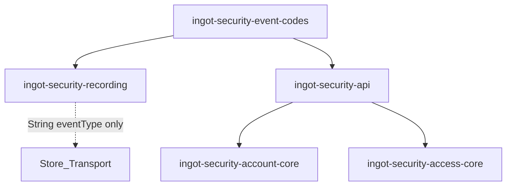

# Design

## 方案摘要

引入零业务依赖的 **code 常量模块**，让 recording 默认优先级表与 api 枚举共享字面量；删除 account-core 重复枚举，兑现 archive D1。



### 关键决策

| ID | 决策 | 结论 |
|----|------|------|
| D1 | code 落点 | 新建 `ingot-framework/ingot-security/ingot-security-event-codes`，类名 `SecurityEventCodes` / `SecurityEventCategoryCodes` |
| D2 | 枚举 SoT | 保持并强化：仅 `ingot-security-api` 保留 `SecurityEventType` / `SecurityEventCategory` |
| D3 | account-core | **删除**本地 enum；依赖 api，用例改 import；`AccountSecurityEvent` 字段类型改为 api 枚举 |
| D4 | recording | 只依赖 `event-codes`；`DefaultPriorityClassifier` 用 `SecurityEventCodes.*`；不引入 enum 类型 |
| D5 | 优先级语义 | **不改**现网 BEST_EFFORT / DURABLE 归属 |
| D6 | 与 edge-dedup | 正交；文件冲突时优先合入边沿 change 后再迁枚举 |

## 数据模型与接口

### `SecurityEventCodes`（示意）

```java
public final class SecurityEventCodes {
    private SecurityEventCodes() {}

    public static final String LOGIN_SUCCESS = "LOGIN_SUCCESS";
    public static final String LOGIN_FAILURE = "LOGIN_FAILURE";
    // ... 与现网 api 枚举 code 一一对应
    public static final String RATE_LIMIT_VIOLATION = "RATE_LIMIT_VIOLATION";
    public static final String BLACKLIST_BLOCK = "BLACKLIST_BLOCK";
    // LOGIN_FAIL_*_EXCEED ...
}
```

### api 枚举

```java
LOGIN_SUCCESS(SecurityEventCodes.LOGIN_SUCCESS, SecurityEventCategory.AUTH),
// ...
```

### `DefaultPriorityClassifier.defaultForType`

```java
case SecurityEventCodes.LOGIN_SUCCESS, SecurityEventCodes.LOGIN_FAILURE,
     SecurityEventCodes.RATE_LIMIT_VIOLATION -> BEST_EFFORT;
case SecurityEventCodes.ACCOUNT_LOCKED, /* ... */ -> DURABLE;
```

（switch 标签须为编译期常量；`static final String` 满足。）

### Gradle

- `ingot-security-event-codes`：`library-base`，无 Spring 业务依赖
- `ingot-security-recording`：`implementation` / `api` 视可见性定——classifier 在同模块则 `implementation` 即可；若测试/扩展需要可 `api`
- `ingot-security-api`：`api project(event-codes)`
- `ingot-security-account-core`：增加对 `ingot-security-api` 的依赖（若尚无传递路径）
- `config/ingot.gradle`：登记模块坐标

## 数据流与失败处理

无运行时行为变化：发布仍经 `SecurityEventPublisher`，`eventType` 仍为 String code。失败语义不变。

迁移步骤（开发态）：

1. 建 `event-codes` 并填入全部现网 code。
2. api 枚举改引用常量（行为不变）。
3. recording classifier 改引用常量。
4. account-core 批量替换 import / 删除旧枚举；修单测。
5. 全量相关模块 `./gradlew test`。

## 迁移与回滚

- **无 DB / 无配置键变更**；回滚即代码回滚。
- 上线无顺序约束（纯重构）；与 edge-dedup 同发时注意 account-core 合并冲突。

## 测试策略

| 层级 | 覆盖 |
|------|------|
| recording | `DefaultPriorityClassifierTest`：各 code 优先级与改造前一致 |
| account-core | 既有 UseCase 单测编译通过；事件 type 断言改用 api 枚举 |
| api | `fromCode` 对全部常量往返 |
| 依赖 | 脚本或手工确认 recording 未依赖 security-api |

## Current 基线更新预告（验收后）

- `specs/current/framework/security-event-recording/SPEC.md`：新增「事件 code SoT」小节——常量模块 + api 枚举 + recording 仅用 String/常量。
- 如需要，在 `security-event-center` README 一句指向 recording SPEC，避免重复长文。
