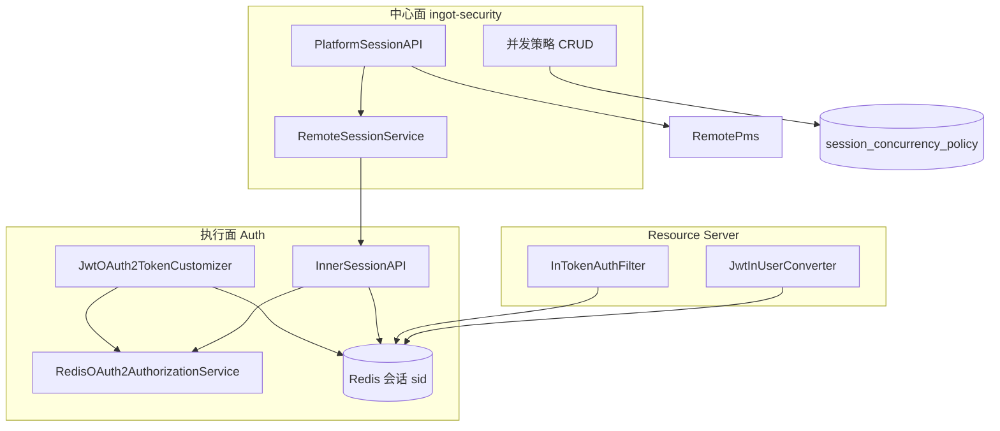
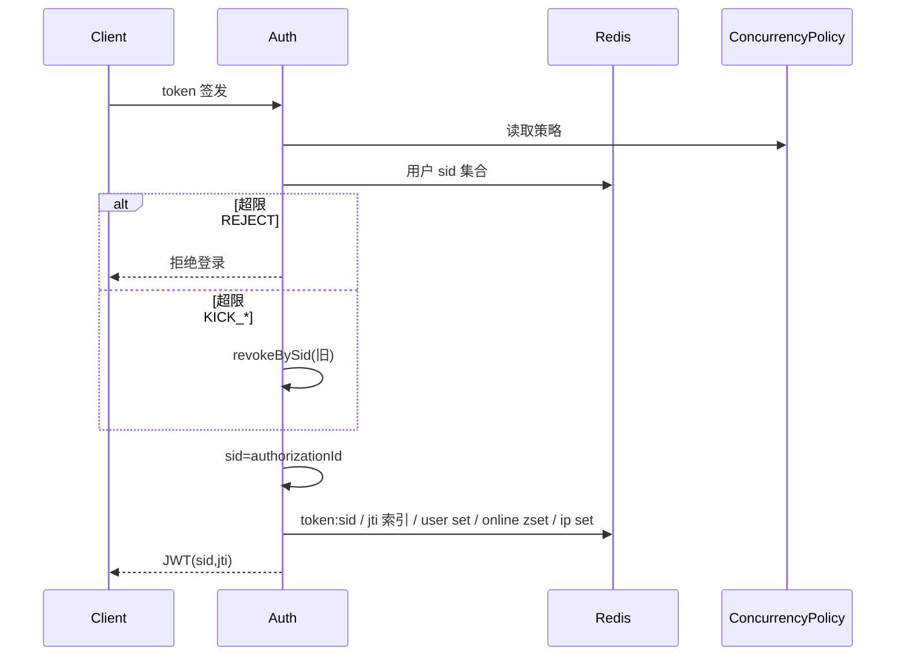
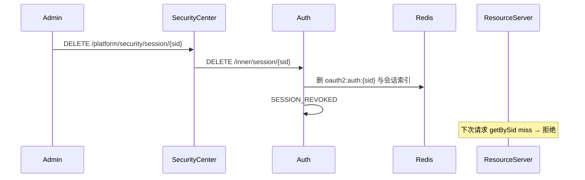

# Design

## 方案摘要

本 change 把现网「jti = 在线主键、管理接口放在 Auth、强制下线只删 OnlineToken」升级为四段能力，分四个 Phase 交付：

| 块 | 内容 | Phase |
|----|------|-------|
| A. 会话模型 | `sid = authorizationId`；Redis 会话主数据按 sid；refresh 复用 sid | 01 |
| B. 撤销与校验 | 下线删除 Authorization；RS 以 Redis 为准拒绝；禁 JWT-only fallback | 01 |
| C. 执行面 + 事件 + 联动 | Auth Inner API；`SESSION_*` 事件；密码/锁定/禁用撤会话 | 02 |
| D. 中心管理面 | Platform API + Feign + PMS 拼装；Auth `/token/*` 管理接口退役 | 03 |
| E. 并发策略 | 中心表 + `LayeredCacheBuilder` 降级链 + 登录时执行 | 04 |



### 关键设计决策

| ID | 议题 | 推荐决议 |
|----|------|----------|
| D1 | Redis 不可用 | **键不存在 → 拒绝**；**Redis 异常 → 30s 宽限**（签名有效的 JWT 可过），指标 `session.redis.unavailable` + 告警；禁止长期 JWT-only fallback |
| D2 | 旧 JWT | 兼容窗口 = `max(accessToken TTL, 3600s)` + 一次滚动发布；窗口内无 sid 回退 jti；窗口后无 sid 拒绝 |
| D3 | 事件 SoT | 只改 api `SecurityEventType` + `DefaultPriorityClassifier`；不双写 account-core。20260812 若已合入则改 codes 常量 |
| D4 | 策略缓存 | 直接 `LayeredCacheBuilder`（`ingot-cache`），不手写 Resilient loader |
| D5 | BFF | `BffSession.sid` 冗余；logout 按 sid 调 Auth；不做 BFF Redis 跨节点主动失效 |
| D6 | sid 来源 | **复用 `OAuth2Authorization.id`**，不另造 UUID 体系 |
| D7 | 类型改名 | 保留 `OnlineToken` / `OnlineTokenService` 类名，语义升级为会话；新增 `sid` 字段与 `removeBySid` / `getBySid` / `isOnlineSid` |
| D8 | 管理面 | 安全中心 Platform；Auth 仅 Inner + 用户自助登出；Auth 不再 Feign PMS |
| D9 | 查询权威 | 在线态只在 Auth Redis；中心不直连 Auth Redis，一律 Inner Feign |
| D10 | 黑名单 | **不**做 JWT denylist；会话缺失 = revoked |
| D11 | lastAccessAt | P0 在登录与 refresh 时更新；RS 热路径不做每次请求写 Redis（避免写放大） |
| D12 | IP 索引 | 新增 `session:ip:{tenantId}:{ip}` → Set\<sid\>，支撑「同 IP 会话」；TTL 随会话 |
| D13 | 清理 | 维护注册表 `session:online:registry`（members = `online:user:{tenant}:{client}` key）；定时任务 SCAN 注册表，禁止 `keys()` |
| D14 | 并发维度 P0 | `USER_CLIENT`（`tenantId+clientId+userId`）；「每设备一个」不做 |
| D15 | client auth-type | 迁移期 UNIQUE/STANDARD 映射到并发策略地板；Phase 04 后策略优先于 client 设置，client 值仅作缺省 |
| D16 | 账号联动范围 | 密码修改/重置、锁定、禁用 → 撤销该用户**当前租户、全部 Client** 的会话 |
| D17 | 兼容期 Auth 旧 API | Phase 03 起 `/token/tokens|/jti|/user` 改为内部转调新撤销/查询实现并标记 deprecated；下一 change 再删除 |
| D18 | 租户级踢光 | Inner 预留 `DELETE /inner/session/tenant/{tenantId}`；Platform 完整交互不阻塞 01–02 |

---

## 数据模型与接口

### 模块职责

| 模块 | 职责 |
|------|------|
| `ingot-commons` | `InJwtClaimNames.SID`；`RedisKeyConstants.OnlineToken` 补 sid/userSet/online/ip/registry |
| `ingot-security-common` | `OnlineToken.sid` / `lastAccessAt`；`RedisOnlineTokenService` 会话 schema；`JwtInUserConverter` / `InTokenAuthFilter` / `JwtTenantValidator` 按 sid 校验 |
| `ingot-security-authorization-server` | `JwtOAuth2TokenCustomizer` 写 sid；Custom grant 预生成 authorizationId；`RedisOAuth2AuthorizationService.remove` 改 `removeBySid` |
| `ingot-auth` | 用户自助登出按 sid；`InnerSessionAPI`；并发策略执行（Phase 04）；删除对 PMS 的管理查询依赖（Phase 03） |
| `ingot-security-api` | `RemoteSessionService`、会话 VO/DTO、`RemoteSessionConcurrencyPolicyService`、`SecurityPolicyDomain.SESSION_CONCURRENCY`、`SESSION_REVOKED` / `SESSION_CONCURRENT_KICKOUT` |
| `ingot-security-provider` | Platform 会话查询/下线；并发策略表 CRUD；拼 PMS 用户/租户 |
| `ingot-gateway` | `BearerJwtPayloadReader.readSid`；`AuthContextRelayFilter` / `ReactiveOnlineTokenUserTypeReader` 按 sid 读会话 |
| `ingot-bff` | `BffSession.sid`；logout / 选租户后写入 sid |
| `ingot-security-account-*` / PMS / Member | 密码、锁定、禁用成功后调用 Auth Inner 撤会话（不经安全中心） |
| `ingot-security-recording` | `DefaultPriorityClassifier` 为新类型 DURABLE |

### JWT claims

现有瘦身 JWT：`iss/sub/aud/iat/exp/nbf/jti` + `i`（用户）+ `org`（租户）+ `scope`。

新增：

```text
sid  = InJwtClaimNames.SID  （值 = authorizationId）
```

`JwtClaimNamesExtension` 转发该常量。

#### sid 在签发链中的取得方式

| Grant | `JwtEncodingContext.getAuthorization()` | 做法 |
|-------|------------------------------------------|------|
| authorization_code | 已有 Authorization（`/authorize` 阶段生成 id） | `sid = context.getAuthorization().getId()` |
| refresh_token | 同一 Authorization 原地更新 | 同上 |
| 自定义 grant（`OAuth2CustomAuthenticationProvider`） | 生成 token 时 **尚无** Authorization | Provider **先** `UUID` 作为 id，构造 stub `OAuth2Authorization` 放入 `DefaultOAuth2TokenContext.authorization(...)`，token 生成后再 `authorizationBuilder.id(sid)` 保存 |

`JwtOAuth2TokenCustomizer.customizeWithUser`：写入 `sid` claim，调用 `onlineTokenService.save(user, sid, jti, expiresAt)`。refresh 时 save 为 upsert：更新当前 jti、过期时间、lastAccessAt，删除旧 jti 索引。

### Redis 会话 schema

`RedisKeyConstants.OnlineToken` 收口全部前缀（现 `token:user:` / `token:user:set:` / `online:user:` 硬编码在 Service 内，一并迁入）。

| Key | 类型 | TTL | 用途 |
|-----|------|-----|------|
| `token:sid:{sid}` | String(OnlineToken) | 与 **Refresh Token 剩余寿命** 对齐（无 RT 则对齐 AT） | **会话主数据** |
| `token:jti:{jti}` | String(sid) | Access Token 剩余寿命 | jti → sid 索引（D2 窗口内旧值仍可能是完整 OnlineToken，双读） |
| `token:user:{tenantId}:{clientId}:{userId}` | String(sid) | 同会话 | UNIQUE / maxSessions=1 当前 sid |
| `token:user:set:{tenantId}:{clientId}:{userId}` | Set\<sid\> | max(成员会话 TTL) | 用户会话集合；**禁止**用当前 AT TTL 缩短导致集合早过期 |
| `online:user:{tenantId}:{clientId}` | ZSet\<userId, expiresAtMs\> | 无（靠注册表 + 定时清理） | 在线用户分页 |
| `session:ip:{tenantId}:{ip}` | Set\<sid\> | 同会话 | 同 IP 查询 |
| `session:online:registry` | Set\<online:user:... key\> | 无 | 定时清理注册表，替代 KEYS |

`OnlineToken` 增补字段：`sid`、`lastAccessAt`、`currentJti`（可与现 `jti` 字段等同，refresh 时覆盖）。保留 authorities / userType / 登录环境字段。

**TTL 修正（修现网 bug）**：用户 Set 的 expire 必须取「集合内最晚过期会话」，不能每次 save 用当前 AT TTL 覆盖。实现：save/remove 后重算 max TTL，或对 Set 不设 TTL、依赖主数据 miss 时惰性剔除。

**灰度双读（Phase 01）：**

```text
getBySid(sid):
  读 token:sid:{sid}
  miss 且处于 D2 窗口 → 不回退（sid 未知则不是新模型）

getByJti(jti):
  读 token:jti:{jti}
  若值为 sid 字符串 → 再读 token:sid:{sid}
  若值为 OnlineToken（旧模型）→ 直接返回（D2）
```

RS 校验顺序：JWT 有 sid → `isOnlineSid`；无 sid 且在 D2 窗口 → `isOnline(jti)`；否则拒绝。

### 撤销实现（统一）

新增 Auth 领域服务（建议名 `SessionRevocationService`），**唯一**实现：

```text
revokeBySid(sid, reason, actor):
  1. authorization = authorizationService.findById(sid)
     若存在 → authorizationService.remove(authorization)
     // remove 内级联 onlineTokenService.removeBySid(sid)
  2. 若 authorization 已不在但仍有会话残留 → onlineTokenService.removeBySid(sid)
  3. 发布 SESSION_REVOKED 或 LOGOUT（reason=USER_LOGOUT）

revokeByUser(userId, tenantId, clientId, reason, actor):
  对 token:user:set 中每个 sid 调用 revokeBySid
  clientId 为空（账号联动）→ 枚举该用户在该租户下已知 Client 集合
    （从 user set key 模式 SCAN 或维护 token:user:clients:{tenantId}:{userId}）
```

`RedisOAuth2AuthorizationService.remove`：由 `extractJti` + `removeByJti` 改为读 Access Token claims / 会话索引得到 sid，调用 `removeBySid`。`extractJti` 里「找不到 jti 就用 authorizationId」的 fallback 在新模型下变为**主路径**。

UNIQUE 踢旧：`kickOldSessionIfUnique` → `revokeBySid(oldSid, CONCURRENT, system)`，不再 `removeByJti`。

`TokenEndpoint`：

| 现接口 | Phase 01–02 | Phase 03+ |
|--------|-------------|-----------|
| `DELETE /token` | 改为 `revokeBySid(当前 sid)` | 保留（用户自助） |
| `GET /token/tokens` | 暂留，改为走新查询 | deprecated，文档指向 Platform |
| `DELETE /token/jti` | 通过 jti 反查 sid 后 `revokeBySid` | deprecated |
| `DELETE /token/user` | `revokeByUser` | deprecated |

### Auth Inner API（Phase 02）

前缀 `/inner/session`，`@Permit(INNER)`。

| 方法 | 路径 | 说明 |
|------|------|------|
| GET | `/page` | query：tenantId、clientId、userId?、ip?、current、size → `IPage<OnlineToken>`（无用户展示名） |
| GET | `/{sid}` | 会话详情 |
| GET | `/user` | query：userId、tenantId、clientId? → 该用户会话列表 |
| DELETE | `/{sid}` | body：reason、actorId；`revokeBySid` |
| DELETE | `/user` | body：userId、tenantId、clientId?、reason、actorId |
| DELETE | `/tenant/{tenantId}` | P1 预留，可 501 直到需要 |

Feign：`ingot-security-api` 的 `RemoteSessionService`，目标 `ServiceNameConstants.AUTH_SERVICE`（**注意：会话执行在 Auth，不是 SECURITY_SERVICE**）。无 Feign fallback；中心调用失败返回 5xx 给管理员，不影响登录主链路。

> 与既有 `RemoteSecurityPolicyService` 不同：本 Feign 的 value 是 **Auth 服务名**。

### 安全中心 Platform API（Phase 03）

前缀 `/platform/security/session`。

| 方法 | 路径 | 权限 |
|------|------|------|
| GET | `/sessions` | `platform:security:session:query` |
| GET | `/sessions/{sid}` | 同上 |
| DELETE | `/sessions/{sid}` | `platform:security:session:revoke` |
| DELETE | `/sessions/user` | 同上 |

VO 在 api 模块定义（不暴露 Auth 的 `OnlineToken` 到前端）：用户名、租户名由 provider 调 `RemotePmsUserDetailsService` / `RemotePmsTenantDetailsService` 拼装；PMS 失败时名称字段为空，sid 级字段仍返回。

Phase 03 交付 `PLATFORM-API.md`（对齐 L4），不在步骤 A 预写死字段，以免与实现漂移。

### 并发策略表（Phase 04）

**库**：`ingot_security`  
**migration**：`014_session_concurrency_policy.sql` + `rollback_014_session_concurrency_policy.sql`

| 列 | 类型 | 说明 |
|----|------|------|
| `id` | bigint PK | |
| `scope` | varchar(32) | `GLOBAL` / `CLIENT` / `USER_TYPE`（P0 先 GLOBAL + 可选 CLIENT） |
| `client_id` | varchar(64) NULL | `scope=CLIENT` 时必填 |
| `user_type` | varchar(16) NULL | 预留；管理员禁止并发可用 `user_type=ADMIN` + max_sessions=1 |
| `max_sessions` | int | `0` = 无限；`1` = 单会话 |
| `dimension` | varchar(32) | P0 仅 `USER_CLIENT` |
| `overflow` | varchar(16) | `REJECT` / `KICK_OLDEST` / `KICK_ALL` |
| `admin_forbid_concurrent` | tinyint | true 时 ADMIN 强制 max_sessions=1 |
| `enabled` | tinyint | |
| `remark` | varchar(255) | |
| `created_at` / `updated_at` | timestamp | |

种子：一行 GLOBAL，`max_sessions=0`（无限，兼容现网 STANDARD 默认）。

`SecurityPolicyDomain` 新增 `SESSION_CONCURRENCY`。PUT 后发 `SecurityPolicyChangedSpringEvent` → 失效广播。

### 并发策略配置与降级

**配置前缀**：`ingot.security.session`（配在 **`in-service-auth.yml`**）

```yaml
ingot:
  security:
    session:
      mode: local                    # local | remote；生产默认 remote
      policy:
        fallback:
          local-floor-enabled: true
      concurrency:                   # mode=local 生效；mode=remote 时作 Nacos 地板
        max-sessions: 0              # 0=无限
        dimension: USER_CLIENT
        overflow: KICK_OLDEST
        admin-forbid-concurrent: false
```

**dataId**：`in-service-auth.yml`，`spring.config.import` 已有 `?refreshEnabled=true`（与 access/credential 相同）。地板绑定 `@ConfigurationProperties(prefix="ingot.security.session.concurrency")`，rebinder / `@RefreshScope` 热刷新。

**remote 链（D4）**：

```text
LayeredCacheBuilder named "session-concurrency-policy"
  loader = Feign RemoteSessionConcurrencyPolicyService
           （SECURITY_SERVICE GET /inner/security/session/concurrency-policies）
  resilientSingleKey(LKG Redis + Nacos FloorSupplier)
  可选 L1 Caffeine
```

配置键归属 **Auth 消费模块**（`ingot.security.session.*`），框架只收 `LayeredCacheSettings`，不改模块键名。

**动态刷新验证**：

| 模式 | 操作 | 期望 |
|------|------|------|
| local | 改 Nacos `max-sessions` 0→1，不重启 Auth | 下一笔登录触发 UNIQUE 语义踢旧 |
| remote | Platform 改策略 + 失效广播 | ≤10s Auth 新登录按新策略（对齐 L4） |
| remote 故障 | 停 security | Actuator / `CacheSourceHolder` 为 LKG 或 LOCAL_FLOOR |

### 安全事件

| 类型 | 分类 | 优先级 | 何时 |
|------|------|--------|------|
| `LOGOUT` | AUTH | 保持现网（classifier 未单列则 BEST_EFFORT） | 用户自助登出 |
| `SESSION_REVOKED` | AUTH | DURABLE | 管理员下线、密码/锁定/禁用联动 |
| `SESSION_CONCURRENT_KICKOUT` | AUTH | DURABLE | 并发策略踢旧 |

`security_event.session_id` 填 sid；`reason` / actor 放 payload。`TOKEN_REFRESH` 本闭环**不强制**新报（避免刷屏）；若现网已有生产方可保持。

### 账号域联动

在 PMS / Member 的 `ChangePasswordUseCase`、`ResetPasswordUseCase`、`LockAccountUseCase`、`ManageAccountStatusUseCase.disableAccount` **成功提交后**调用：

```text
RemoteAuthSessionService.revokeByUser(userId, tenantId, clientId=null, reason)
```

该 Feign 定义在合适的 api 模块（可与 `RemoteSessionService` 同接口，由账号域依赖 `ingot-security-api` 或 auth-api）。**不**经过安全中心，以满足 S11。

失败：ERROR 日志 + 计数器 `session.revoke.linkage.failure`；不回滚密码/锁定事务（账号状态已是新值，会话残留视为补偿项，可重试）。Phase 02 验收必须能用日志/指标证明失败可见。

---

## 数据流与失败处理

### 登录（含并发）



### 强制下线



### 失败处理

| 场景 | 行为 |
|------|------|
| 撤销时 Authorization 已不在、会话还在 | 仍删会话索引，记原因 |
| 撤销时会话已不在、Authorization 还在 | 仍 `remove(authorization)` |
| 事件上报失败 | 不回滚撤销（L3） |
| PMS 拼装失败 | 列表仍返回 sid 级字段，名称空 |
| Inner Feign 失败（中心→Auth） | Platform 返回错误；主登录不受影响 |
| 账号联动 Feign 失败 | 不回滚账号用例；指标+日志；可重试 |
| Redis 键不存在（RS） | 拒绝（下线生效） |
| Redis 异常（RS） | D1 宽限 |
| 策略 remote 失败 | LKG → 地板；地板关闭且无 LKG → fail-closed **拒绝新登录**（不静默无限并发） |

---

## Nacos 降级与动态刷新

| 能力 | 可降级？ | dataId | 字段 | 刷新验证 |
|------|----------|--------|------|----------|
| 并发策略参数 | 是 | `in-service-auth.yml` | `ingot.security.session.concurrency.*` | 改 max-sessions 不重启 → 新登录行为变 |
| mode 开关 | 是 | 同上 | `ingot.security.session.mode` | local/remote 切换需确认 loader 重建或 rebinder |
| 在线会话存储 | 否 | — | Redis | 不部署中心仍工作 |
| Platform 统一管理 | 否 | — | — | 不部署中心则无页面 |
| 账号联动撤销 | 否（执行在 Auth） | — | — | 不依赖中心 |

---

## 迁移与回滚

### 上线顺序

1. **Phase 01**：双写 sid 主数据 + 保留 jti 完整对象或索引；RS 双读；撤销改彻底。先发 Auth/框架，再发 Gateway/RS 消费方。
2. **D2 窗口**：观察无 sid 请求比例；窗口结束后 RS 拒绝无 sid JWT。
3. **Phase 02**：Inner API + 事件 + 账号联动。
4. **Phase 03**：Platform 管理面；Auth 旧管理 API deprecated。
5. **Phase 04**：策略表 + LayeredCache；生产 `mode=remote`。

### Redis 数据

- 无需离线扫全库迁移。新登录/refresh 自然写入新 schema。
- 旧 `token:jti:{jti}` OnlineToken 对象在 D2 内仍可认证；过期后消失。
- 回滚 Phase 01：RS 恢复 jti 读取即可；多写的 `token:sid:*` 可留待 TTL。

### DB

- `014` 仅新增表与种子，回滚 drop 表。无现网列变更。
- 基线 `databases/ingot_security.sql` 在验收后同步。

### 兼容性

- 旧客户端忽略未知 claim `sid` 无影响。
- BFF：旧 session 无 sid 字段时 logout 仍可走 Access Token `findByToken` 路径（`DELETE /token` 现逻辑）作为 D2 回退。

---

## 测试策略

| 层 | 内容 |
|----|------|
| 单元 | `RedisOnlineTokenService` save/refresh/revoke TTL 与 Set 过期；sid/jti 双读；Customizer 从 authorization 取 sid；Converter miss 拒绝；Filter UNIQUE 改 sid |
| 集成 | 登录 → refresh → sid 不变；revokeBySid 后 refresh 失败；STANDARD 下线后 RS 401；KEYS 清理改为注册表 |
| 联动 | 改密码 / 锁定后旧 Token 401（可用 Testcontainers Redis 或契约测试） |
| 策略 | local 热刷新；remote 停中心走 LKG/地板；overflow 三种行为 |
| E2E | Platform 列表+下线；BFF logout；手册用例写入 `test-case/`（实施时补文件，本步骤 A 不预创建） |

回归：L2 锁定信号、L3 事件上报、L4 登录失败封禁不得因 Auth Filter 变更而 fail-open。

---

## 待审阅决策记录

实施前由负责人把 README D1–D5 及上表 D6–D18 标为已决议。若否决「sid=authorizationId」，必须改签发链另造 sid 并在 Authorization attributes 持久化，任务量上升，需重评 Phase 01。
