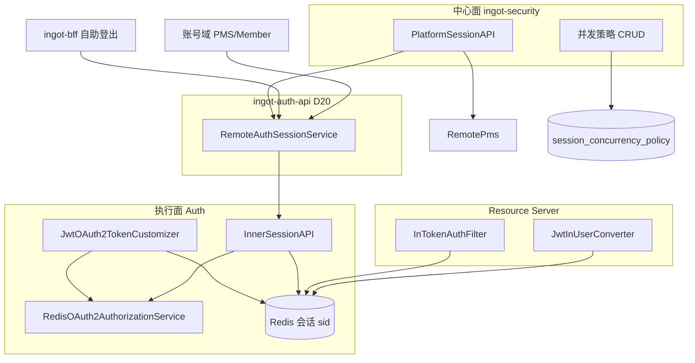
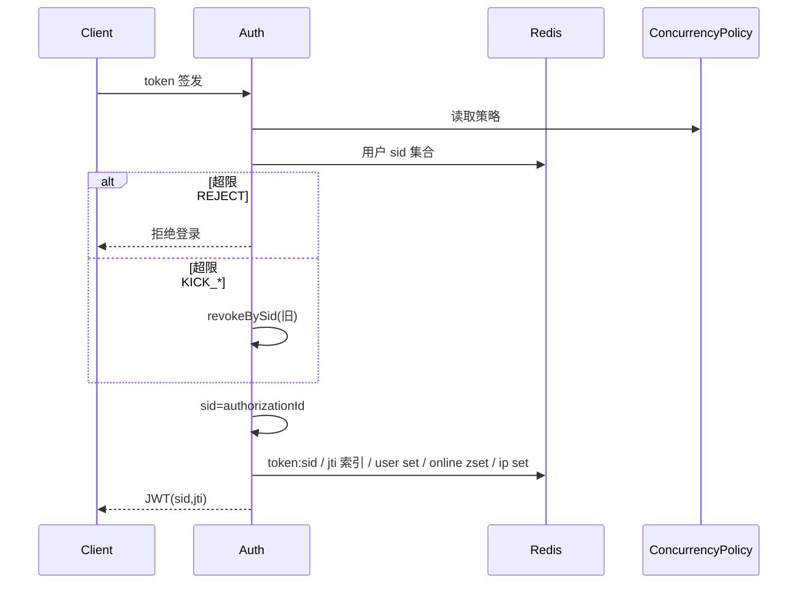
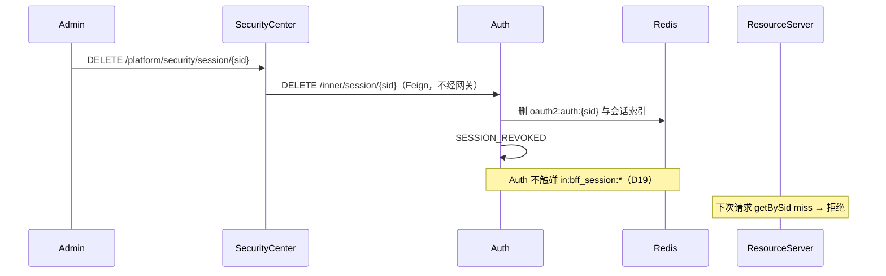

# Design

## 方案摘要

本 change 把现网「jti = 在线主键、管理接口放在 Auth、强制下线只删 OnlineToken」升级为四段能力，分四个 Phase 交付：

| 块 | 内容 | Phase |
|----|------|-------|
| A. 会话模型 | `sid = authorizationId`；Redis 会话主数据按 sid；refresh 复用 sid | 01 |
| 模块结构 | Auth 拆 `ingot-auth-api` / `ingot-auth-provider`；BFF 迁 `RemoteAuthTokenService` | 01 |
| B. 撤销与校验 | 下线删除 Authorization；RS 以 Redis 为准拒绝；禁 JWT-only fallback | 01 |
| C. 执行面 + 事件 + 联动 | Auth Inner API；删除 `TokenEndpoint`；网关摘 `/auth/token/**`；`SESSION_*` 事件；密码/锁定/禁用撤会话 | 02 |
| D. 中心管理面 | Platform API + Feign + PMS 拼装 | 03 |
| E. 并发策略 | 中心表 + `LayeredCacheBuilder` 降级链 + 登录时执行 | 04 |



> 图中所有跨服务箭头都指向 Auth：**Auth 没有出向依赖**（D19 否决 Auth → BFF）。BFF 的 `in:bff_session:*` 只由 BFF 自己写、网关只读。

### 关键设计决策

| ID | 议题 | 推荐决议 |
|----|------|----------|
| D1 | Redis 不可用 | **键不存在 → 拒绝**；**Redis 异常 → 30s 宽限**（签名有效的 JWT 可过），指标 `session.redis.unavailable` + 告警；禁止长期 JWT-only fallback |
| D2 | 旧 JWT | **不兼容**：JWT 无 sid → 拒绝。无过渡开关、无 jti 双读。上线即全局失效，用户重新登录 |
| D3 | 事件 SoT | 只改 api `SecurityEventType` + `DefaultPriorityClassifier`；不双写 account-core。20260812 若已合入则改 codes 常量 |
| D4 | 策略缓存 | 直接 `LayeredCacheBuilder`（`ingot-cache`），不手写 Resilient loader |
| D5 | 撤销入口与 BFF 分工 | 自助登出由 **BFF（及将来 App BFF）编排** → Auth Inner；管理员 / 账号联动 / 并发踢旧由中心、账号域、Auth 自身直调 Auth Inner，**不经 BFF**。`BffSession.sid` 仅用于自助登出精确撤销 |
| D19 | Auth 是否清 BFF 会话键 | **否决**（依赖成环 + 数据所有权侵犯）。残键靠 401 + TTL 自然收敛，不引入反向索引与跨服务写 |
| D20 | Auth 模块结构 | **拆并入本 change**：`ingot-auth-api` 承担 Feign RPC（对齐其它服务 api 模块），`ingot-auth-provider` 承接现有实现 |
| D21 | Auth 网关暴露 | 摘 `/auth/token/**`，**保留** `/auth/client/**`；本期不迁移 `DevClientAPI` |
| D6 | sid 来源 | **复用 `OAuth2Authorization.id`**，不另造 UUID 体系 |
| D7 | 类型改名 | 保留 `OnlineToken` / `OnlineTokenService` 类名，语义升级为会话；新增 `sid` 字段与 `removeBySid` / `getBySid` / `isOnlineSid` |
| D8 | Auth 对外保留什么 | **会话相关只留 Inner RPC**。用户登出在边缘代理编排；管理员签退走安全中心 Feign。网关仅因 D21 仍暴露 `/client/**`；`/oauth2/**` 由 BFF Feign 直连 |
| D9 | 查询权威 | 在线态只在 Auth Redis；中心不直连 Auth Redis，一律 Inner Feign |
| D10 | 黑名单 | **不**做 JWT denylist；会话缺失 = revoked |
| D11 | lastAccessAt | P0 在登录与 refresh 时更新；RS 热路径不做每次请求写 Redis（避免写放大） |
| D12 | IP 索引 | 新增 `session:ip:{tenantId}:{ip}` → Set\<sid\>，支撑「同 IP 会话」；TTL 随会话 |
| D13 | 清理 | 维护注册表 `session:online:registry`（members = `online:user:{tenant}:{client}` key）；定时任务 SCAN 注册表，禁止 `keys()` |
| D14 | 并发维度 P0 | `USER_CLIENT`（`tenantId+clientId+userId`）；「每设备一个」不做 |
| D15 | client auth-type | UNIQUE/STANDARD 映射到并发策略地板；Phase 04 后策略优先于 client 设置，client 值仅作缺省 |
| D16 | 账号联动范围 | 密码修改/重置、锁定、禁用 → 撤销该用户**当前租户、全部 Client** 的会话 |
| D17 | 旧 HTTP API | **不兼容**：删除 `TokenEndpoint` 全部 `/token/**`，无 deprecated 包装、无双路径 |
| D18 | 租户级踢光 | Inner 预留 `DELETE /inner/session/tenant/{tenantId}`；Platform 完整交互不阻塞 01–02 |

---

## 数据模型与接口

### 模块职责

| 模块 | 职责 |
|------|------|
| `ingot-commons` | `InJwtClaimNames.SID`；`RedisKeyConstants.OnlineToken` 补 sid/userSet/online/ip/registry |
| `ingot-security-common` | `OnlineToken.sid` / `lastAccessAt`；`RedisOnlineTokenService` 会话 schema；`JwtInUserConverter` / `InTokenAuthFilter` / `JwtTenantValidator` 按 sid 校验 |
| `ingot-security-authorization-server` | `JwtOAuth2TokenCustomizer` 写 sid；Custom grant 预生成 authorizationId；`RedisOAuth2AuthorizationService.remove` 改 `removeBySid` |
| `ingot-auth-api`（D20 新增） | `RemoteAuthTokenService`（仅 `/oauth2/**` 协议：pre_authorize / authorize / token）、`RemoteAuthSessionService`（会话查询与撤销）、对应 DTO |
| `ingot-auth-provider`（原 `ingot-auth`） | `InnerSessionAPI`；并发策略执行（Phase 04）；删除 `TokenEndpoint` 与对 PMS 的管理查询依赖 |
| `ingot-security-api` | 会话 VO/DTO（Platform 出参）、`RemoteSessionConcurrencyPolicyService`、`SecurityPolicyDomain.SESSION_CONCURRENCY`、`SESSION_REVOKED` / `SESSION_CONCURRENT_KICKOUT`。**不再**放会话 Feign 契约（已归 `ingot-auth-api`） |
| `ingot-security-provider` | Platform 会话查询/下线；并发策略表 CRUD；拼 PMS 用户/租户 |
| `ingot-gateway` | `BearerJwtPayloadReader.readSid`；`AuthContextRelayFilter` / `ReactiveOnlineTokenUserTypeReader` 按 sid 读会话；路由摘 `/auth/token/**`（D21） |
| `ingot-bff` | `BffSession.sid`（选租户后写入）；logout 按 sid 调 Auth；删除自建 `AuthClient`，改依赖 `ingot-auth-api`。**不**建 sid 反向索引（D19） |
| `ingot-security-account-*` / PMS / Member | 密码、锁定、禁用成功后调用 Auth Inner 撤会话（不经安全中心，也不经 BFF） |
| `ingot-security-recording` | `DefaultPriorityClassifier` 为新类型 DURABLE |

### JWT claims

现有瘦身 JWT：`iss/sub/aud/iat/exp/nbf/jti` + `i`（用户）+ `org`（租户）+ `scope`。

新增：

```text
sid  = InJwtClaimNames.SID  （值 = authorizationId）
```

`JwtClaimNamesExtension` 转发该常量。

#### sid 在签发链中的取得方式

| Grant | `JwtEncodingContext.getAuthorization()` | 做法 |
|-------|------------------------------------------|------|
| authorization_code | 已有 Authorization（`/authorize` 阶段生成 id） | `sid = context.getAuthorization().getId()` |
| refresh_token | 同一 Authorization 原地更新 | 同上 |
| 自定义 grant（`OAuth2CustomAuthenticationProvider`） | 生成 token 时 **尚无** Authorization | Provider **先** `UUID` 作为 id，构造 stub `OAuth2Authorization` 放入 `DefaultOAuth2TokenContext.authorization(...)`，token 生成后再 `authorizationBuilder.id(sid)` 保存 |

`JwtOAuth2TokenCustomizer.customizeWithUser`：写入 `sid` claim，调用 `onlineTokenService.save(user, sid, jti, expiresAt)`。refresh 时 save 为 upsert：更新当前 jti、过期时间、lastAccessAt，删除旧 jti 索引。

### Redis 会话 schema

`RedisKeyConstants.OnlineToken` 收口全部前缀（现 `token:user:` / `token:user:set:` / `online:user:` 硬编码在 Service 内，一并迁入）。

| Key | 类型 | TTL | 用途 |
|-----|------|-----|------|
| `token:sid:{sid}` | String(OnlineToken) | 与 **Refresh Token 剩余寿命** 对齐（无 RT 则对齐 AT） | **会话主数据** |
| `token:jti:{jti}` | String(sid) | Access Token 剩余寿命 | jti → sid 索引，仅供排错与 Phase 01–02 期间旧 `/token/jti` 管理接口；**非权威**，Phase 03 旧接口退役后可移除 |
| `token:user:{tenantId}:{clientId}:{userId}` | String(sid) | 同会话 | UNIQUE / maxSessions=1 当前 sid |
| `token:user:set:{tenantId}:{clientId}:{userId}` | Set\<sid\> | max(成员会话 TTL) | 用户会话集合；**禁止**用当前 AT TTL 缩短导致集合早过期 |
| `online:user:{tenantId}:{clientId}` | ZSet\<userId, expiresAtMs\> | 无（靠注册表 + 定时清理） | 在线用户分页 |
| `session:ip:{tenantId}:{ip}` | Set\<sid\> | 同会话 | 同 IP 查询 |
| `session:online:registry` | Set\<online:user:... key\> | 无 | 定时清理注册表，替代 KEYS |

> `token:jti:{jti}` 的值语义在本 change 从「完整 OnlineToken 对象」变为「sid 字符串」。因 D2 不做兼容，**无需双读**：旧键随发布作废。
>
> BFF 私有的 `in:bff_session:{sessionId}` 不在本表内：它由 BFF 独占写入，Auth 不读不写（D19）。不新增 `in:bff_session:sid:*` 反向索引。

`OnlineToken` 增补字段：`sid`、`lastAccessAt`、`currentJti`（可与现 `jti` 字段等同，refresh 时覆盖）。保留 authorities / userType / 登录环境字段。

**TTL 修正（修现网 bug）**：用户 Set 的 expire 必须取「集合内最晚过期会话」，不能每次 save 用当前 AT TTL 覆盖。实现：save/remove 后重算 max TTL，或对 Set 不设 TTL、依赖主数据 miss 时惰性剔除。

**读取路径（D2：无兼容分支）：**

```text
getBySid(sid):
  读 token:sid:{sid}，miss → empty

getByJti(jti):            // 仅排错 / 旧管理接口
  读 token:jti:{jti} 得 sid → getBySid(sid)
```

RS 校验：JWT 无 `sid` → 直接拒绝（`invalid_token`）；有 sid → `getBySid` / `isOnlineSid`，miss 即拒绝。不存在「无 sid 时回退 jti」的分支，也不保留 `convertFromJwtOnly` 路径。

### 撤销实现（统一）

新增 Auth 领域服务（建议名 `SessionRevocationService`），**唯一**实现：

```text
revokeBySid(sid, reason, actor):
  1. authorization = authorizationService.findById(sid)
     若存在 → authorizationService.remove(authorization)
     // remove 内级联 onlineTokenService.removeBySid(sid)
  2. 若 authorization 已不在但仍有会话残留 → onlineTokenService.removeBySid(sid)
  3. 发布 SESSION_REVOKED 或 LOGOUT（reason=USER_LOGOUT）

revokeByUser(userId, tenantId, clientId, reason, actor):
  对 token:user:set 中每个 sid 调用 revokeBySid
  clientId 为空（账号联动）→ 枚举该用户在该租户下已知 Client 集合
    （从 user set key 模式 SCAN 或维护 token:user:clients:{tenantId}:{userId}）
```

**不含 BFF 会话清理（D19）**：`revokeBySid` 只处置 Auth 自己的数据。若被撤销的会话来自 BFF，`in:bff_session:{sessionId}` 成为指向死 Token 的悬空指针，收敛路径是：网关 `SessionTokenRelayFilter` 注入已失效 JWT → RS 401 → 前端跳登录 → 重新登录覆盖 Cookie 与会话键；未重登的残键随 BFF 会话 TTL（默认 7 天）消失。无安全风险：`BffSession.refreshToken` 已随 `OAuth2Authorization` 一起失效，且 BFF 仅在登录时写入该字段、此后从不使用（无自动续期逻辑）。

**BFF 自助登出（D5 / D8）**：方向是边缘代理 → Auth Inner，由 BFF 编排（将来 App BFF 同样调 Inner，不经网关）：

```text
BffAuthService.logout(sessionId):
  session = 读 in:bff_session:{sessionId}
  RemoteAuthSessionService.revokeBySid(session.sid, USER_LOGOUT)
  DEL in:bff_session:{sessionId}；清 Cookie
```

`BffSession.sid` 的价值在于：Access Token 已过期而 Cookie 会话仍在时，按 sid 仍能撤销对应 Authorization 与 Refresh Token。`sid` 为空（发布清空后不应出现）则只清 BFF 自己的键，不再回落到已删除的 `DELETE /token`。

`RedisOAuth2AuthorizationService.remove`：由 `extractJti` + `removeByJti` 改为读 Access Token claims / 会话索引得到 sid，调用 `removeBySid`。`extractJti` 里「找不到 jti 就用 authorizationId」的 fallback 在新模型下变为**主路径**。

UNIQUE 踢旧：`kickOldSessionIfUnique` → `revokeBySid(oldSid, CONCURRENT, system)`，不再 `removeByJti`。

`TokenEndpoint`（D8 / D17）：**删除**，无 deprecated 窗口。

| 现接口 | 处置 |
|--------|------|
| `DELETE /token` | 删除。BFF / 将来 App BFF 改调 `RemoteAuthSessionService.revokeBySid` |
| `GET /token/tokens` | 删除。管理员改走安全中心 Platform |
| `DELETE /token/jti` | 删除。管理员改走 Platform → Inner `DELETE /{sid}` |
| `DELETE /token/user` | 删除。管理员改走 Platform → Inner `DELETE /user` |

Phase 01 施工期内 `DELETE /token` 可暂接 `revokeBySid`，仅供 BFF 在 Inner 落地前使用；Phase 02 Inner 可用后立即删除整个 `TokenEndpoint` 与 `BizUserTokenService`，网关同步摘 `/auth/token/**`。不向任何直连旧客户端提供替代路径。

### Auth Inner API（Phase 02）

前缀 `/inner/session`，`@Permit(mode = PermitMode.INNER)`。

**为什么管理侧撤销放 Auth 而不是 BFF（D5）**

三条不同的调用链决定了 BFF 无法作为统一入口：

| 调用链 | 能否走 BFF | 原因 |
|--------|-----------|------|
| 用户自助登出 | **走边缘代理**（当前 Web BFF，将来可有 App BFF） | 代理持有自己的会话（Cookie / 设备会话），天然是编排者；方向 代理 → Auth Inner |
| 管理员强制下线 | 不走 | 链路变成「中心 → BFF → Auth」，BFF 在中间对他人会话既不知情也无权处置，纯转发无附加价值 |
| 账号域联动 | 不走 | 会退化成「PMS → BFF → Auth」，账号域反向依赖边缘层 |
| 并发策略踢旧 | 不走 | 发生在 Auth 登录流程内部，根本没有外部调用者 |

Inner 面的对外安全性不构成新风险：`@Permit(INNER)` 由 `OAuth2InnerResourceFilter` 强制要求 `In-Inner-From: Inside`，该头在 `HeaderConstants.GATEWAY_INTERNAL_HEADERS` 中被网关 `RequestGlobalFilter` 入口剥离，外部无法伪造；与 security / pms / member 已有 `/inner/**` 同一机制。Feign 调用不经网关，因此「Auth 从网关摘除路由」与「Auth 提供 Inner API」并不矛盾（D21）。

| 方法 | 路径 | 说明 |
|------|------|------|
| GET | `/page` | query：tenantId、clientId、userId?、ip?、current、size → `IPage<OnlineToken>`（无用户展示名） |
| GET | `/{sid}` | 会话详情 |
| GET | `/user` | query：userId、tenantId、clientId? → 该用户会话列表 |
| DELETE | `/{sid}` | body：reason、actorId；`revokeBySid` |
| DELETE | `/user` | body：userId、tenantId、clientId?、reason、actorId |
| DELETE | `/tenant/{tenantId}` | P1 预留，可 501 直到需要 |

Feign：`ingot-auth-api` 的 `RemoteAuthSessionService`，`value = ServiceNameConstants.AUTH_SERVICE`（D20）。三个消费方（安全中心 provider、账号域 adapter、BFF / 将来 App BFF）共用同一契约，不复制。

无 Feign fallback；中心调用失败返回 5xx 给管理员，不影响登录主链路。

### Auth 对外暴露与模块结构（D20 / D21）

**模块结构**：Auth 从 flat 模块拆为

```text
ingot-service/ingot-auth/
├── ingot-auth-api/       # Feign 契约 + DTO
└── ingot-auth-provider/  # 现有实现整体平移
```

BFF 删除自建 `com.ingot.cloud.bff.client.AuthClient`，改依赖 `ingot-auth-api`。拆分对齐现有服务：`settings.gradle` 增加 api/provider 两行、`config/ingot.gradle` 增加 `ingot.auth_api` 别名、`EnableAPIConfiguration` + `AutoConfiguration.imports`、Dockerfile 与 `.gitlab-ci.yml` 的 assemble 路径从 `:ingot-service:ingot-auth` 改为 `:ingot-service:ingot-auth:ingot-auth-provider`。本 change Phase 01 交付结构与 `RemoteAuthTokenService`（仅 `/oauth2/**` 协议端点；`revoke` 仅作 Phase 01 施工桥），Phase 02 加 `RemoteAuthSessionService` 并去掉 Feign 上的 `/token`。

**Auth 对外暴露（D8 / D21）**：

| 路径 | 调用方 | 网关 | 说明 |
|------|--------|------|------|
| `/inner/session/**` | 安全中心、账号域、BFF / 将来 App BFF | 不注册 | 会话查询与撤销的唯一执行面 |
| `/oauth2/**` | BFF Feign | 不注册 | 授权码 / Token 协议，不是会话管理面 |
| `/auth/client/**` | 管理前端 | **保留** | `DevClientAPI` 本期不迁移（D21） |
| `/auth/token/**` | — | **摘除** | 随 `TokenEndpoint` 删除（Phase 02） |

### 安全中心 Platform API（Phase 03）

前缀 `/platform/security/session`。

| 方法 | 路径 | 权限 |
|------|------|------|
| GET | `/sessions` | `platform:security:session:query` |
| GET | `/sessions/{sid}` | 同上 |
| DELETE | `/sessions/{sid}` | `platform:security:session:revoke` |
| DELETE | `/sessions/user` | 同上 |

VO 在 api 模块定义（不暴露 Auth 的 `OnlineToken` 到前端）：用户名、租户名由 provider 调 `RemotePmsUserDetailsService` / `RemotePmsTenantDetailsService` 拼装；PMS 失败时名称字段为空，sid 级字段仍返回。

Phase 03 交付 `PLATFORM-API.md`（对齐 L4），不在步骤 A 预写死字段，以免与实现漂移。

### 并发策略表（Phase 04）

**库**：`ingot_security`  
**migration**：`014_session_concurrency_policy.sql` + `rollback_014_session_concurrency_policy.sql`

| 列 | 类型 | 说明 |
|----|------|------|
| `id` | bigint PK | |
| `scope` | varchar(32) | `GLOBAL` / `CLIENT` / `USER_TYPE`（P0 先 GLOBAL + 可选 CLIENT） |
| `client_id` | varchar(64) NULL | `scope=CLIENT` 时必填 |
| `user_type` | varchar(16) NULL | 预留；管理员禁止并发可用 `user_type=ADMIN` + max_sessions=1 |
| `max_sessions` | int | `0` = 无限；`1` = 单会话 |
| `dimension` | varchar(32) | P0 仅 `USER_CLIENT` |
| `overflow` | varchar(16) | `REJECT` / `KICK_OLDEST` / `KICK_ALL` |
| `admin_forbid_concurrent` | tinyint | true 时 ADMIN 强制 max_sessions=1 |
| `enabled` | tinyint | |
| `remark` | varchar(255) | |
| `created_at` / `updated_at` | timestamp | |

种子：一行 GLOBAL，`max_sessions=0`（无限，兼容现网 STANDARD 默认）。

`SecurityPolicyDomain` 新增 `SESSION_CONCURRENCY`。PUT 后发 `SecurityPolicyChangedSpringEvent` → 失效广播。

### 并发策略配置与降级

**配置前缀**：`ingot.security.session`（配在 **`in-service-auth.yml`**）

```yaml
ingot:
  security:
    session:
      mode: local                    # local | remote；生产默认 remote
      policy:
        fallback:
          local-floor-enabled: true
      concurrency:                   # mode=local 生效；mode=remote 时作 Nacos 地板
        max-sessions: 0              # 0=无限
        dimension: USER_CLIENT
        overflow: KICK_OLDEST
        admin-forbid-concurrent: false
```

**dataId**：`in-service-auth.yml`，`spring.config.import` 已有 `?refreshEnabled=true`（与 access/credential 相同）。地板绑定 `@ConfigurationProperties(prefix="ingot.security.session.concurrency")`，rebinder / `@RefreshScope` 热刷新。

**remote 链（D4）**：

```text
LayeredCacheBuilder named "session-concurrency-policy"
  loader = Feign RemoteSessionConcurrencyPolicyService
           （SECURITY_SERVICE GET /inner/security/session/concurrency-policies）
  resilientSingleKey(LKG Redis + Nacos FloorSupplier)
  可选 L1 Caffeine
```

配置键归属 **Auth 消费模块**（`ingot.security.session.*`），框架只收 `LayeredCacheSettings`，不改模块键名。

**动态刷新验证**：

| 模式 | 操作 | 期望 |
|------|------|------|
| local | 改 Nacos `max-sessions` 0→1，不重启 Auth | 下一笔登录触发 UNIQUE 语义踢旧 |
| remote | Platform 改策略 + 失效广播 | ≤10s Auth 新登录按新策略（对齐 L4） |
| remote 故障 | 停 security | Actuator / `CacheSourceHolder` 为 LKG 或 LOCAL_FLOOR |

### 安全事件

| 类型 | 分类 | 优先级 | 何时 |
|------|------|--------|------|
| `LOGOUT` | AUTH | 保持现网（classifier 未单列则 BEST_EFFORT） | 用户自助登出 |
| `SESSION_REVOKED` | AUTH | DURABLE | 管理员下线、密码/锁定/禁用联动 |
| `SESSION_CONCURRENT_KICKOUT` | AUTH | DURABLE | 并发策略踢旧 |

`security_event.session_id` 填 sid；`reason` / actor 放 payload。`TOKEN_REFRESH` 本闭环**不强制**新报（避免刷屏）；若现网已有生产方可保持。

### 账号域联动

在 PMS / Member 的 `ChangePasswordUseCase`、`ResetPasswordUseCase`、`LockAccountUseCase`、`ManageAccountStatusUseCase.disableAccount` **成功提交后**调用：

```text
RemoteAuthSessionService.revokeByUser(userId, tenantId, clientId=null, reason)
```

该 Feign 即 `ingot-auth-api` 的 `RemoteAuthSessionService`（D20），账号域直接依赖 `ingot-auth-api`。**不**经过安全中心（满足 S11），也**不**经过 BFF（D5）。

失败：ERROR 日志 + 计数器 `session.revoke.linkage.failure`；不回滚密码/锁定事务（账号状态已是新值，会话残留视为补偿项，可重试）。Phase 02 验收必须能用日志/指标证明失败可见。

---

## 数据流与失败处理

### 登录（含并发）



### 强制下线



若该会话来自 BFF：浏览器仍持 Cookie，网关注入已失效 JWT，RS 返回 401，前端跳登录页并在重登时覆盖会话键。一次 401，不构成循环。

### 失败处理

| 场景 | 行为 |
|------|------|
| 撤销时 Authorization 已不在、会话还在 | 仍删会话索引，记原因 |
| 撤销时会话已不在、Authorization 还在 | 仍 `remove(authorization)` |
| 撤销的是 BFF 来源会话（非自助路径） | Auth 不清 `in:bff_session:*`（D19）；浏览器一次 401 → 跳登录 → 重登覆盖；残键随 TTL 消亡 |
| BFF 自助登出时 `BffSession.sid` 为空 | 只清 BFF 自己的会话键与 Cookie，不再回落已删除的 `DELETE /token`（D17） |
| 事件上报失败 | 不回滚撤销（L3） |
| PMS 拼装失败 | 列表仍返回 sid 级字段，名称空 |
| Inner Feign 失败（中心→Auth） | Platform 返回错误；主登录不受影响 |
| 账号联动 Feign 失败 | 不回滚账号用例；指标+日志；可重试 |
| Redis 键不存在（RS） | 拒绝（下线生效） |
| Redis 异常（RS） | D1 宽限 |
| 策略 remote 失败 | LKG → 地板；地板关闭且无 LKG → fail-closed **拒绝新登录**（不静默无限并发） |

---

## Nacos 降级与动态刷新

| 能力 | 可降级？ | dataId | 字段 | 刷新验证 |
|------|----------|--------|------|----------|
| 并发策略参数 | 是 | `in-service-auth.yml` | `ingot.security.session.concurrency.*` | 改 max-sessions 不重启 → 新登录行为变 |
| mode 开关 | 是 | 同上 | `ingot.security.session.mode` | local/remote 切换需确认 loader 重建或 rebinder |
| 在线会话存储 | 否 | — | Redis | 不部署中心仍工作 |
| Platform 统一管理 | 否 | — | — | 不部署中心则无页面 |
| 账号联动撤销 | 否（执行在 Auth） | — | — | 不依赖中心 |

---

## 迁移与回滚

### 上线顺序

D2 决定 Phase 01 是**一次性断代发布**（无灰度窗口），因此发布顺序必须保证「拒绝无 sid」晚于「签发 sid」。

1. **Phase 01-a**：先发 Auth（签发 sid、写新 schema、撤销改彻底）。此时 RS 仍按旧逻辑，但旧 JWT 已无对应新会话 → 见 1-b。
2. **Phase 01-b**：紧随发布 Gateway 与全部 Resource Server（按 sid 校验、拒绝无 sid）。
   - a 与 b 之间存在旧 JWT「已无会话但 RS 尚未拒绝」的窗口，因此**两步应在同一发布批次内连续完成**；否则应先发 RS 再发 Auth（RS 会拒绝全部旧 JWT，等价于提前强制下线，行为更保守）。
3. **发布即全局强制下线**：所有存量 Access / Refresh Token 作废。
   - 选低峰窗口，提前通知。
   - 发布时**必须一次性清空** `in:bff_session:*` 与 `token:jti:*` / `oauth2:auth:*` / `oauth2:token:*`。因 D19 不做运行时跨服务清理，这是唯一清除存量 BFF 会话键的时机；否则全量浏览器都会带着旧 Cookie 吃一次 401。清空脚本在 Phase 01 任务中给出（SCAN，非 KEYS）。
4. **Phase 02**：Inner API + 删除 `TokenEndpoint` + 网关摘 `/auth/token/**` + 事件 + 账号联动。
5. **Phase 03**：Platform 管理面；`/auth/client/**` 保留（D21）。
6. **Phase 04**：策略表 + LayeredCache；生产 `mode=remote`。

### Redis 数据

- 无需离线迁移脚本：新登录自然写入新 schema。
- 旧 `token:jti:{jti}`（值为完整 OnlineToken）在新代码下不被读取，随 TTL 消失；建议按上条直接清空。
- 回滚 Phase 01：回退 Auth 与 RS 版本；因为无兼容层，回滚同样导致一次强制下线。**回滚代价与上线代价对称**，需在发布预案中写明。

### DB

- `014` 仅新增表与种子，回滚 drop 表。无现网列变更。
- 基线 `databases/ingot_security.sql` 在验收后同步。

### 兼容性

- **无旧 JWT 兼容层**（D2）：上线后持旧 Token 的请求一律 401，客户端按既有 401 处理跳登录。
- **无旧 HTTP API 兼容层**（D17）：`TokenEndpoint` 删除后，直连 `/auth/token/**` 的客户端必须改走 BFF / 安全中心，不提供过渡路径。
- BFF：旧 `BffSession` 无 `sid` 字段时只清自己的键；配合发布时清空 BFF 会话，该情形只在极短时间内存在。
- **网关路由变更**（Phase 02，D8 / D21）：摘除 `/auth/token/**`。BFF 走 Feign 不受影响。`/auth/client/**` 不变。
- **模块坐标变更**（D20）：`ingot-service:ingot-auth` → `ingot-auth-api` + `ingot-auth-provider`，影响 Dockerfile 与 CI 构建路径；由本 change Phase 01 一并改完。

---

## 测试策略

| 层 | 内容 |
|----|------|
| 单元 | `RedisOnlineTokenService` save/refresh/revoke TTL 与 Set 过期；Customizer 从 authorization 取 sid；Converter 对无 sid JWT 与 miss 均拒绝；Filter UNIQUE 改 sid；BFF logout 按 `session.sid` 调 Inner |
| 集成 | 登录 → refresh → sid 不变；revokeBySid 后 refresh 失败；STANDARD 下线后 RS 401；BFF 自助登出后会话键与 Cookie 均清；**管理员下线 BFF 会话后 `in:bff_session:*` 仍存在但请求得 401**（D19 预期行为，需有断言防止后人误当 bug 修）；KEYS 清理改为注册表 |
| 联动 | 改密码 / 锁定后旧 Token 401（可用 Testcontainers Redis 或契约测试） |
| 策略 | local 热刷新；remote 停中心走 LKG/地板；overflow 三种行为 |
| E2E | Platform 列表+下线；BFF logout；手册用例写入 `test-case/`（实施时补文件，本步骤 A 不预创建） |

回归：L2 锁定信号、L3 事件上报、L4 登录失败封禁不得因 Auth Filter 变更而 fail-open。

---

## 待审阅决策记录

- **已决议（2026-08-18）**：D1–D21 全部闭合。
  - D8 修订：Auth 会话相关只留 Inner RPC；用户登出在 BFF / 将来 App BFF；管理员签退走安全中心 Feign。网关仅保留 `/auth/client/**`。
  - D17 修订：删除 `TokenEndpoint`，无 deprecated 窗口；其它旧 API 同样不兼容。
  - D1、D3、D4、D6、D7、D9–D16、D18 按推荐决议。
  - D2 / D5 / D19 / D20 / D21 保持此前决议。

若否决「sid=authorizationId」（D6），必须改签发链另造 sid 并在 Authorization attributes 持久化，任务量上升，需重评 Phase 01。
