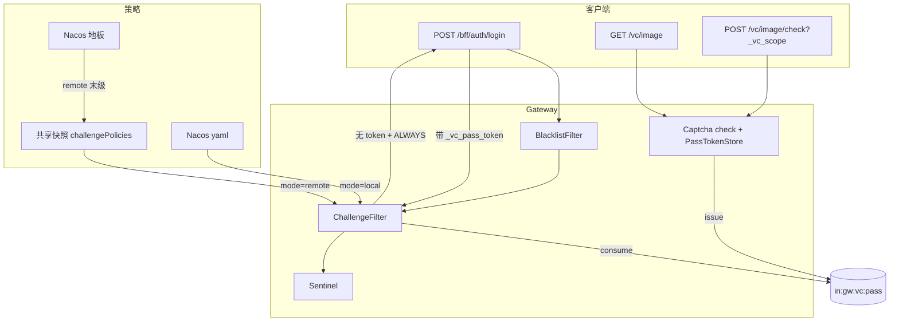

# Design

## 方案摘要

L6 不新建策略管道。打开并接上 L4 已交付的挑战 SDK，把验证码从「拦业务请求带码」改成「412 + PassToken」。图形验证码在 `ingot-verification-code` 内从 OTP 抽象拆出，编排留在网关。

| 块 | 内容 |
|---|---|
| A. 执行闭环 | 恢复 PassToken 签发；ALWAYS 覆盖登录；废弃 `verifyUrls`；**修 D10 scope 消费** |
| B. 策略启用 | Nacos 开关 / mode / 地板；DB 种子 `login-always`；remote 走既有快照 |
| C. 引擎拆分 | captcha（anji get/check）与 SMS/Email OTP 分离；网关只认滑块成功 + scope |
| D. 管理面 | Platform 写入校验；客户端 412 契约文档 |



### 关键设计决策

| ID | 议题 | 推荐决议 |
|---|---|---|
| D1 | 登录 / 敏感接口怎么验码 | **412 + PassToken**。不用 `verifyUrls` 随登录带 `_vc_code`。已确认 2026-08-27 |
| D2 | 策略来源 | **复用** `ingot.security.challenge` + `ChallengePolicyService` + 共享 `SecurityPolicySnapshotVO`。不新建 Feign、不新建 layered-cache 域 |
| D3 | 滑块引擎配置是否进中心 | **否**。`ingot.vc.image.*` 只在 Nacos。触发策略与引擎参数分离（L4 已约定不合并） |
| D4 | `ingot-verification-code` 怎么改 | **模块内拆分**，不新开 Maven 模块。captcha 不再走 `AbstractVCProcessor` / `VCRepository` / `checkOnly`。SMS/Email **原样保留** |
| D5 | SMS / EMAIL 挑战类型 | L6 **不执行**。编译或匹配时跳过并 warn。库列与 VO 可暂留字符串，执行面枚举只认 `IMAGE` / `SLIDER` |
| D6 | 登录保护哪条路径 | 只保护网关 **`POST /bff/auth/login`**。BFF→Auth Feign 不再套码。删除 `CaptchaVCProcessor` 对 `/auth/oauth2/token`、`pre_authorize` 的 grant 特例 |
| D7 | `ingot.vc.verifyUrls` | **废弃安全触发**。三环境清空列表。`VCWebFilter` / `@VCVerify` 代码可留作 no-op，登录路径不得再出现在列表里 |
| D8 | Redis 不可用 | **fail-closed**：`issue` 失败则 check 返回错误，不得 `R.ok` 且无 token；`consume` 失败视为无效。与当前 no-op 的「空 Mono」相比，带 `_vc_scope` 的 check 必须显式失败 |
| D9 | 白名单 | **保持**现 `ChallengeFilter`：`ATTR_WHITELISTED` 直接放行 |
| D10 | PassToken 消费用哪个 scope | **请求 query `_vc_scope`**（与 check 签发、412 `data.scope` 同一值）。现网 `ChallengeFilter` 只用 ALWAYS 的 scope，没有则 `default`，导致限流挑战闭环断裂，本 change **必须修** |

### 现网缺陷（L6 必修）

`ChallengeFilter` 当前消费逻辑（bug）：

```text
有 _vc_pass_token
  scope = ALWAYS 策略的 scope，否则 DEFAULT_PASS_TOKEN_SCOPE（"default"）
  consume(scope, token)
  成功 → ATTR_PASS_TOKEN_OK → 跳过 Sentinel
  失败且有 ALWAYS → 412
  失败且无 ALWAYS → 继续 Sentinel（不会跳过限流）
```

签发侧（`PassTokenStore.issue` + 策略 `findByScope`）使用 **挑战策略自己的 `scope`**。E2E / 文档示例里 `ON_RATE_LIMIT` 常用 `scope: anon` / `e2e-anon`。

结果：限流 412 → check 写入 `in:gw:vc:pass:e2e-anon:{token}` → 重试只带 `_vc_pass_token` 时去读 `in:gw:vc:pass:default:{token}` → miss → 再次撞限流。与「验码通过即可跳过本次限流」的设计相反。ALWAYS 登录若 `scope=login` 且消费也取 ALWAYS，碰巧能通，所以登录种子路径掩盖了这个 bug。

**修复：**

1. 业务重试同时带 `_vc_pass_token` 与 `_vc_scope`（412 已给出两个 param 名）。
2. `consume` 的 Redis scope **只**用请求 `_vc_scope`；缺则视为无效 token（ALWAYS → 412；仅限流路径 → 进 Sentinel）。
3. 不要回退到 `default` 去猜。签发与消费必须同一 scope 字符串。
4. 单测：无 ALWAYS、策略 scope=`e2e-anon` 的完整 consume + `ATTR_PASS_TOKEN_OK`。

---

## 数据模型与接口

### 模块职责

| 模块 | 职责 |
|---|---|
| `ingot-gateway-rule-client` | `ChallengeProperties` / `ChallengePolicyService` / `ChallengeTrigger` / `ChallengeTypes`；新增执行面允许的挑战类型常量或枚举（`IMAGE`/`SLIDER`），`SMS`/`EMAIL` 不进入 `toVcType` 的可路由集合 |
| `ingot-gateway` | `ChallengeFilter`、`ChallengeResponses`、`PassTokenStore`；验码成功签发 token；去掉登录 `checkOnly` 特例 |
| `ingot-verification-code` | captcha 引擎：`GET /vc/image`、`POST /vc/image/check`；OTP 包不动 |
| `ingot-security-provider` | 种子、Platform 校验加强；快照已含 `challengePolicies` |
| `ingot-security-api` | `ChallengePolicyVO` 文档与校验约定；可选：list 接口改为 VO 而非实体 |
| Nacos | 开关 / mode / 地板 / 清空 `verifyUrls` |

### 已有表（不改 DDL 语义）

`security_challenge_policy`（migration `005`）继续使用。L6 只 **INSERT 种子**，不改列。

| 列 | L6 执行面 |
|---|---|
| `trigger` | `always` / `on_rate_limit` |
| `challenge_type` | `SLIDER` / `IMAGE`；其它跳过 |
| `group_code` / `pattern_list` | 与限流相同的路径模型 |
| `pass_token_ttl_sec` / `pass_token_remaining` / `scope` | PassToken |
| `failure_*` / `challenge_failure_limit` / `block_ttl_sec` | 不读 |

种子（migration `020`，编号以实施时下一个空号为准）：

| 字段 | 值 |
|---|---|
| `code` | `login-always` |
| `group_code` | `login-auth`（011 已有，`POST /bff/auth/login`） |
| `trigger` | `always` |
| `challenge_type` | `SLIDER` |
| `scope` | `login` |
| `pass_token_ttl_sec` | `300` |
| `pass_token_remaining` | `3` |
| `enabled` | `1` |
| `priority` | `0` |

回滚：删除该 `code` 行。关闭执行面仍靠 `enabled=false`。

### 配置

**L2 开关** — `in-service-gateway.yml`（仅 Gateway）：

```yaml
ingot:
  security:
    challenge:
      enabled: true
      policy:
        mode: local    # DEV；TEST/PROD 用 remote
  vc:
    verifyUrls: []     # 清空；不要再配登录路径
    image:
      opsLimitGetPerMinute: 20
      opsLimitCheckPerMinute: 40
```

**L1 地板** — `in-security-gateway.yml`（**不写** `challenge.enabled` / `policy.mode`）：

```yaml
ingot:
  security:
    challenge:
      policy:
        groups:
          - code: login-auth-floor
            name: 登录认证入口
            enabled: true
            pattern-list:
              - path: /bff/auth/login
                method: POST
        policies:
          - code: login-always-floor
            group-code: login-auth-floor
            trigger: ALWAYS
            challenge-type: SLIDER
            scope: login
            pass-token-ttl-sec: 300
            pass-token-remaining: 3
            enabled: true
            priority: 0
```

`ingot.vc.image.*` 可留在 `in-service-gateway.yml`（引擎只在网关进程）。

### Nacos 降级与动态刷新（Roadmap 强制项）

| 项 | 说明 |
|---|---|
| 可降级字段 | 策略：`groups`、`policies`（code/groupCode/patternList/trigger/challengeType/scope/ttl/remaining/enabled/priority） |
| 不可降级 | PassToken 运行时状态（Redis）；滑块会话（anji Redis/local cache） |
| dataId | 地板 `in-security-gateway.yml`；开关/mode/`ingot.vc`：`in-service-gateway.yml`（即 `${spring.application.name}.yml`） |
| import | Gateway `spring.config.import` 已引入上述 dataId。实施时为两文件补 `?refreshEnabled=true`（当前 import **没有** 该参数，local 刷新依赖此补齐或等价 RefreshEvent） |
| 运行时感知 | local：已有 `LocalPolicyEnvironmentRefreshListener` 注册前缀 `ingot.security.challenge.` → `evictAll()`。remote：失效广播 → 共享快照 `evictAll()` |
| 验证 | **local**：改地板 `login-always-floor.enabled` 为 false → 不重启网关 → `POST /bff/auth/login` 不再 412。**remote**：Platform 停用种子策略 → 失效后登录不再 412 |

`ChallengeProperties` 已是 `@ConfigurationProperties(prefix = "ingot.security.challenge")`。`mode` 使用既有 `PolicySourceMode`（`VALUE_LOCAL` / `VALUE_REMOTE`），禁止再复制内部 `Mode` 字符串。

### 封闭取值

| 语义 | 类型 | 说明 |
|---|---|---|
| 策略来源 | 已有 `PolicySourceMode` | 不要与投递 `local/center` 合成 |
| 触发 | 已有 `ChallengeTrigger` | `ALWAYS` / `ON_RATE_LIMIT` |
| 挑战类型 | **新增**执行面枚举或常量类（建议 `ChallengeCaptchaType`：`IMAGE`/`SLIDER`） | YAML/DB 字面量放在枚举的 `public static final String` 上，供校验与映射 |
| VC 路由 | 已有 `ChallengeTypes.VC_IMAGE` | `SLIDER`/`IMAGE` → `image` |

### HTTP 契约

412 body 以实现为准（修正注释里的 `slider` 笔误）：

```json
{
  "code": "CHALLENGE_REQUIRED",
  "msg": "Captcha required",
  "data": {
    "vcType": "image",
    "scope": "login",
    "scopeParam": "_vc_scope",
    "passTokenParam": "_vc_pass_token",
    "checkPath": "/vc/image/check",
    "ttlSec": 300,
    "remaining": 3
  }
}
```

Header：`WWW-Authenticate: Captcha realm="image"`。

验码成功（挑战场景）：

```json
{
  "code": "S0200",
  "data": {
    "captcha": { },
    "_vc_pass_token": "...",
    "_vc_scope": "login"
  }
}
```

无 `_vc_scope` 的 check：只返回 anji `ResponseModel`（不签发），避免误发 token。

### captcha 与 OTP 拆分

现状问题：`DefaultCaptchaVCGenerator` 是空壳；`DefaultCaptchaVCProcessor` 不走 `VCRepository`；网关又用 `checkOnly` 模拟「业务请求带二次 token」。

目标包结构（实施时可微调命名，职责不变）：

```text
ingot-verification-code
  module/otp/          SMS + Email（现有 Processor/Provider，本 change 不改行为）
  module/captcha/      仅 anji CaptchaService + 频率 PreChecker + get/check
```

- Reactive 路由保留 `/vc/{type}`；`type=image` 只实现 `handle`（get）与 `check`。
- `checkOnly` 对 image：**不再用于安全拦截**。Gateway 覆盖 Bean 去掉 token 路径特例；若接口仍在，实现为「无操作放行」或委托 check 语义但不挂 `VCWebFilter`。
- 网关在 `check` 成功后：解析 `_vc_scope` → `findByScope` → `PassTokenStore.issue`；scope 未知则校验失败（防乱签发）。
- Servlet `VCEndpoint` / `DefaultCaptchaVCProvider`：网关是 WebFlux，Servlet 路径不是 L6 执行面；保持可编译，不接 PassToken。

### Platform API

路径不变：`/platform/security/policy/challenges`。加强 `validateChallengeTrigger` 为完整 `validateChallengePolicy`：

- `scope` 非空，长度上限（建议 64，对齐列）
- `challengeType` 仅 `SLIDER`/`IMAGE`（大小写规范后写入）
- `passTokenTtlSec` ≥ 1、`passTokenRemaining` ≥ 1
- `groupCode` 或 `patternList` 至少一个
- pattern path 不得以 `/vc` 为前缀或匹配 `/vc/**`
- `trigger` 规范化为 SDK `parse` 可接受的值

变更仍发 `CHALLENGE_POLICY`。详细字段见 [PLATFORM-API.md](./PLATFORM-API.md)。

### 客户端与 BFF

- BFF **不**改登录 JSON；清理 `vcCode` 过时注释。
- 登录页：捕获 412 → 按 `checkPath`/`scope` 完成滑块 → 原 URL 追加 `passTokenParam` **与** `scopeParam`。
- PassToken 与 scope 均放 query（现状参数名）；不改 Header。

---

## 数据流与失败处理

### ALWAYS 登录

```text
POST /bff/auth/login
  BlacklistFilter：白名单 → 放行；临时封禁/黑名单 → 403
  ChallengeFilter：
    无 ChallengePolicyService（enabled=false）→ 放行
    匹配 ALWAYS
    有 _vc_pass_token + _vc_scope=login → consume(login, token) 成功 → ATTR_PASS_TOKEN_OK → 放行
    consume 失败或未带 token → 412
GET /vc/image → anji get（频率限制）
POST /vc/image/check?_vc_scope=login
  anji check 失败 → 业务错误
  scope 无策略 → 错误，不签发
  Redis issue 失败 → 错误（D8）
  成功 → data._vc_pass_token
POST /bff/auth/login?_vc_pass_token=...&_vc_scope=login → 进入 BFF
```

### ON_RATE_LIMIT（含 D10 修复）

```text
业务请求（无 token）
  ChallengeFilter：无 ALWAYS → 放行
  Sentinel 命中 → SentinelBlockHandler
    累加违规计数（可能升级 403，与是否 412 无关）
    匹配 ON_RATE_LIMIT → 412（payload.scope = 策略 scope，例如 e2e-anon）
    否则 → 429
GET /vc/image
POST /vc/image/check?_vc_scope=e2e-anon → issue(e2e-anon, token)
业务请求?_vc_pass_token=...&_vc_scope=e2e-anon
  ChallengeFilter：consume(e2e-anon, token) 成功 → ATTR_PASS_TOKEN_OK
  Sentinel：看到标记 → 跳过 → 200
```

无 `_vc_scope` 或 scope 与签发不一致：不打跳过标记，请求仍可能 412/429。

### 失败

| 场景 | 行为 |
|---|---|
| 策略关闭 / 未匹配 ALWAYS | 不 412 |
| 滑块错误 | check 失败，无 token |
| token 次数用尽 | Redis DEL，下次 ALWAYS 再 412 |
| 共享快照失败 | LKG / 地板；禁止空策略 fail-open |
| `/vc/**` 被误配 ALWAYS | 写入拒绝；存量若已误配，匹配时跳过 `/vc` 路径（网关防御） |

---

## 迁移与回滚

### 上线顺序

1. 先发网关 + 验证码拆分（签发可用），`challenge.enabled` 仍可 false，前端尚未切 412。
2. 跑 migration 种子；Nacos 地板与清空 `verifyUrls`。
3. 打开 `enabled=true`；生产 `mode=remote`。
4. 前端同发登录 412 处理。建议低峰：打开后未改前端的登录会全部 412。

### 回滚

1. `ingot.security.challenge.enabled=false` → 立即回到无挑战（登录裸奔，与 L4 现状类似）。
2. 不要靠恢复 `verifyUrls` 当回滚（该模型已废弃）。
3. 种子回滚脚本删除 `login-always`。
4. 无需回滚 `005` 表结构。

### 灰度

按网关实例开关；或先只在 DEV `mode=local` 验闭环，再开 TEST/PROD remote。

---

## 测试策略

- **单元**：PassToken 签发（含 Redis 失败）；`ChallengeFilter` 按 `_vc_scope` 消费（含 `e2e-anon`、缺 scope、ALWAYS 失败回 412）；`ChallengeTypes` 只映射 IMAGE/SLIDER；Platform `validateChallengePolicy`（`/vc`、SMS、空 scope）；captcha `check` 无 scope 不签发。
- **SDK**：沿用 `ChallengeAutoConfiguration` / 共享快照测试，补「SMS 策略不进入可匹配执行集」。
- **E2E**：扩展 [test-case/security-policy-e2e.md](../../../../../test-case/security-policy-e2e.md) TC-SP-011～015，**TC-SP-012 必须带 `_vc_scope`**；新增登录 A1/A2；A17 非 default scope 的限流挑战全链路；A5 local 刷新；A10 Redis 失败（可 mock 或停 Redis 专测）。
- **刷新**：TASKS 记录改 Nacos 无重启的操作步骤与期望（A16）。

## 文档与 current

验收后：

- 新建 `specs/current/security/challenge-verification/`（README + SPEC）。
- 更新 access-protection SPEC「挑战 SDK 未启用」限制。
- 更新 config-governance 前缀地图：`ingot.security.challenge` 开关在 `in-service-gateway.yml`，地板在 `in-security-gateway.yml`。
- 更新 `docs/modules/security-center/GATEWAY-RATE-LIMIT.md` 签发描述（去掉「注释掉」后的事实）。
- Roadmap L6 → `done`；`R-2026-029` → `done`。
