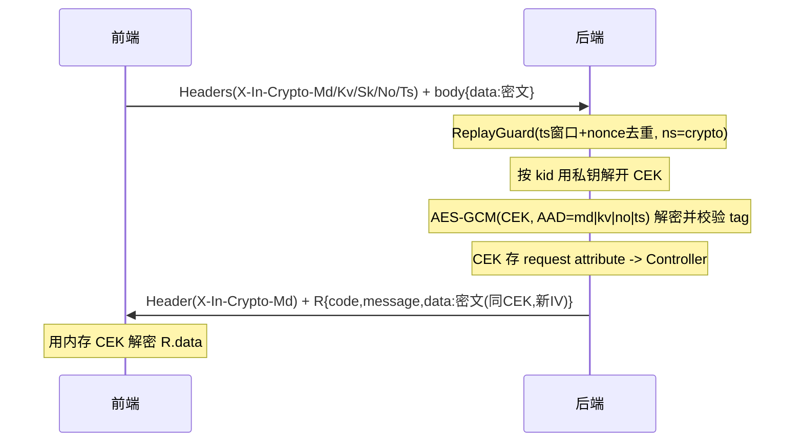

# Design

## 方案摘要

采用信封加密（HYBRID）：前端每请求随机生成 CEK（AES-256-GCM），用服务端公钥 `RSA-OAEP-256` 包裹传输；服务端用私钥解开 CEK 解密请求，并复用同一 CEK 加密响应。前端不再保存长期对称密钥。复用现有注解 + `RequestBodyAdvice`/`ResponseBodyAdvice` 触发链路，向后兼容旧模式。防重放抽象为独立通用模块 `ingot-security-replay`，crypto 仅作为绑定层调用。

关键决策：
- D1 每请求临时 CEK（无状态，服务端零会话存储，前端零长期密钥），响应复用请求 CEK。
- D2 响应默认保留 `R` 结构，仅加密 `R.data`（`responseWrap=DATA_ONLY`），`code/message` 明文。
- D3 nonce/ts/kid 明文头 + 绑定 AES-GCM AAD 防篡改。
- D4 防重放独立成模块，`namespace` 隔离；提供 `@Idempotent`。
- D5 全局共享密钥集（配置中心），多 kid 轮换；公钥端点由框架提供、网关统一路由。
- D6 算法可协商（`alg/enc` 头）为国密预留，本期只实现 `RSA-OAEP-256 + A256GCM`。
- D7 支持三种加解密粒度并存：整体加密（请求体/响应 `FULL`）、`DATA_ONLY`（仅 `R.data`）、字段级（仅注解字段）。字段级：`@InCryptoHybridContext` + `@InDecryptField(HYBRID)`/`@InEncryptField(HYBRID)`；整体：`@InCryptoHybridContext` + `@InDecrypt(HYBRID)`/`@InEncrypt(HYBRID)`。二者在同一端点互斥。
- D8 注解职责单一、无组合包装：`@InCryptoHybridContext` 为拦截器唯一触发点；已删除 `@InCryptoHybrid`、`@InCryptoHybridField`、`@InCryptoAES`、`@InCryptoRSA` 等组合注解。响应头 `Md/Kv` 由拦截器统一回带。

## 数据模型与接口

### 协议头（前端 -> 后端，前缀 `X-In-Crypto-`，可配置）

| 头 | 含义 |
|---|---|
| `X-In-Crypto-Md: h1` | 模式标记/触发开关（`h1`=信封加密 v1） |
| `X-In-Crypto-Kv: <kid>` | 包裹 CEK 所用服务端公钥版本 |
| `X-In-Crypto-Sk: <base64>` | `RSA-OAEP-256(CEK)`，被包裹的 32 字节内容密钥 |
| `X-In-Crypto-No: <随机串>` | 防重放随机数（绑定 AAD） |
| `X-In-Crypto-Ts: <epochMillis>` | 防重放时间戳（绑定 AAD） |
| `X-In-Crypto-Al` / `-En`（可选） | 算法协商，缺省即默认套件 |

### 报文格式

- 请求体（沿用 `bodyKey`，默认 `data`）：`{"data":"base64(iv[12]‖ciphertext‖tag[16])"}`。
- 响应体（默认 `DATA_ONLY`）：`{"code":"0","message":"OK","data":"base64(iv[12]‖ciphertext‖tag[16])"}`；`FULL` 模式整体加密。
- 字段级：请求体/响应体为正常 JSON，仅被注解字段的值为 `base64(iv[12]‖ciphertext‖tag[16])` 密文串，每字段独立随机 IV、复用同一 CEK 与握手 AAD。
- 响应头回带 `X-In-Crypto-Md: h1` 与 `X-In-Crypto-Kv: <activeKid>`（供前端感知密钥轮换并按需刷新公钥）；字段级模式下响应 Advice 不运行，改由拦截器写入这两个响应头。AAD = 规范化 `md|kv|no|ts`（响应方向以相同约定或省略 nonce）。

### 公钥端点

`GET /crypto/public-keys` -> `[{kid, alg, publicKey(PEM/Base64), active}]`；框架自动配置（`@ConditionalOnProperty`），部署于对外公开的认证服务，网关将固定公共路径统一路由并加入放行白名单。

### 新增/改动类型（ingot-security-crypto）

- `model/CryptoType.java`：新增 `HYBRID`。
- `annotation/InCryptoHybridContext.java`：上下文标记注解，拦截器建立 CEK/AAD 上下文的唯一触发点。
- `annotation/InDecryptField.java` / `InEncryptField.java`：字段级加解密（原 `InFieldDecrypt`/`InFieldEncrypt` 重命名）。
- `jackson/CryptoSerializer.java` / `CryptoDeserializer.java`：绑定 `@InEncryptField`/`@InDecryptField`，HYBRID 分支复用 `HybridContext.currentCek()/currentAad()`。
- `web/HybridCryptoInterceptor.java`：以单一 `@InCryptoHybridContext` 触发建立上下文，并统一回带响应头 `Md/Kv`。
- 已删除组合注解：`InCryptoHybrid`、`InCryptoHybridField`、`InCryptoAES`、`InCryptoRSA`。
- `InCryptoProperties.java`：新增 `hybrid` 配置（`responseWrap`、`activeKid`、`keyPairs`、`headers`、`modeValue`、`publicKeyEndpointEnabled`）。**已删除 `mode`（optional/strict）**，标注端点统一要求协议头。
- `hybrid/HybridKeyManager.java`：多 kid 密钥加载、活跃公钥列表、按 kid 解包 CEK；密钥集以不可变快照持有，监听 `RefreshScopeRefreshedEvent` 重新加载并原子替换（可显式 `refresh()`）。
- `hybrid/HybridCryptoService.java`：`unwrapCek(kid, wrapped)`、`encrypt(cek, bytes, aad)`、`decrypt(cek, blob, aad)`。
- `web/HybridPublicKeyController.java`：公钥下发。
- `web/InDecryptParamResolver.java`：URL 查询参数解密；HYBRID 分支复用 `HybridContext` CEK/AAD（GET 场景，需 `@InCryptoHybridContext` + 参数 `@InDecrypt(HYBRID)`）。
- 改造 `InDecryptRequestBodyAdvice` / `InEncryptResponseBodyAdvice`：HYBRID 分支。
- `model/CryptoErrorCode.java`：新增加密类错误码。
- `pom.xml`：依赖 `ingot-security-replay`。

### 新增模块 ingot-security-replay

- `NonceStore` + `RedisNonceStore`（`tryAcquire(key, ttl)`，Redis `setIfAbsent`）。
- `ReplayGuard.check(namespace, nonce, timestamp)`：时间窗校验 + nonce 原子判重。
- `ReplayProperties`（`ingot.replay.*`：`enabled`/`window`/`clockSkew`/`keyPrefix`）。
- `ReplayErrorCode`：`REPLAY_TIMESTAMP_EXPIRED`、`REPLAY_NONCE_DUPLICATE`。
- `@Idempotent` + `IdempotentAspect`（SpEL 取 key + namespace + ttl，复用 `ReplayGuard`）。
- `ReplayAutoConfiguration`（`@ConditionalOnMissingBean`）。

### ingot-commons

- `AESUtil`：新增接受 `byte[]` 原始 CEK 且支持 `aad` 的 GCM 加解密重载，保留现有 `String` key 重载与 `base64(iv‖ct‖tag)` 拼接约定。

### ingot-core

- `GlobalExceptionHandlerResolver`：新增 `HttpMessageNotReadableException` 处理，还原根因链中的 `BizException` 并透出其错误码（字段级 HYBRID 解密在 Jackson 反序列化阶段抛出的 `CRYPTO_INTEGRITY_ERROR` 会被 Jackson 包装，需还原后返回）。

## 数据流与失败处理

失败处理（均以明文 `R` 返回）：
- 缺头：`CRYPTO_HEADER_MISSING`。
- 未知/失效 kid：`CRYPTO_KID_UNKNOWN`（前端刷新公钥重试）。
- CEK 解包失败：`CRYPTO_KEY_UNWRAP_ERROR`。
- tag 校验失败/被篡改：`CRYPTO_INTEGRITY_ERROR`（字段级在 Jackson 反序列化阶段抛出，经 `HttpMessageNotReadableException` 还原后仍返回该码）。
- 时间戳超窗：`REPLAY_TIMESTAMP_EXPIRED`；nonce 重复：`REPLAY_NONCE_DUPLICATE`。
- 不支持算法：`CRYPTO_ALG_UNSUPPORTED`。
- 校验顺序：先 ts 窗口/nonce 去重（省去无谓 RSA 解包）-> 解包 CEK -> 带 AAD 解密验 tag。
- Redis 不可用降级：由 `ingot.replay` 配置决定 `fail-open`（放行并告警）或 `fail-close`（拒绝），默认 `fail-close`。

## 迁移与回滚

| 步骤 | 行为 | 回滚方式 |
|---|---|---|
| 引入 | 部署新模块与配置，前端按协议接入 | 移除 `@InCryptoHybridContext` 注解即恢复明文 |
| 轮换 | 配置中心更新 kid，新旧并存 | 回退 `active-kid` 配置 |

- 无数据库变更；密钥集经配置中心下发，轮换通过 `RefreshScopeRefreshedEvent` 热刷新。
- 向后兼容：`AES/AES_GCM/RSA` 与未标记接口不受影响。

## 测试策略

- 单元测试：`HybridCryptoService`（RSA 解包 + GCM 收发 + AAD）、`AESUtil` byte[]/AAD 重载、`ReplayGuard`（窗口/去重）、`IdempotentAspect`。
- 集成测试：端到端加密请求/响应（POST 与 GET）、`R` 结构解密、多 kid 轮换、缺头拒绝、篡改/重放拒绝、公钥端点经网关放行。
- 兼容测试：旧模式与未标记接口回归。
- 安全测试：篡改 nonce/ts/kid、重放、超窗、无效密文的错误码与明文返回。
