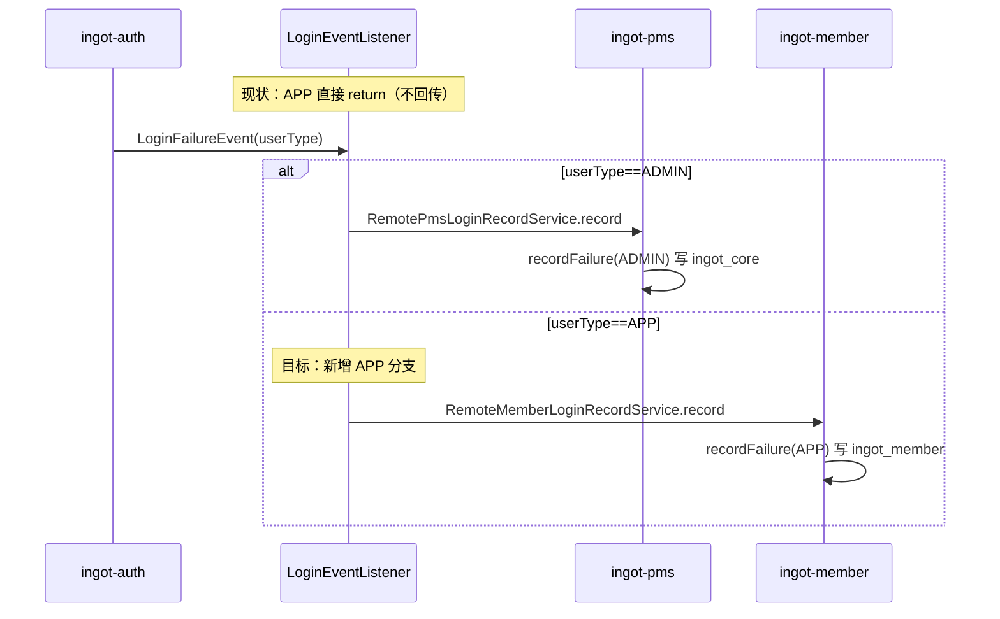

# Design

## 方案摘要

本 change 分两块，共用一次实施：

**A. 账号保护全用户闭环**：复用账号域（`ingot-security/ingot-security-account`）已有用例、领域模型、Port 与 adapter 实现，**不新增判定逻辑、不改动 ADMIN 侧行为**，只补齐 Member 侧「依赖 / 数据 / 接线」三层，让 Member 走通与 ADMIN 相同的账号保护闭环。

**B. remote 弹性架构土台**：对齐 L1 凭证的命名与可扩展结构，但**不实现 remote**。只做三件铺垫：配置改名 `ingot.security.account.*`、引入 `mode` 开关、引入 `AccountLockoutPolicyLoader` seam（仅 Local 实现）。使将来另立的 remote 弹性 change 能「差入即用」，无需再改消费侧。

关键设计原则：

- **对齐而非重造**（闭环）：Member 的失败计数 / 锁定 / 解锁 / 安全事件全部复用 `RecordLoginUseCaseService` / `LockAccountUseCaseService` / `UnlockAccountUseCaseService`，区别仅在 `userType=APP` 与数据落 `ingot_member` 库。
- **Port 自动切换**：引入 `ingot-security-account-adapter` 后，`AccountAdapterAutoConfiguration`（`@AutoConfigureBefore(AccountDomainAutoConfiguration)`）注册真实 `LockStatePort` / `SecurityEventPort`，覆盖 `@ConditionalOnMissingBean` 的 NoOp，`AccountLockTask` 定时任务 bean 随之生效。
- **策略 vs 用户数据分离**：将来可 remote/LKG/缓存的仅是 **lockout 策略参数**；`account_lock_state` 锁定状态与失败计数永远落 DB、不可降级（与凭证「策略 vs 用户数据」一致）。
- **seam 先行**：消费侧改经 `AccountLockoutPolicyLoader`，把「策略来源」收敛到单一 seam，未来 remote 只需新增 `RemoteAccountLockoutPolicyLoader` 实现并按 `mode` 装配。

### 分层职责与改动

| 层 | 组件 | 本次改动 |
|----|------|----------|
| 依赖 | `ingot-member-provider/build.gradle` | 增 `ingot-security-account-adapter` 依赖 |
| 数据 | `ingot_member.account_lock_state` / `account_security_event` | 新增 migration `009` + 回滚 + 基线 SQL |
| 接口 | `ingot-member-api` | 新增 `RemoteMemberLoginRecordService`（Feign） |
| 接口 | `ingot-member-provider` | 新增 `InnerLoginRecordAPI`（`userType=APP`） |
| 接线 | `ingot-auth` `LoginEventListener` | 按 `userType` 分发 ADMIN→PMS / APP→Member |
| 配置 | `AccountDomainProperties` | 前缀 `ingot.account` → `ingot.security.account`；新增 `mode` |
| 配置 | PMS/Member `in-service-*.yml` | 键迁移 + B/C 差异化值 |
| seam | `ingot-security-account-core` | 新增 `AccountLockoutPolicyLoader` + `LocalAccountLockoutPolicyLoader` |
| 消费 | `RecordLoginUseCaseService` / `AuthContextSupport` | 改经 loader 取策略 |

## 数据模型与接口

### 数据模型

Member 侧两张表 DDL 与 ADMIN（`ingot_core`）**完全一致**，仅落库位置不同（`ingot_member`），DDL 复用 [ingot-security-account-adapter 内置 SQL](../../../../../ingot-framework/ingot-security/ingot-security-account/ingot-security-account-adapter/src/main/resources/sql/)：

- `account_lock_state`：`(user_id, user_type)` 联合唯一；`user_type=1`（APP）；含 `failed_login_count` / `locked` / `lock_type` / `locked_until` / `idx_locked(locked, locked_until)`（定时解锁使用）。
- `account_security_event`：审计事件表，`user_type=1`；`event_category` = AUTH / ACCOUNT / CREDENTIAL；`source` = MEMBER / AUTH。

`member_user` 表结构不变：`locked` / `last_login_at` / `last_login_ip`（002 迁移已加）作为冗余字段，指向 `account_lock_state`。

### 接口

- 新增 Feign `RemoteMemberLoginRecordService`（`ingot-member-api`），契约镜像 PMS：

```java
@FeignClient(contextId = "memberLoginRecordService", value = ServiceNameConstants.MEMBER_SERVICE)
public interface RemoteMemberLoginRecordService {
    @PostMapping("/inner/user/login/record")
    R<Void> record(@RequestBody LoginRecordDTO dto);
}
```

- 新增 `InnerLoginRecordAPI`（`ingot-member-provider`），镜像 [PMS InnerLoginRecordAPI](../../../../../ingot-service/ingot-pms/ingot-pms-provider/src/main/java/com/ingot/cloud/pms/web/inner/InnerLoginRecordAPI.java)，差异仅：`userType = UserTypeEnum.APP`、`findByUsername` 查 Member 用户体系。
- 不改动账号域任何 Port / UseCase 契约。

## 配置命名与结构（土台 B-1）

### 改名影响面

据 [调查](4d216e99-08d1-4f9c-9df5-f5b8d6f05aa0)，`ingot.account.*` 影响面小且集中：

| 影响点 | 内容 |
|--------|------|
| Properties 类 | `AccountDomainProperties`（`@ConfigurationProperties(prefix)`，1 处） |
| Java 消费 | `RecordLoginUseCaseService`、`AuthContextSupport`（2 处，改为经 loader，见 B-2） |
| Nacos yml | `in-service-pms.yml`（`ingot.account.lockout.enabled` 已有）+ `in-service-member.yml`（本次新增） |
| `@Value` / 硬编码 | 无 |

### 目标配置结构

```yaml
ingot:
  security:
    account:
      mode: local            # local(纯 Nacos) | remote(预留，本期未实现)
      lockout:
        enabled: true
        max-attempts: 5
        lock-duration-minutes: 30   # 0=永久，仅 B端可用
        attempt-window-minutes: 15  # 已定义，滑动窗口未实现（非目标）
        hint-after-attempts: 3
```

- `AccountDomainProperties` 前缀 `ingot.account` → `ingot.security.account`；新增 `mode` 字段（默认 `local`）。
- 类名保留 `AccountDomainProperties`（仅改前缀，降低改动面）；是否改名为 `AccountSecurityProperties` 列为待审阅决策点。
- Nacos 迁移为**一次性改键**（不双写）：PMS `in-service-pms.yml` 与 Member `in-service-member.yml` 直接使用新前缀。

## seam 抽象（土台 B-2）

### 目标

把「lockout 策略来源」收敛到单一 seam，消费侧不再直读 `@ConfigurationProperties`。本期仅 `Local` 实现；将来 remote change 新增 `Remote` 实现并按 `mode` 装配，消费侧零改动。

### 接口草案（`ingot-security-account-core`）

```java
// service/AccountLockoutPolicyLoader.java
public interface AccountLockoutPolicyLoader {
    /** 返回当前生效的锁定策略（remote 优先 / local 兜底；本期仅 local）。 */
    LockoutPolicy getLockoutPolicy();
}
```

- `LockoutPolicy`：不可变值对象（`enabled` / `maxAttempts` / `lockDurationMinutes` / `attemptWindowMinutes` / `hintAfterAttempts`）。是否直接复用现有 `AccountDomainProperties.LockoutPolicy` 或新建独立 model，列为待审阅决策点。
- `LocalAccountLockoutPolicyLoader implements AccountLockoutPolicyLoader`：**每次调用即时**从 `AccountDomainProperties` 映射（不缓存），保证 `local` 热刷新可感知（属性由 rebinder 重绑定后，下次调用即读到新值）。
- 装配：`AccountDomainAutoConfiguration` 按 `ingot.security.account.mode` 装配 loader；本期 `mode=local` 或缺省时装 `LocalAccountLockoutPolicyLoader`；`mode=remote` 的占位行为见待审阅决策点。

### 消费侧改造

- `RecordLoginUseCaseService`：`recordFailure` 中的 `accountProperties.getLockout()` 改为 `lockoutPolicyLoader.getLockoutPolicy()`。
- `AuthContextSupport`：`buildMeta` 中读取阈值 / 提示改经 loader。
- 两处均为「读取来源替换」，判定逻辑不变。

## 数据流与失败处理

### 目标闭环（Member 登录失败）

```
Member 登录请求 → Auth 认证（RemoteMemberUserDetailsService → Member /inner/user/details）
  → 密码错误 → DefaultAuthenticationFailureHandler 发 LoginFailureEvent(userType=1)
  → LoginEventListener: userType==APP → RemoteMemberLoginRecordService.record(success=false)
  → Member InnerLoginRecordAPI → RecordLoginUseCaseService.recordFailure(APP)
      → LockStatePort.incrementFailCount（原子 upsert，ingot_member）
      → SecurityEventPort.publishEvent(LOGIN_FAILURE)
      → lockoutPolicyLoader.getLockoutPolicy() 达 maxAttempts
         → LockAccountUseCaseService.lockAutomatically(APP, LOGIN_FAIL_EXCEED)
             → account_lock_state.locked=1 + UserAccountPort.updateLockStatus(member_user.locked=1)
             → SecurityEventPort.publishEvent(ACCOUNT_LOCKED)
```

### 目标闭环（Member 登录成功 / 解锁）

```
登录成功 → LoginSuccessEvent(userType=1) → LoginEventListener(APP)
  → RecordLoginUseCaseService.recordSuccess → resetFailCount + last_login 更新 + LOGIN_SUCCESS 事件

定时解锁 → AccountLockTask（每分钟，adapter 引入后生效）
  → UnlockAccountUseCaseService.unlockExpired（分页 locked_until<=now）→ 清零 failed_login_count → ACCOUNT_UNLOCKED 事件
```

### 认证 meta 填充

Member `UsernameIdentityResolver` 已调用 `AuthContextSupport.fill()`；引入 adapter 后 `LockStatePort` 为真实实现，`buildMeta`（改经 loader 取阈值）自动填充 `failedLoginCount` / `lockedUntil` / 阈值，供 Auth 侧 `InUserDetailsChecker` / `DefaultUserCredentialChecker` 生成友好提示。

### 失败处理

- 登录记录回调异步（`@Async`），异常仅 `log.error` 不阻断登录（与现有 PMS 链路一致）。
- 缺 `userId`（密码错但用户存在）时按用户名在 Member 用户体系查找，查不到静默忽略（防枚举攻击）。
- 自动锁定为「本次失败回调后」落库，当次仍返回 bad credentials，下次登录命中 locked（与 ADMIN 现状一致）。

## 现状与目标对照



## Nacos 降级与动态刷新设计

> 遵循 [roadmap 横切原则](../../../../../docs/requirements/themes/security-center-roadmap.md)。

本 change 仅落地 `mode=local`（纯 Nacos + 免冷启动刷新）；`remote` 弹性阶梯拆为后续 change（见下节）。

- 可 Nacos 配置字段（前缀 `ingot.security.account.lockout`）：`enabled` / `maxAttempts` / `lockDurationMinutes` / `hintAfterAttempts` / `attemptWindowMinutes`。
- 对应 dataId：PMS `in-service-pms.yml`、Member `in-service-member.yml`（账号 lockout 属服务本地配置，不放 `in-security-policy.yml`；后续 remote change 再引入地板 dataId 决策）。
- **免冷启动刷新**：`AccountDomainProperties` 为 `@ConfigurationProperties`，Nacos 变更由 `ConfigurationPropertiesRebinder` 重绑定；`LocalAccountLockoutPolicyLoader` 每次即时读取属性，故刷新后下次失败判定即按新值执行，无需重启、无需 `@RefreshScope`。实施时验证 Member/PMS 均生效。
- **B端/C端 差异化默认值**（引擎统一、按服务配置差异）：

  - PMS（B端，`in-service-pms.yml`）：`maxAttempts=5`、`lockDurationMinutes=30`、`hintAfterAttempts=3`（维持现状严格）。
  - Member（C端，`in-service-member.yml`）：`maxAttempts=5`、`lockDurationMinutes=15`（短锁）、`hintAfterAttempts=3`；**禁止 `lockDurationMinutes=0`（永久自动锁定）** —— 规避恶意锁号 DoS 与高人工解锁成本。

- **不可降级项**：`account_lock_state` 锁定状态、`account_security_event` 事件数据依赖 DB 持久化。
- 验证方式：改 `in-service-member.yml` 的 `maxAttempts`（如 5→3），不重启，连续失败 3 次即锁定。

## 后续 change 预览（remote 弹性与中心化，本期不实现）

依托本 change 的 `mode` 开关与 `AccountLockoutPolicyLoader` seam，后续 change 镜像 [20260717-security-credential-resilience](../../archive/2026/20260717-security-credential-resilience/DESIGN.md)：

- 框架侧（account-core 或新模块）：`RemoteAccountLockoutPolicyLoader` + `AccountLockoutPolicyConfigService` seam + `Resilient`（remote→LKG→Nacos 地板）+ `LastKnownGoodStore`（Redis 独立 key）+ `LocalFloorSupplier` + L1 Caffeine / L2 Redis + `CredentialPolicySourceHolder` 式来源可观测 + `InvalidationBus` 跨节点失效 + Actuator 端点。
- 安全中心侧（`ingot-security`）：新增 `account_lockout_policy_config` 表 + Entity/Mapper/Service + `RemoteAccountLockoutService` Feign + `InnerAccountLockoutAPI` + 管理面 CRUD + 失效发布。
- `mode=remote` 装配 `RemoteAccountLockoutPolicyLoader`，`local` 装配 `LocalAccountLockoutPolicyLoader`；消费侧零改动。

## 迁移与回滚

- **DDL 迁移**：新增 `databases/migrations/009_member_account_protection.sql`（`USE ingot_member;` + 复用 adapter 内置 `CREATE TABLE IF NOT EXISTS` 两张表），并同步 `databases/ingot_member.sql` 基线；回滚 `databases/migrations/rollback_009.sql`（`DROP TABLE`）。
- **配置迁移**：`ingot.account.*` → `ingot.security.account.*` 一次性改键。上线需同步更新 Nacos（DEV/TEST/PROD 各 `in-service-pms.yml`）与新增 `in-service-member.yml`；代码与 Nacos 同版本发布，避免旧键残留导致读默认值。
- **执行顺序**：先执行 `009` 建表 + 更新 Nacos 键 → 再上线含 adapter 依赖与新前缀的服务。
- **兼容性**：`CREATE TABLE IF NOT EXISTS` 幂等；两张表为新增，不影响存量 `member_user`；`mode` 缺省 `local`，行为与现状一致；seam 为读取来源替换，判定逻辑不变。
- **回滚**：回退服务代码（移除 adapter 依赖、恢复旧前缀与直读属性）+ 执行 `rollback_009` + Nacos 键回退；`LoginEventListener` 回退 APP 分支后 Member 恢复原「不回传」行为，ADMIN 链路不受影响。

## 待审阅决策点（实施前需在 TASKS 敲定）

1. **D1 `LoginRecordDTO` 归属**：复用 `pms-api`（推荐，member-provider 已依赖 `pms_api`）/ `member-api` 独立 / 上提 `commons`。
2. **D2 migration 编号**：现有最新 `008`，本次取 `009`，确认无并行占用。
3. **D3 Member 注册时 `lockStatePort.initialize`**：引入 adapter 后自动生效，确认回归无影响。
4. **D4 `AccountDomainProperties` Nacos 动态刷新方式**：确认 rebinder 重绑定即时生效，或需补刷新监听。
5. **D5 `mode=remote` 占位行为**：本期未实现 remote，配置为 `remote` 时 → 回退 `local` + WARN（推荐，可用性优先）/ fail-fast 启动报错。
6. **D6 `LockoutPolicy` 载体形态**：seam 返回值直接复用 `AccountDomainProperties.LockoutPolicy` / 新建独立不可变 model（推荐，与 Properties 解耦，便于 remote 复用）。
7. **D7 `AccountDomainProperties` 是否改类名**：仅改前缀保类名（推荐，改动最小）/ 改名 `AccountSecurityProperties`（与 `CredentialSecurityProperties` 对齐）。
8. **D8 `unlockExpired` 是否清零 `failed_login_count`**：当前 ADMIN 侧行为确认；不清零则在本闭环补齐（影响两端一致性，需评估 ADMIN 回归）。

## 测试策略

- 单元：`InnerLoginRecordAPI`（Member）成功 / 失败 / 缺 userId 按用户名查找 / 查不到静默忽略；`LoginEventListener` 按 userType 分发；`LocalAccountLockoutPolicyLoader` 映射与热刷新（属性变更后返回新值）。
- 集成：Member「失败 N 次→锁定→到期解锁→再登录」全链路；`ingot_member` 两张表落库；同 ID 的 ADMIN / APP 用户共存互不干扰（`user_type` 区分）。
- 降级/刷新：`in-service-member.yml` 改 `maxAttempts` / `lockDurationMinutes` 免冷启动刷新验证（不重启生效）。
- 回归：ADMIN 登录 / 锁定 / 解锁链路不受影响；Member baseline（`enabled=false`）不自动锁定；全代码库无 `ingot.account.*` 残留读取；相关模块编译通过。
- 迁移：`009` 在 `ingot_member` 执行成功、`rollback_009` 可回退。
