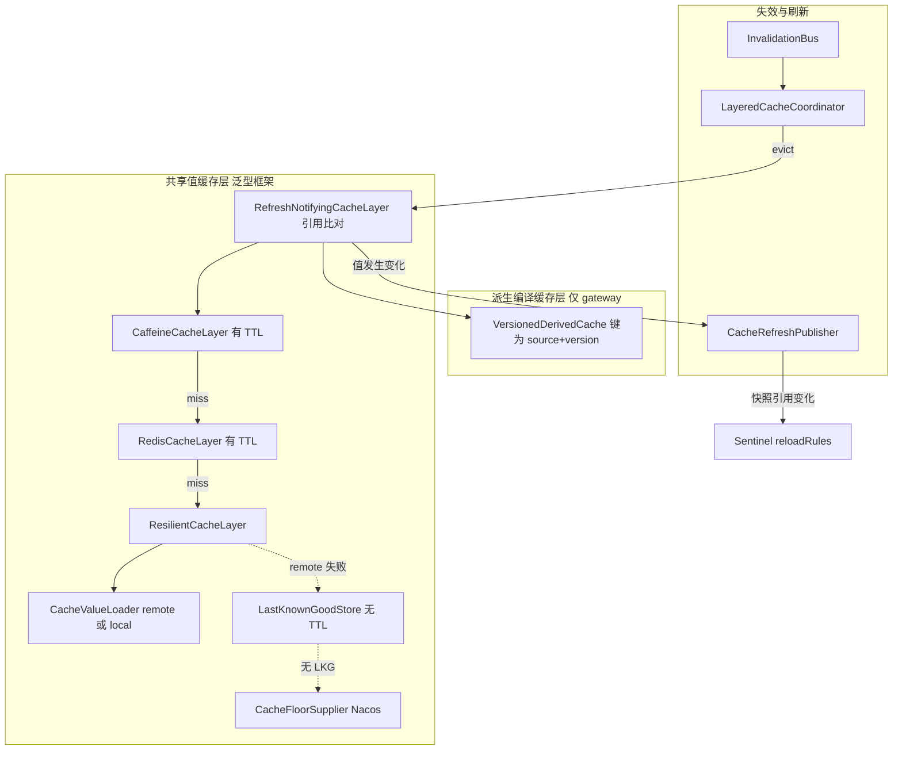

# Design

## 方案摘要

新建 `ingot-framework/ingot-cache`（包 `com.ingot.framework.cache`），把「L1 Caffeine → L2 Redis → Resilient(remote → LKG → Nacos 地板)」这条装饰器链抽象为泛型组件，再把四个消费者的内部实现替换为框架组件。对外 SPI、配置键、Redis key、Actuator endpoint id 全部不变。

### 目标分层



三重一致性保障，职责不重叠：

| 机制 | 角色 | 时延 | 解决 |
|---|---|---|---|
| `InvalidationBus` 广播 | 主路径 | 秒级 | 规则变更即时生效 |
| L1/L2 TTL | 兜底 | 一个 TTL 周期 | Redis Pub/Sub 消息丢失导致的永久 stale |
| `(source, version)` 比对 | 抑制 | — | 避免无谓重编译与 Sentinel 规则抖动 |

## 数据模型与接口

### 框架类清单

模块路径 `ingot-framework/ingot-cache`，按 [ingot-gateway-rule-client/build.gradle](../../../../ingot-framework/ingot-gateway-rule-client/build.gradle) 的依赖模式：`implementation(deps.caffeine)`，Redis 与 Actuator 走 `compileOnly` + `ObjectProvider` 可选注入。

| 包 | 类 | 职责 |
|---|---|---|
| `spi` | `LayeredCache<K, V>` | 统一读写口：`get(K)` / `evict(K)` / `evictAll()` / `name()` |
| `spi` | `CacheValueLoader<K, V>` | 底层加载器（Feign remote 或 DB local） |
| `spi` | `CacheFloorSupplier<K, V>` | 地板供给；带 key 参数以兼容多 key 场景 |
| `spi` | `RemoteUnavailableException` | 远端不可用信号，区别于合法空 |
| `internal` | `CaffeineCacheLayer<K, V>` | L1 装饰器，`expireAfterWrite` + `maximumSize` |
| `internal` | `RedisCacheLayer<K, V>` | L2 装饰器，JSON via `ObjectMapper` + `TypeReference`；`evictAll` 按 pattern 决定 DEL 或 SCAN+DEL |
| `internal` | `ResilientCacheLayer<K, V>` | remote → LKG → floor 阶梯 |
| `internal` | `LoaderCacheLayer<K, V>` | 弹性关闭时的最内层占位，保证链路结构完整 |
| `internal` | `RefreshNotifyingCacheLayer<K, V>` | 最外层刷新通知层，引用比对去重 |
| `internal` | `LastKnownGoodStore<K, V>` | Redis 无 TTL 存储，`evict` 不触及 |
| `derived` | `VersionedDerivedCache<S, D>` | 派生编译缓存，键为 `SnapshotVersion` |
| `derived` | `LazyDerivedCache<D>` | 无版本源的派生缓存，仅显式失效后重编译，供 local 模式使用 |
| `derived` | `SnapshotVersion` | `record(CacheSource source, long version)` |
| `source` | `CacheSource` | `REMOTE` / `LAST_KNOWN_GOOD` / `LOCAL_FLOOR` |
| `source` | `CacheSourceHolder` | 当前来源、降级计数、`lastDegradeAt` |
| `coordinator` | `LayeredCacheCoordinator<E, D>` | `InvalidationBus` 订阅 + `register(domain, Runnable)`；泛型化以适配各模块自己的事件与域类型 |
| `coordinator` | `CacheRefreshListener<V>` | 载入新值时的回调，供 version 变化联动 |
| `coordinator` | `CacheRefreshPublisher<V>` | 监听器注册与分发中介，解耦缓存构建与监听方装配时机 |
| `config` | `LayeredCacheSettings` | 分层参数载体（Lombok `@Builder` POJO，见 D2） |
| `config` | `LayeredCacheBuilder<K, V>` | 流式装配，可选层缺省即跳过 |
| `config` | `LayeredCacheAutoConfiguration` | 注册 `LayeredCacheRegistry` 与 Endpoint；不装配具体缓存实例 |
| `registry` | `LayeredCacheRegistry` | 汇总已注册实例，供 Actuator |
| `registry` | `LayeredCacheDescriptor` | 单实例装配画像（层次开关 + `CacheSourceHolder`） |
| `actuate` | `LayeredCacheEndpoint` | `GET /actuator/layeredcache` |

`CacheSource` 只有三个值而非包含 L1/L2：来源标记仅由 `ResilientCacheLayer` 更新，热缓存命中不重新标记，否则高频读取会把可观测数据覆盖成无意义的「命中缓存」。这也保证 `SnapshotVersion` 的来源维度只反映降级位置。

`LazyDerivedCache` 是 `VersionedDerivedCache` 的退化形式，服务于数据来自本地 `Properties`、没有可比对版本号的 local 模式。它替代 gateway 原有的 `LocalCompiledCache`，避免四个 local 域各自重复实现双重检查加载。

刷新通知层位于装饰器链<b>最外层</b>而非 L1 之下：监听器回调通常要回读缓存取转换后的领域模型，若此时 L1 尚未写入，回读会再次穿透到远端，把一次加载放大成两次。放在最外层则回读必然命中 L1；配合引用比对去重，L1 命中期间完全静默，回调内的回读也不会触发二次广播，从根本上排除递归。代价是引用比对不区分缓存键，故该层仅适用于单 key 的共享快照场景。

### Builder 用法

```java
LayeredCache<String, List<CredentialPolicyConfigVO>> cache = LayeredCacheBuilder
        .<String, List<CredentialPolicyConfigVO>>named("credential")
        .loader(remoteLoader)
        .settings(settings)
        .cacheable(v -> v != null && !v.isEmpty())   // 集合类必须排除空值
        .emptyValue(List::of)
        .resilientSingleKey(redisTemplate, objectMapper, TYPE, lkgKey, floorSupplier)
        .l2SingleKey(redisTemplate, objectMapper, TYPE, "in:credential:configs:all")
        .sourceHolder(holder)
        .registry(registry)
        .build();
```

L2 键策略按基数二选一：`l2SingleKey` 用于单一聚合快照（`evictAll` 直接 DEL），`l2MultiKey` 用于按实体分键（`evictAll` 按前缀 SCAN）；两者都是 `l2(...)` 的便捷封装，需要完全自定义映射时直接用后者。

### 关键决策

**D1 单模块而非 core/adapter 拆分。** 仓库已有 `ingot-security-access-{core,adapter}` 先例，但那是为了隔离「纯领域模型」与「Redis/Feign 基础设施」。本框架的全部价值就在基础设施装配上，拆分只会产生一个近乎空的 core。Redis/Actuator 用 `compileOnly` 已足够表达可选性。

**D2 框架不定义 `@ConfigurationProperties`，配置键归消费者。** credential 用 `l1-enabled`/`l1-ttl`/`l1-maximum-size`/`l2-enabled`/`l2-ttl`/`l2-key-prefix`，dict 用 `cache-enabled`/`cache-ttl`/`cache-maximum-size`/`redis-enabled`/`redis-ttl`/`redis-key-prefix`——语义相同但键名不同。若框架强加统一前缀就会破坏 REQUIREMENTS 规则 11 的兼容承诺。因此框架只提供普通 POJO `LayeredCacheSettings`，由各模块现有 Properties 负责映射。新模块可自由采用推荐命名。

**D3 Resilient 位于 L1/L2 之下。** 热缓存可缓存降级值，TTL 到期后自动重试 remote 从而自动恢复。若反过来把 Resilient 放最外层，降级值将不受 TTL 约束，恢复需依赖失效广播。这是 credential 现有实现的既定语义，抽象后保持。

**D4 派生缓存键为 `(source, version)` 二元组。** 地板快照 version 恒为 0，remote version 来自 DB，降级与恢复之间会出现 version 回退甚至相等。若只比 version 数值，「remote(v0 不存在) → 地板(v0) → 恢复 remote(v0)」这类场景会漏重编译。二元组把来源纳入键，彻底消除歧义。

**D5 Sentinel reload 由 version 变化回调驱动，搭流量便车。** ratelimit 域的缓存实际无读者（详见「数据流」S4 段），单加 TTL 是空转。共享快照层为四域共用，`BlacklistFilter` 与 `ChallengeFilter` 在每个请求上都读自己的缓存，会连带刷新共享层并产出新 version，ratelimit 订阅 `CacheRefreshListener` 即可。仅在「只开 ratelimit 且其他域无流量」的部署下需要定时兜底，故 `refresh-interval` 默认关闭。

**D6 单 key 与多 key 统一到 `LayeredCache<K, V>`。** credential / gateway / LoginFailure 是单 key 全量快照，传固定 key（如 `"all"`）；dict 是多 key，键为 `DictCacheKey`（code + scope + 租户/应用 + 是否含禁用项）。多 key 的 `evictAll()` 在 Redis 侧需 SCAN+DEL。按 code 清掉全部 query 变体走 `evictMatching(Predicate, l2ScanPattern)`（Phase 04 实施时追加到 SPI，因精确 `evict(K)` 无法表达「同一 code 的多 query 变体」）。

**D7 L2 与 LKG 保持两个独立 Redis key，不合并。** 两者存的都是同一个值对象，但生命周期正交：L2 有 TTL 且随 `evictAll` 清除，LKG 无 TTL 且不随失效清除。合并会让「失效后仍要保留最后成功快照」无法表达。仅复用序列化逻辑。

**D8 dict 不新增 LKG 与地板。** 见 README 非目标。

**D9 各模块 Actuator 端点保留，框架另加汇总端点。** `credentialpolicy` / `securitypolicy` / `loginfailurepolicy` 已被 Nacos 三环境的 `management.endpoints.web.exposure.include` 列入，删除即破坏运维习惯与现有排障文档。框架汇总端点 `layeredcache` 是增量能力。

**D10 Phase 03 门禁。** 见 README「分 Phase 交付与门禁」。

## 数据流与失败处理

### 读路径（remote 模式）

```
LayeredCache.get(key)
  → L1 Caffeine getIfPresent
      命中且非空 → 返回
  → L2 Redis GET
      命中且非空 → 回填 L1 → 返回
      命中但为空 → DEL 该 key → 视为 miss（规则 3）
  → ResilientCacheLayer
      → CacheValueLoader.load()
          成功（含合法空）→ LastKnownGoodStore.save() → mark(REMOTE) → 返回
          抛 RemoteUnavailableException → 进入降级
      → 降级：LastKnownGoodStore.load()
          非 null → mark(LAST_KNOWN_GOOD) → 返回
          null 且地板启用 → CacheFloorSupplier.get() → mark(LOCAL_FLOOR) → 返回
          null 且地板禁用 → 抛出原异常（fail-closed，规则 5）
  → 非空则回填 L2 与 L1；空值不回填（规则 3）
```

`CacheSourceHolder` 只在 Resilient 层更新，L1/L2 命中不改来源——沿用 credential 现有语义。

### 失效路径

```
写侧（provider）：本地 evictAll() → InvalidationBus.publish(event)
读侧（其他节点）：LayeredCacheCoordinator.handle(event)
  → 按 domainKey 查 evictor 列表 → 串行执行，单个异常不中断其余
  → evictAll() 逐层向下：L1 invalidateAll → L2 DEL/SCAN+DEL → Resilient 透传（不清 LKG，规则 2）
```

广播方收不到自己的事件（`RedisInvalidationBus` 按 origin 过滤），故写侧必须自清（规则 6）。

### S4：ratelimit 域的 TTL 空转问题与解法

各域缓存的读者分布：

| 域 | 请求路径上的读者 | TTL 是否天然生效 |
|---|---|---|
| blacklist | `BlacklistFilter` 每请求调 `match(...)` | 生效 |
| challenge | `ChallengeFilter` 每请求调 `match(...)` | 生效 |
| violation | `SentinelBlockHandler` 限流时调 | 生效（低频） |
| **ratelimit** | **无**。Sentinel 读的是 `GatewayRuleManager` 已加载规则；`getSnapshot()` 仅在 `reloadRules()` 内被调用 | **不生效** |

解法（D5）：共享快照层被 blacklist/challenge 的流量刷新后发出 `CacheRefreshListener` 回调，`SentinelGatewayConfiguration` 订阅并判断快照是否真的变了，变化才执行 `GatewayApiDefinitionManager.loadApiDefinitions` + `GatewayRuleManager.loadRules`。

判断用的是 `RateLimitSnapshot` 的<b>对象引用</b>而非重新解析版本号：派生缓存在 `(source, version)` 未变时返回同一个对象，引用比对因此直接复用了它已经做过的判定，零成本且不会漏判。原有 Coordinator 注册的失效路径保持不变（走 `reloadRules()`，先清缓存再无条件重载），两条路径互不干扰。

### 失败处理矩阵

| 场景 | 行为 |
|---|---|
| Redis 完全不可用 | L2 与 LKG 静默 no-op（`ObjectProvider` 返回 null），链路退化为 L1 + Resilient(remote → 地板) |
| L2 反序列化失败 | `log.warn` + 返回 null，视为 miss 穿透，不抛给调用方 |
| LKG 反序列化失败 | `log.warn` + 返回 null，落地板 |
| 远端超时 | `CacheValueLoader` 包装为 `RemoteUnavailableException` → 降级 |
| 远端返回业务失败码 | 同上，视为不可用而非合法空 |
| 远端成功但 data 为空 | 合法空：刷新 LKG、mark(REMOTE)、不降级、不写入热缓存（规则 3/4） |
| 地板配置缺失 | 补最小基线，强制非空（规则 5） |
| 失效回调抛异常 | catch + log，不影响同域其他 evictor 与其他域 |

## 迁移与回滚

### 上线顺序

Phase 01 → 02 → 03 → 04，每个 Phase 独立可发布。Phase 03 有外部门禁（L4 change 完成 T4-1/T4-2）。

### 各消费者迁移要点

**gateway-rule-client（Phase 02）**

- 共享层：`SecurityPolicySnapshotVO` 走完整 L1+L2+Resilient，替换现有无缓存的 `ResilientSnapshotFetcher`。这一步同时消除 D-A 重复 Feign。
- 派生层：四域的 `LocalCompiledCache` 换 `VersionedDerivedCache`。`SnapshotAssembler`、`CompiledIpList.compile`、`CompiledChallengePolicy.compile`（内含 `PathPatternParser.parse`）均有实际开销，值得保留编译缓存。
- Sentinel：`reloadRules()` 增加 version 比对 + 订阅 `CacheRefreshListener`。
- 新增配置键 `ingot.security.policy.client.cache.*`（l1/l2/refresh，均有默认值）；复用现有 `lkg-redis-key` 与 `local-floor-enabled`；`resilience-enabled` 语义不变。
- `LocalCompiledCache` 位于 `internal` 包且无外部引用，可直接删除。

**access-adapter LoginFailure（Phase 03）**

- 换框架组件并**首次补齐 L1+L2**，修复 D-C（Coordinator 空转）。
- 该模块属 L4 active change 的交付物，改动需同步回写 [20260729-security-access-protection/DESIGN.md](../../archive/2026/20260729-security-access-protection/DESIGN.md)。

**credential（Phase 03）**

零行为变化清单，逐项核对：

| 不变项 | 值 |
|---|---|
| SPI | `CredentialPolicyConfigService` 方法签名 |
| L2 Redis key | `in:credential:configs:all` |
| LKG Redis key | `in:credential:policy:lkg` |
| Actuator | endpoint id `credentialpolicy`，输出字段与顺序 |
| 配置键 | `ingot.security.credential.cache.*` 全部键名与默认值 |
| provider 装配 | `LocalCredentialPolicyConfigConfig` 覆盖同名 delegate（MySQL 直查、不包 Resilient），L1/L2 仍叠加其上 |

**dict（Phase 04）**

- 保持 `mode=AUTO|LOCAL|REMOTE|NONE`、多 key `evict(code)` 粒度、配置键 `cache-*`/`redis-*`。
- 不新增 LKG/地板（D8）。

### 回滚

- Phase 01：框架模块未被依赖前可直接移除。
- Phase 02-04：每个 Phase 为独立提交，回滚该提交即恢复原实现类（旧类在对应 Phase 内删除，回滚一并恢复）。因对外契约不变，回滚不涉及配置或数据迁移。
- 无 DB schema 变更，无数据迁移。
- Redis key 格式不变，回滚后旧实现可直接读取新实现写入的缓存与 LKG。

## 测试策略

### 单元测试（Phase 01）

- 装饰器组合矩阵：L1/L2/Resilient 各开关组合下链路完整性与来源标记正确性。
- 逐条覆盖 REQUIREMENTS 业务规则 1-7，重点：LKG 不随 `evictAll` 清除、不缓存空值、fail-closed 抛异常、合法空不触发降级。
- `VersionedDerivedCache`：version 回退、version 相等但 source 不同、连续降级恢复序列。
- 多 key：`evict(K)` 精确删除、`evictAll()` SCAN+DEL 覆盖全部前缀键。
- Redis 缺失（`ObjectProvider` 返回 null）时不抛异常。

### 集成测试

- `ApplicationContextRunner` 装配测试：各层开关组合下无 Bean 缺失，延续上一轮确立的正交性契约。
- gateway：冷启动与 `ALL` 失效后的 Feign 调用计数（mock `RemoteSecurityPolicyService` 计次）。
- gateway：version 未变时 `loadRules` 未被调用；version 变化时被调用。

### 迁移回归

- credential：迁移前后对比 Actuator 输出与 Redis key 内容（同一份数据，两次运行 diff）。
- dict：四种 mode 的行为对比。
- 端到端失效链路：Platform 改规则 → 各节点 evict → Sentinel 仅在 version 变化时 reload。
- 复用 [test-case/security-policy-e2e.md](../../../../test-case/security-policy-e2e.md) 的既有用例做 gateway 回归。

## As-Built 与原设计差异

实施期间确认并固化的差异：

| 项 | 原设计 | As-Built |
|---|---|---|
| dict 缓存键 | 业务 key「code + scope」 | `DictCacheKey(code, scope, tenantId, appId, includeDisabled)`，与迁移前 Redis key 格式一致 |
| 按 code 失效 | 未单独建模 | SPI 追加 `LayeredCache.evictMatching(Predicate, l2ScanPattern)` |
| dict `batchItems` | 未规定 | 按键顺序 `get`；冷缓存不再折叠为一次批量 RPC |
| `CacheSourceHolder` Bean | 未规定 | 各模块具名 Bean，避免 Auth 进程内类型冲突 |
| 会话并发策略 | 非本 change 范围 | L5 已接入同一框架，列入 current 消费者表 |
| gateway E2E（V3） | 复用 `test-case/security-policy-e2e.md` | 需运行环境，仍待用户执行 |
