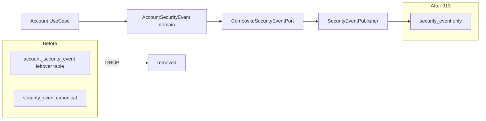

# Design

## 方案摘要

本 change 为**破坏性 DDL 清理**：在 recording 已停写旧表的前提下，用前向 migration 删除 `account_security_event`，并收敛仓库内仍暗示该表在线的基线与文档。账号事件运行时路径不变。



### 关键决策

| ID | 决策 | 结论 |
|----|------|------|
| D1 | 清理手段 | 新 migration `013`，不改写已执行的 `009` |
| D2 | 覆盖库 | `ingot_core` + `ingot_member`；不碰 `ingot_security` |
| D3 | 历史数据 | DROP 销毁；无在线回填；运维可选事前 dump |
| D4 | 回滚 | `rollback_013` 按旧 DDL 建**空表**，不恢复行 |
| D5 | 领域模型 | 保留 `AccountSecurityEvent` 与 Port 映射 |
| D6 | shadow 对账脚本 | 仅服务 legacy 对账则**删除**文件 |
| D7 | `SecurityEventPort.deleteByUser` | 保留 default NoOp；注释改为指向 canonical `security_event`（若将来 GDPR 清理，清理目标为 `security_event`，另开 change） |

## 数据模型与接口

### 删除对象

| 库 | 对象 |
|---|---|
| `ingot_core` | 表 `account_security_event` |
| `ingot_member` | 表 `account_security_event` |

保留：`account_lock_state`、各库 `security_event`（migration `012`）。

### Migration

**`databases/migrations/013_drop_account_security_event.sql`**（示意）：

```sql
-- ingot_core
USE ingot_core;
DROP TABLE IF EXISTS `account_security_event`;

-- ingot_member
USE ingot_member;
DROP TABLE IF EXISTS `account_security_event`;
```

**`databases/migrations/rollback_013_drop_account_security_event.sql`**：

- 在两库按本 change 附带的 `rollback_013_drop_account_security_event.sql` DDL 重建空表（无数据）。
- 回滚仅用于紧急恢复「表存在」假设，**不**恢复审计内容。

### 仓库清理清单

| 路径 | 动作 |
|---|---|
| `databases/ingot_core.sql` | 删除该表 `CREATE`/`INSERT` 段 |
| `databases/ingot_member.sql` | 同上 |
| `.../sql/account_security_event.sql` | **删除文件** |
| `databases/scripts/security_event_shadow_reconcile.sql` | **删除**（legacy shadow 对账失效） |
| `009` / `rollback_009` | **不改**正文 |
| `DeleteAccountUseCaseService` 类/行注释 | 旧表名 → `security_event` |
| `docs/requirements/themes/security-center-roadmap.md` | 去掉「事件写入 account_security_event」过时句（轻量） |

### 接口

无公共 API / Java SPI 签名变更。

## 数据流与失败处理

- 运行时：UseCase → `AccountSecurityEvent` → `CompositeSecurityEventPort` → recording → `security_event`（已存在，本 change 不改）。
- DROP 后若残留代码仍 SQL 访问旧表 → 启动或运行期 SQLException；验收以 grep + 手工登录保证无此路径。
- `deleteByUser` 仍为 NoOp；删除账号不删审计行（现落在 `security_event`）。

## 迁移与回滚

### 上线顺序

1. 确认无外部报表/作业依赖旧表；需要则先 dump。
2. 部署含注释/文档清理的制品（可与 DDL 同窗）。
3. 在 `ingot_core`、`ingot_member` 执行 `013`。
4. 跑功能验收清单；更新 current 并归档本 change。

### 回滚

1. 执行 `rollback_013` 重建空表。
2. 服务无需为「空旧表」回滚代码（本无写路径）；仅当有外部依赖「表必须存在」时需要空表。

### 兼容

- 破坏性：旧表数据不可恢复（除非事前 dump）。
- 向前兼容：已停写，DROP 不影响 recording。

## 测试策略

| 层级 | 覆盖 |
|---|---|
| 手工 | FUNCTIONAL-TEST-CHECKLIST E1–E5 |
| 静态 | grep 确认无 Entity/Mapper/旁路 DDL/现行写旧表路径 |
| 回归 | PMS/Member 登录成功失败各 1 次，仅 `security_event` 增长 |

## Current 基线更新预告（验收后）

- `specs/current/security/account-protection/`：数据模型表仅 `account_lock_state` + `security_event`；删除「历史只读保留」。
- `specs/current/security/security-event-center/`：删除「表尚未物理下线」。
- `specs/current/framework/security-event-recording/SPEC.md` §7/§8：删除 legacy 表保留表述，注明已 DROP。
