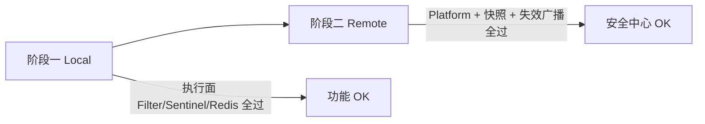

# 网关限流与安全策略 — 端到端测试用例

> **对照实现**：[`docs/security-center/GATEWAY-RATE-LIMIT.md`](../docs/security-center/GATEWAY-RATE-LIMIT.md)  
> **管理面 API**：`ingot-service/ingot-security` → `/platform/security/policy/*`  
> **适用版本**：Phase 1–4（2026-05 As-Built）

本文档供**手工 E2E / 联调**使用，覆盖网关执行面全部安全策略能力：限流、黑白名单、挑战、PassToken、违规封禁、规则热更新与降级场景。

---

## 0. 推荐测试顺序（两阶段）

**先 Local，后 Remote** — 这是推荐的联调顺序，用于快速定位问题归属：



| 阶段 | 模式 | 验证什么 | 不依赖什么 |
|------|------|----------|------------|
| **阶段一** | `policy.mode: local` | 网关**执行面**是否正确：Filter 链、412/429/403、PassToken、违规封禁、Sentinel 编译 | `ingot-service-security`、Platform API、失效事件 |
| **阶段二** | `policy.mode: remote` | **安全中心 + 集成**：CRUD、快照 Feign、L1 evict、跨节点热更新、审计入库 | —（需 security 已部署） |

**判断逻辑：**

- 阶段一失败 → 优先查 `ingot-gateway`、`ingot-gateway-rule-client`、Redis、下游路由。
- 阶段一通过、阶段二失败 → 执行面已 OK，优先查 security 服务、DB 迁移、Feign 连通、失效广播、`invalidation-enabled`。
- 两阶段均通过 → 全链路可用，可上生产 remote 配置。

阶段一用例：§4–§7 核心用例（TC-SP-002 ~ TC-SP-016、TC-SP-023/024），规则写在网关 yaml（§1.3）。  
阶段二用例：§2 种子数据 + §8 热更新 + §10 审计 + §9 部分降级 + TC-SP-021 管理面校验。

---

## 0.1 测试范围与通过标准

### 0.1.1 范围

| 模块 | 验证点 |
|------|--------|
| 规则 SDK | local / remote 加载、L1 缓存、失效广播、快照拉取失败降级 |
| Filter 链 | Blacklist(+30) → Challenge(+40) → Sentinel(+50) 顺序与互斥响应 |
| 限流 | IP / DEVICE / USER 维度、burst、dryRun、未配置路径不限流 |
| 黑白名单 | 静态黑/白、CIDR、临时封禁、白名单跳过挑战与 Sentinel |
| 挑战 | ALWAYS 强制 412、ON_RATE_LIMIT 限流降级 412、PassToken 全链路 |
| 运行时 Redis | PassToken、ViolationCounter、TempBlockStore |
| 管理面 | CRUD、快照、审计、`on_failure_threshold` 拒绝 |

### 0.1.2 全局通过标准

- HTTP 状态码、`code` 字段与文档 §5 一致。
- 关键日志出现且无 ERROR（见 §12）。
- Redis / DB 侧效应与用例描述一致（如适用）。
- 规则变更后 **无需重启网关**，失效广播 ≤ 10s 内生效（可调大观察窗口）。

---

## 1. 环境与前置

### 1.1 依赖服务

| 服务 | 阶段一 Local | 阶段二 Remote |
|------|--------------|---------------|
| `ingot-gateway` | 必须 | 必须 |
| `ingot-service-test`（或任意下游） | 必须 | 必须 |
| Redis | 必须（PassToken / 临时封禁） | 必须 |
| `ingot-service-security` | **不需要** | 必须 |
| Nacos（可选） | 注册发现 | 注册发现 |

### 1.2 阶段一：Local 模式配置（先测执行面）

规则直接写在网关 yaml，**不经过安全中心**。三域均设为 `local`，`policy.client` 可关闭以简化环境：

```yaml
ingot:
  security:
    policy:
      client:
        enabled: false          # 阶段一可关，不测失效广播
    ratelimit:
      enabled: true
      policy:
        mode: local
        groups:
          - code: e2e-public
            name: E2E 探测
            enabled: true
            pattern-list:
              - path: /test/**
                method: ANY
        rules:
          - code: e2e-ip-2qps
            group-code: e2e-public
            dimension: IP
            qps: 2
            burst: 2
            interval-sec: 1
            control-behavior: F
            enabled: true
    blacklist:
      enabled: true
      policy:
        mode: local
        items:
          - list-type: BLACK
            key-type: IP
            key-value: 192.168.99.100
            enabled: true
    challenge:
      enabled: true
      policy:
        mode: local
        policies:
          - code: e2e-challenge-ratelimit
            group-code: e2e-public
            trigger: ON_RATE_LIMIT
            challenge-type: SLIDER
            scope: e2e-anon
            pass-token-ttl-sec: 300
            pass-token-remaining: 3
            enabled: true

spring:
  cloud:
    sentinel:
      scg:
        enabled: true
```

阶段一通过标准：§4–§7 核心用例在**改 yaml 后重启网关**即可生效（local 无 Platform 热更新，属预期）。

### 1.3 阶段二：Remote 模式配置（再测安全中心）

确认 security 已执行 `005_security_policy_center.sql`，再切换为三域 `remote`：

```yaml
ingot:
  security:
    policy:
      client:
        enabled: true
        invalidation-enabled: true   # 必开，测热更新
    ratelimit:
      enabled: true
      policy:
        mode: remote
    blacklist:
      enabled: true
      policy:
        mode: remote
    challenge:
      enabled: true
      policy:
        mode: remote

spring:
  cloud:
    sentinel:
      scg:
        enabled: true
```

阶段二通过标准：§2 Platform 种子数据写入后**无需重启网关**，失效广播 ≤10s 内生效；§8、§10 用例通过。

### 1.4 环境变量（示例）

```bash
export GATEWAY="http://localhost:9999"          # 网关地址，按实际端口修改
export PLATFORM_TOKEN="<平台管理员 Bearer>"   # 调用 /platform/security/policy 所需
export TEST_IP="192.168.99.100"               # 用于 IP 维度 / 黑白名单
export TEST_DEVICE="device-fingerprint-test"  # 用于 DEVICE 维度
```

### 1.5 探测接口约定

默认使用 `ingot-service-test` 的匿名接口：

| 方法 | 路径 | 说明 |
|------|------|------|
| POST | `/test/send` | `@Permit`，适合压测限流 |

若下游不可用，可改为任意已路由、允许匿名 GET/POST 的路径，并在分组 `pattern-list` 中同步修改。

### 1.6 启动自检

| 模式 | 期望日志 |
|------|----------|
| Local | `[Challenge] local policies compiled`、`[Sentinel] reloaded`、`[Sentinel] custom BlockRequestHandler registered` |
| Remote | 同上 + `[SecurityPolicy] ratelimit snapshot: rules=...`；Feign 拉快照无 WARN |

---

## 2. 测试数据准备（阶段二 Remote — Platform 种子）

> **阶段一 Local 跳过本章**，规则已在 §1.2 yaml 中内联。

以下通过网关访问 security（需 `PLATFORM_TOKEN`）。保存后调用 `POST /platform/security/policy/broadcast-invalidation` 或等待自动失效广播。

### 2.1 路径分组 `e2e-public`

```http
POST {{GATEWAY}}/platform/security/policy/groups
Authorization: Bearer {{PLATFORM_TOKEN}}
Content-Type: application/json
```

```json
{
  "code": "e2e-public",
  "name": "E2E 公开探测接口",
  "enabled": true,
  "patternList": [
    { "path": "/test/**", "method": "ANY" }
  ]
}
```

### 2.2 限流规则

**规则 A — IP 2 QPS（纯 429 场景）**

```json
{
  "code": "e2e-ip-2qps",
  "groupCode": "e2e-public",
  "dimension": "IP",
  "qps": 2,
  "burst": 2,
  "intervalSec": 1,
  "controlBehavior": "F",
  "enabled": true,
  "dryRun": false,
  "priority": 0
}
```

```http
POST {{GATEWAY}}/platform/security/policy/rules
```

**规则 B — dryRun 观察**

```json
{
  "code": "e2e-dryrun",
  "groupCode": "e2e-public",
  "dimension": "IP",
  "qps": 1,
  "burst": 1,
  "intervalSec": 1,
  "controlBehavior": "F",
  "enabled": true,
  "dryRun": true,
  "priority": 1
}
```

**规则 C — DEVICE 维度（可选 P1）**

```json
{
  "code": "e2e-device-1qps",
  "patternList": [{ "path": "/test/send", "method": "POST" }],
  "dimension": "DV",
  "qps": 1,
  "burst": 1,
  "intervalSec": 1,
  "controlBehavior": "F",
  "enabled": true,
  "dryRun": false,
  "priority": 0
}
```

> 执行 DEVICE 用例前，将规则 A 设为 `enabled: false`，避免与 IP 规则叠加干扰。

### 2.3 挑战策略

**策略 D — ON_RATE_LIMIT**

```json
{
  "code": "e2e-challenge-ratelimit",
  "groupCode": "e2e-public",
  "trigger": "on_rate_limit",
  "challengeType": "SLIDER",
  "scope": "e2e-anon",
  "passTokenTtlSec": 300,
  "passTokenRemaining": 3,
  "enabled": true,
  "priority": 0
}
```

```http
POST {{GATEWAY}}/platform/security/policy/challenges
```

**策略 E — ALWAYS（强制挑战）**

```json
{
  "code": "e2e-challenge-always",
  "patternList": [{ "path": "/test/send", "method": "POST" }],
  "trigger": "always",
  "challengeType": "SLIDER",
  "scope": "e2e-always",
  "passTokenTtlSec": 300,
  "passTokenRemaining": 1,
  "enabled": true,
  "priority": 0
}
```

> ALWAYS 与 ON_RATE_LIMIT 同时作用于 `/test/send` 时，**ALWAYS 优先**（412 在 Sentinel 之前）。分场景测试时请**只启用其一**。

### 2.4 清理

每个模块测试结束后删除或 `enabled: false` 对应规则，避免污染其他用例。临时封禁需等待 15 分钟或手动删除 Redis Key（见 §11）。

---

## 3. 用例清单（速览）

| ID | 优先级 | 模块 | 标题 |
|----|--------|------|------|
| TC-SP-001 | P0 | 限流 | 未配置路径不限流 |
| TC-SP-002 | P0 | 限流 | 超 QPS 返回 429 |
| TC-SP-003 | P0 | 限流 | dryRun 不阻断 |
| TC-SP-004 | P1 | 限流 | IP 维度隔离 |
| TC-SP-005 | P1 | 限流 | DEVICE 维度（Header） |
| TC-SP-006 | P1 | 限流 | USER 维度（需登录） |
| TC-SP-007 | P0 | 名单 | 静态黑名单 403 |
| TC-SP-008 | P0 | 名单 | CIDR 黑名单 |
| TC-SP-009 | P0 | 名单 | 白名单跳过限流与挑战 |
| TC-SP-010 | P0 | 名单 | 临时封禁 403（违规升级） |
| TC-SP-011 | P0 | 挑战 | ALWAYS 返回 412 |
| TC-SP-012 | P0 | 挑战 | PassToken 验码后放行 |
| TC-SP-013 | P0 | 挑战 | ON_RATE_LIMIT 限流后 412 |
| TC-SP-014 | P0 | 挑战 | 无限流挑战策略时 429 |
| TC-SP-015 | P1 | 挑战 | PassToken scope 不匹配 |
| TC-SP-016 | P1 | 挑战 | PassToken 次数耗尽 |
| TC-SP-017 | P0 | 热更新 | Platform 改规则后网关生效 |
| TC-SP-018 | P1 | 热更新 | broadcast-invalidation 强制刷新 |
| TC-SP-019 | P1 | 降级 | security 不可达时快照为空 |
| TC-SP-020 | P1 | 降级 | Redis 不可用时 PassToken no-op |
| TC-SP-021 | P0 | 管理面 | 拒绝 on_failure_threshold |
| TC-SP-022 | P1 | 审计 | 临时封禁上报 gateway_blacklist_event |

---

## 4. 限流用例

### TC-SP-001 未配置路径不限流

| 项 | 内容 |
|----|------|
| 前置 | 限流规则仅匹配 `/test/**`；规则 A 启用 |
| 步骤 | `GET {{GATEWAY}}/actuator/health`（或任意不在分组内的路径）连续请求 20 次 |
| 期望 | 均不被 SDK 限流（不出现 `LIMIT_TOO_MANY`）；状态由下游决定 |

### TC-SP-002 超 QPS 返回 429

| 项 | 内容 |
|----|------|
| 前置 | 规则 A 启用；挑战策略 D **禁用**；策略 E **禁用** |
| 步骤 | 1 秒内对 `POST {{GATEWAY}}/test/send` 连续请求 ≥ 5 次，Header：`X-Forwarded-For: {{TEST_IP}}` |
| 期望 | 前 2 次左右 200；之后 **HTTP 429**，body `code=LIMIT_TOO_MANY`，响应头 `Retry-After: 1` |

```bash
for i in $(seq 1 6); do
  curl -s -o /dev/null -w "%{http_code}\n" \
    -X POST "$GATEWAY/test/send" \
    -H "X-Forwarded-For: $TEST_IP"
done
```

### TC-SP-003 dryRun 不阻断

| 项 | 内容 |
|----|------|
| 前置 | 规则 A `enabled: false`；仅规则 B（dryRun=true）启用 |
| 步骤 | 高速请求 `POST /test/send` |
| 期望 | 客户端始终 200；网关日志出现 dry-run / block 相关观察日志，**不**返回 429 |

### TC-SP-004 IP 维度隔离

| 项 | 内容 |
|----|------|
| 前置 | 规则 A 启用 |
| 步骤 | IP1=`192.168.99.1` 打满限流；IP2=`192.168.99.2` 同时请求 |
| 期望 | IP2 仍可 200；两 IP 计数互不影响 |

### TC-SP-005 DEVICE 维度

| 项 | 内容 |
|----|------|
| 前置 | 规则 A 禁用；规则 C 启用 |
| 步骤 | 相同 IP、不同 `X-In-Ca-Sig` 头各发 3 次 POST |
| 期望 | 按设备指纹独立限流；缺省设备头时行为以 `ClientIdentity` 实现为准（记录实际结果） |

### TC-SP-006 USER 维度

| 项 | 内容 |
|----|------|
| 前置 | 新增 `dimension: UI` 规则，绑定需登录路径（如 `/api/user/**`） |
| 步骤 | 用户 A、用户 B 各自 Bearer Token 并发请求 |
| 期望 | 按 `X-User-Id`（JWT 解析回填）独立计数 |

---

## 5. 黑白名单用例

### TC-SP-007 静态黑名单 403

| 项 | 内容 |
|----|------|
| 步骤 | Platform 新增：`listType=B, keyType=IP, keyValue={{TEST_IP}}, enabled=true` |
| 步骤 | `POST /test/send`，`X-Forwarded-For: {{TEST_IP}}` |
| 期望 | **HTTP 403**，`code=FORBIDDEN_BLOCKED`；**不**进入 Challenge / Sentinel |

### TC-SP-008 CIDR 黑名单

| 项 | 内容 |
|----|------|
| 步骤 | `keyType=CD, keyValue=10.10.0.0/24` |
| 步骤 | 使用 `10.10.0.5` 访问 |
| 期望 | 403 |

### TC-SP-009 白名单跳过限流与挑战

| 项 | 内容 |
|----|------|
| 前置 | 规则 A 启用（2 QPS）；策略 D 启用 |
| 步骤 | 为 `{{TEST_IP}}` 添加白名单 `listType=W, keyType=IP` |
| 步骤 | 高速请求 + 不带 PassToken |
| 期望 | 持续 200；不出现 412 / 429 / 403 |

### TC-SP-010 临时封禁（违规升级）

| 项 | 内容 |
|----|------|
| 前置 | 规则 A 启用；挑战 D 禁用（确保 429 计数）；`{{TEST_IP}}` 不在静态黑/白名单 |
| 步骤 | 60s 内触发 Sentinel 阻断 ≥ **30** 次（脚本循环 curl） |
| 期望 | 第 1–30 次多为 429；**满 30 次后的新请求**直接 **403**（`BlacklistFilter` 读 Redis 临时封禁） |
| 验证 | Redis：`KEYS in:gw:bl:tmp:IP:{{TEST_IP}}` 存在且 TTL ≈ 900s |

```bash
# 约 30 次快速 429（视 QPS 调整循环次数）
for i in $(seq 1 35); do
  curl -s -o /dev/null -w "%{http_code} " \
    -X POST "$GATEWAY/test/send" \
    -H "X-Forwarded-For: $TEST_IP"
  sleep 0.05
done
echo
# 封禁生效后再测一次
curl -s -w "\n%{http_code}\n" -X POST "$GATEWAY/test/send" -H "X-Forwarded-For: $TEST_IP"
```

---

## 6. 挑战与 PassToken 用例

### TC-SP-011 ALWAYS 强制 412

| 项 | 内容 |
|----|------|
| 前置 | 策略 E 启用；策略 D 禁用；规则 A 可启用或禁用（ALWAYS 在 Sentinel 前） |
| 步骤 | `POST /test/send`，不带 `_vc_pass_token` |
| 期望 | **HTTP 412**，`code=CHALLENGE_REQUIRED`，`data` 含：`vcType`、`scope=e2e-always`、`checkPath`、`passTokenParam=_vc_pass_token`、`scopeParam=_vc_scope` |

### TC-SP-012 PassToken 全链路

| 项 | 内容 |
|----|------|
| 前置 | 同 TC-SP-011 |
| 步骤 | 1. 收到 412，记录 `data.scope`、`data.checkPath` |
| 步骤 | 2. 获取验证码 → `POST {{GATEWAY}}/vc/image/check?_vc_scope=e2e-always`（body 按验证码模块要求） |
| 步骤 | 3. 从响应取 `data._vc_pass_token` |
| 步骤 | 4. `POST /test/send?_vc_pass_token=<token>` |
| 期望 | 步骤 4 返回 200；网关日志无二次 412；若规则 A 启用，本次应跳过 Sentinel |

### TC-SP-013 ON_RATE_LIMIT → 412

| 项 | 内容 |
|----|------|
| 前置 | 策略 E **禁用**；策略 D **启用**；规则 A 启用 |
| 步骤 | 打满限流 |
| 期望 | **412**（非 429）；`code=CHALLENGE_REQUIRED` |

### TC-SP-014 无限流挑战 → 429

| 项 | 内容 |
|----|------|
| 前置 | 策略 D、E 均禁用；规则 A 启用 |
| 步骤 | 打满限流 |
| 期望 | **429** `LIMIT_TOO_MANY` |

### TC-SP-015 PassToken scope 错误

| 项 | 内容 |
|----|------|
| 前置 | 策略 E 启用 |
| 步骤 | 使用 scope=`e2e-always` 签发的 token，但请求时故意不带或改错 query（或用过期 token） |
| 期望 | 再次 **412**；不泄露下游业务数据 |

### TC-SP-016 PassToken 次数耗尽

| 项 | 内容 |
|----|------|
| 前置 | 策略 E，`passTokenRemaining: 1` |
| 步骤 | 验码后连续 2 次携带同一 `_vc_pass_token` 访问 |
| 期望 | 第 1 次 200；第 2 次因 token 已消费再次 412 |
| 验证 | Redis key `in:gw:vc:pass:e2e-always:*` 在消费后删除 |

---

## 7. 状态码组合与顺序（专项）

### TC-SP-023 单次请求互斥（P0）

| 场景 | 期望（仅一种） |
|------|----------------|
| 已在临时封禁 | 403 |
| ALWAYS 且无 token | 412（不到 Sentinel） |
| Sentinel 阻断 + ON_RATE_LIMIT | 412 |
| Sentinel 阻断 + 无挑战策略 | 429 |

**不应出现**：同一次响应先 412 再 429；同一次响应 412 变 403。

### TC-SP-024 跨请求升级（P0）

| 步骤 | 期望 |
|------|------|
| 连续多次 412 或 429 | 每次仍为挑战或限流响应 |
| 满 30 次违规后下一次 | 403（见 TC-SP-010） |

---

## 8. 规则热更新

### TC-SP-017 Platform 修改后自动生效

| 项 | 内容 |
|----|------|
| 步骤 | 将规则 A 的 `qps` 从 2 改为 10 并保存 |
| 期望 | ≤10s 内网关日志：`[Sentinel] reloaded`；新阈值生效，无需重启 |
| 步骤 | 将规则 A `enabled: false` |
| 期望 | 不再出现 429 |

### TC-SP-018 强制广播

| 项 | 内容 |
|----|------|
| 步骤 | `POST /platform/security/policy/broadcast-invalidation` |
| 期望 | 各域 evict 日志 + Sentinel reload |

---

## 9. 降级与异常

### TC-SP-019 security 快照拉取失败

| 项 | 内容 |
|----|------|
| 步骤 | 暂时停掉 security 或阻断 Feign |
| 期望 | 网关不崩溃；限流退化为无 SDK 规则；名单不命中；挑战不触发 |

### TC-SP-020 Redis 不可用

| 项 | 内容 |
|----|------|
| 步骤 | 断开网关 Redis |
| 期望 | 启动日志 `[PassTokenStore] reactive redis not available`；PassToken / 临时封禁 no-op；412/429 仍正常 |

### TC-SP-021 拒绝 on_failure_threshold

```json
POST /platform/security/policy/challenges
{ "code": "bad", "trigger": "on_failure_threshold", "challengeType": "SLIDER", "enabled": true }
```

| 期望 | 保存失败，错误码含 `SecurityPolicy.ChallengeTriggerInvalid` |

---

## 10. 审计

### TC-SP-022 封禁事件入库

| 项 | 内容 |
|----|------|
| 前置 | 完成 TC-SP-010 |
| 步骤 | `GET /platform/security/policy/events?limit=20` |
| 期望 | 存在 `triggerSource=A`（自动）、`keyType=IP`、`countInWindow≥30` 的记录 |

---

## 11. 测试辅助

### 11.1 常用 curl 模板

```bash
# 带 IP
curl -X POST "$GATEWAY/test/send" -H "X-Forwarded-For: $TEST_IP"

# 带设备指纹
curl -X POST "$GATEWAY/test/send" \
  -H "X-Forwarded-For: $TEST_IP" \
  -H "X-In-Ca-Sig: $TEST_DEVICE"

# 带 PassToken
curl -X POST "$GATEWAY/test/send?_vc_pass_token=YOUR_TOKEN" \
  -H "X-Forwarded-For: $TEST_IP"
```

### 11.2 Redis 检查

```bash
redis-cli KEYS 'in:gw:bl:tmp:*'
redis-cli KEYS 'in:gw:vc:pass:*'
redis-cli TTL 'in:gw:bl:tmp:IP:192.168.99.100'
```

### 11.3 手动解除临时封禁

```bash
redis-cli DEL "in:gw:bl:tmp:IP:192.168.99.100"
```

### 11.4 快照直连（绕过网关）

```bash
curl -s "$SECURITY_INNER/inner/security/policy/snapshot" | jq '.data.version, .data.challengePolicies | length'
```

---

## 12. 日志检查点

| 关键字 | 含义 |
|--------|------|
| `[SecurityPolicy] ratelimit snapshot` | 限流快照加载 |
| `[Sentinel] reloaded` | Sentinel 规则热加载 |
| `[Challenge] remote policies compiled` | 挑战策略编译 |
| `[BlacklistFilter] blocked` | 403 拦截（static / temp） |
| `[Sentinel] threshold reached, temp-block` | 违规达 30 次写临时封禁 |
| `[Sentinel] custom BlockRequestHandler registered` | 自定义 412/429 处理器就绪 |

---

## 13. 阶段对照速查

| 用例章节 | 阶段一 Local | 阶段二 Remote |
|----------|--------------|---------------|
| §4 限流 | 必测（改 yaml + 重启） | 必测（Platform 规则 + 热更新） |
| §5 黑白名单 | 必测（yaml items） | 必测（Platform ip-list） |
| §6 挑战 | 必测 | 必测 |
| §7 状态码顺序 | 必测 | 抽测确认一致 |
| §8 热更新 | **跳过**（local 需重启） | 必测 |
| §9 降级 | Redis 降级可测；security 不可达仅阶段二 | 全测 |
| §10 审计 | 跳过 | 必测 |
| §2 种子数据 | 跳过 | 使用 |

---

## 14. 已知限制（不测或记为观察项）

| 项 | 说明 |
|----|------|
| HTTP Method 过滤 | `EndpointPattern.method` 不参与 Sentinel 编译 |
| `challenge_failure_limit` / `block_ttl_sec` | 管理面字段保留，网关 Phase 1 **未实现**验码失败拉黑；违规封禁阈值为代码常量 30 次 / 60s / 15min |
| `on_failure_threshold` | 已废弃；登录失败锁定走 account-domain |
| 登录 `/auth/token` 验码 | 属 `CaptchaVCProcessor.checkOnly` 业务链路，非本策略中心 trigger |

---

## 15. 测试执行记录模板

| ID | 执行人 | 日期 | 结果 | 备注 |
|----|--------|------|------|------|
| TC-SP-002 | | | PASS / FAIL | |
| TC-SP-010 | | | | |
| TC-SP-012 | | | | |
| … | | | | |

---

## 16. 相关文档

- [网关限流与安全策略执行面](../docs/security-center/GATEWAY-RATE-LIMIT.md)
- [DB 迁移 `005_security_policy_center.sql`](../databases/migrations/005_security_policy_center.sql)
